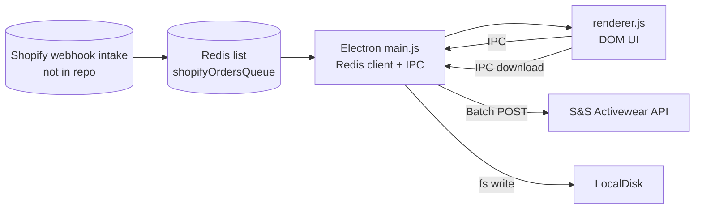
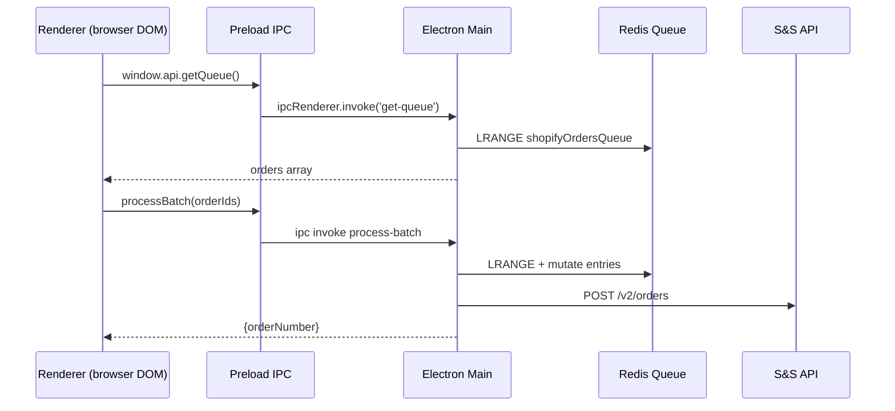

**Shopify Admin Embedding Brief**

**Current Architecture (as-found)**
- Electron main process loads `.env`, connects to Redis, and wires IPC handlers; renderer is a vanilla JS/HTML app (no bundler). No Express/webhook server code is present in this repo despite README claims.
- Packaging via `electron-builder`; `start` runs `electron .` (`package.json`).
- Redis queue key `shopifyOrdersQueue` is the single persistence surface; S&S API calls happen directly from the main process.

**Key Entry Points & Boot Sequence**
- Env + Redis init, IPC registration, BrowserWindow creation:  
  ```js
  // main.js:7-101
  let envPath = app.isPackaged ? path.join(process.resourcesPath, '.env') : path.join(__dirname, '.env');
  dotenv.config({ path: envPath });
  const redis = createClient({ url: process.env.REDIS_URL }); redis.connect();
  const win = new BrowserWindow({ width:1500, height:1000, webPreferences:{ preload: path.join(__dirname,'preload.js'), contextIsolation:true }});
  win.loadFile('index.html');
  ```
  - `BrowserWindow` uses `contextIsolation: true`; `nodeIntegration` not set (defaults to false). No `sandbox`, no CSP relaxation beyond inline styles allowed in `index.html`.
  - WebPreferences: no `nodeIntegration`, preload path set; no `devTools` restriction.

**Preload & IPC Surface**
- APIs exposed via `contextBridge` (`preload.js:4-24`): `getQueue`, `updateStatus`, `processBatch`, `updateReady`, `deleteOrder`, `setBundle`, `updateBundleStatus`, `addFile`, `removeFiles`, `updateNotes`, `updateName`, `updateProgress`, `downloadAsset`, plus sync `getAssetPath`.
- Renderer uses these IPC channels for all data mutations; no direct Node modules used in renderer.

**Renderer Data Flow & State**
- Renderer is plain DOM/JS (`renderer.js`), loading directly via `<script src="renderer.js">` (`index.html`).
- Initial fetch + board render: `allOrders = await window.api.getQueue();` (`renderer.js:1088`) then populates columns and bundle cards; drag/drop updates statuses via IPC (`renderer.js:1292-1294`).
- Batch submit path calls `window.api.processBatch(toOrder)` then marks orders `blanks` (`renderer.js:1330-1334`).
- Attachments modal uses `window.api.addFile/removeFiles` (IPC persists to Redis) and uses browser `FileReader` for uploads (`renderer.js:910-961`).
- Asset downloads call IPC `download-asset` to trigger `dialog.showSaveDialog` + fs write (`renderer.js:526-534` -> `main.js:260-286`).
- UI is otherwise web-safe (DOM, fetch, FileReader, drag/drop). Styling lives inline in `index.html` (no build step).

**IPC Handler Behaviors (backend-equivalent logic)**
- Queue fetch/normalize: `main.js:69-91` (`get-queue`) reads entire Redis list, patches missing fields, rewrites entries.
- Status updates and bundles: `update-status` (`main.js:93-105`), `update-bundle-status` (`108-117`), `set-bundle` (`137-147`), `update-ready` (`119-134`), etc. All mutate list entries by index.
- Attachments: `add-file` (`149-162`), `remove-files` (`164-177`) store files base64-encoded inside the Redis list entry itself.
- Batch submission: `process-batch` (`206-258`) aggregates SKUs from selected orders, fetches prices from S&S API, builds payload, posts order, and returns order number; does **not** dequeue items.

**Environment & Secrets Handling**
- `.env` is bundled into app resources for packaged builds (`main.js:7-21`; `package.json > build.extraResources`). Secrets (Redis URL, S&S creds) are loaded client-side inside Electron. In a web-hosted context this is not acceptable; secrets must move server-side.
- Renderer has no env awareness; depends entirely on IPC.

**Renderer Dependencies on Electron/Node**
- Electron-only: IPC usage (`window.api.*`), synchronous `getAssetPath` (for packaged asset paths), download via `dialog`/fs (`download-asset`), Redis mutations and S&S API calls via main process.
- Web-safe today: all DOM rendering, drag/drop, FileReader, fetch of remote asset URLs, modal logic, CSS animations.
- Missing for web: there is no HTTP layer; all data comes from IPC to Redis.

**Backend / Webhook Layer**
- No Express/webhook code is present. README references Shopify webhook intake and an Express API, but the repo lacks those endpoints and any signature/HMAC validation. Assume the webhook/worker lives elsewhere; for Shopify embedding you’ll need an HTTP API that fronts Redis and S&S.

**Build & Packaging**
- No bundler/tooling for renderer; runs raw JS/HTML. `electron-builder` config in `package.json` produces dmg/zip (mac) and nsis/zip (win); extraResources include `.env` and SVG assets.

**Shopify Compatibility Gaps**
- Electron/Node APIs unavailable inside Shopify Admin iframe or mobile WebView: no IPC, no Redis client, no filesystem dialogs, no direct S&S API with private keys.
- Shopify iframe blocks `file://` and local resources; must serve over HTTPS with proper CSP and X-Frame-Allow from your app domain via Shopify’s embed headers.
- Session/cookie constraints: Shopify Admin requires JWT session tokens (App Bridge / session token) instead of cookies; current app has no auth/session concept.
- Mobile Shopify app uses WebView with limited storage; avoid localStorage/session cookies for auth.

**Portability Assessment**
- Renderer UI is largely pure web and can render as a static SPA once data access is swapped from IPC→HTTP. Drag/drop, modals, FileReader uploads will work in browser/Shopify iframe.
- Must replace: IPC calls, Redis client in main, S&S API calls in main, dialog-based downloads, `getAssetPath`.
- Must add: Hosted HTTP API for queue operations + attachments + batch submission; Shopify session token validation; app embed chrome (App Bridge/Polaris or custom).
- Can keep: HTML/CSS/JS layout, component logic, drag/drop, asset rendering, FileReader upload flows (when backed by HTTP endpoints).

**Change Categories (grounded in files)**
- Remove (from web build): BrowserWindow creation (`main.js:202-211`), IPC handlers (`main.js:51-199,260-286`), dialog/fs download path (`main.js:260-286`), `.env` in client bundle.
- Replace: IPC calls in renderer (`renderer.js:231,526,735,793,910,961,984,1015,1065,1088,1217,1292-1294,1330-1363`) with fetch/Apollo/etc. to HTTPS API; `getAssetPath` usage with CDN/relative URLs.
- Move server-side: Redis interactions (`main.js:31-173`), S&S price fetch/order submission (`main.js:214-248`), attachment storage (base64 in Redis) to object storage + metadata in DB/Redis.
- Keep as-is: UI layout/styling (`index.html`), renderer state handling and drag/drop logic (browser-friendly), asset preview logic (uses fetch/Blob/FileReader).

**Mermaid: Current Runtime Flow (as found)**


**Mermaid: Renderer Interaction Sequence (today)**


**Shopify Embedded App Approach (recommended)**
- Host renderer as HTTPS SPA (could keep vanilla or adopt Vite/React if desired) served from your app domain with `Content-Security-Policy` allowing Shopify iframe; include Shopify App Bridge for iframe resize/nav.
- Backend (existing server) fronts Redis + S&S; expose authenticated routes for: list orders, update status/bundle/ready flags, add/remove attachments (store files in S3-like bucket), process batch (server-side S&S call), download asset (redirect or signed URL).
- Auth/session: use Shopify Admin embedded app pattern—OAuth install flow server-side; per-request session tokens from App Bridge in iframe; backend validates Shopify session JWT and maps to shop; no cookies required.
- Mobile compatibility: ensure responsive layout (currently desktop grid; will need media queries to stack columns).

**Order-Detail Preview Panel (Admin UI extension)**
- Implement Admin “Order details” action extension (UI extension) that requests a lightweight preview payload from backend (e.g., order status, counts, design thumbnails) and renders in Shopify’s Polaris UI; include CTA “Open Full Manager” linking to embedded app route with order id.
- Backend endpoint for preview should avoid Redis LRANGE of entire list; add lookup by order id.

**Migration Plan (minimal rewrite)**
- Phase 1: Extract data access to HTTP client  
  - Create thin REST client in renderer replacing `window.api.*` with fetch calls; feature flags to allow Electron IPC vs HTTP for parallel runs.  
  - Acceptance: renderer runs in browser hitting stubbed HTTP endpoints (can be json-server/local mock).
- Phase 2: Stand up API facade (server-side)  
  - Implement Express/Koa/Fastify service exposing current IPC operations over HTTPS; move Redis + S&S logic here; add Shopify session-token middleware; move attachment storage to object storage.  
  - Acceptance: Electron renderer (in dev) can point to HTTP API and still function; no secrets in client.
- Phase 3: Web packaging & hosting  
  - Serve `index.html`/`renderer.js` as static assets with adjusted CSP and asset URLs; ensure drag/drop/file upload works with API.  
  - Acceptance: app loads in normal browser, full workflow works via HTTP.
- Phase 4: Shopify embedding  
  - Add App Bridge initialization, token fetch, and authenticated API calls; add top-level route for embedded app; update styling for responsive admin; deploy behind Shopify app install with embedded=true.  
  - Acceptance: app loads inside Shopify Admin iframe with session token verified server-side.
- Phase 5: Order-detail preview extension  
  - Build extension UI with Polaris; backend preview endpoint; deep-link to embedded app with order id.  
  - Acceptance: preview renders on order page and opens manager.

**Risks & De-risking**
- Missing webhook code: verify/port existing Shopify webhook receiver; ensure HMAC verification and retry handling. Spike: build minimal `/webhooks/orders-paid` with HMAC check and push to Redis to confirm data shape matches renderer expectations.
- Data coupling to Redis LRANGE of full list (O(n)): may be slow/expensive in hosted context. Spike: create indexed lookups or move to DB.
- Attachments stored in Redis as base64 blobs: not scalable. Spike: proof-of-concept S3 upload + metadata link stored in Redis/DB.
- S&S API keys currently client-side: must move server-side and protect per-shop mapping.
- CSP/iframe issues: ensure hosted app sets `X-Frame-Options` and `Content-Security-Policy` compatible with Shopify; spike by hosting static build and loading via Shopify App Bridge Playground.

**Effort Estimate (relative)**
- HTTP API facade for existing IPC operations (Redis + S&S) – medium.
- Repoint renderer IPC calls to HTTP client and keep UI – medium.
- Attachment storage refactor to S3 + metadata – hard.
- Shopify OAuth/session token integration – medium.
- Responsive layout + embedded App Bridge chrome – medium.
- Order-detail preview extension – medium.
- Cleaning up secrets handling (.env not bundled client-side) – easy.
- Build/hosting pipeline for static SPA – easy.
