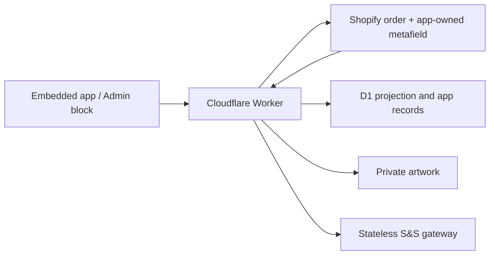

# Shopify-Primary Candidate Data Plane

## Use This When

- You are changing the Shopify-backed board, production metadata, D1, R2, webhooks, reconciliation, migration, or the Admin order block.
- You need to determine whether an operation belongs to the legacy Redis board or the isolated Shopify candidate.

## Skip This When

- You are changing only the legacy Redis queue or Electron IPC: read `ipc-and-storage.md`.
- You are changing only card layout: read `../workflows/order-ingestion-kanban.md`.

## Section Map

- [Current Release Boundary](#current-release-boundary)
- [Ownership](#ownership)
- [Canonical Production Metafield](#canonical-production-metafield)
- [D1 Schema](#d1-schema)
- [Board Reads](#board-reads)
- [Webhooks and Reconciliation](#webhooks-and-reconciliation)
- [Batches](#batches)
- [Assets and Migration](#assets-and-migration)
- [Environment Flags](#environment-flags)
- [Security Baseline and Remaining Hardening](#security-baseline-and-remaining-hardening)
- [Common Failure Modes & Recovery](#common-failure-modes--recovery)

## Current Release Boundary

Current production deployment on 2026-08-25:

- Worker version: `c21ae215-b7de-484c-915f-e0ad597509a8`
- Pages deployment: `f0c24982.print-mo-order-manager.pages.dev` (release marker `1787679222819`)
- Shopify app version: `designer-assets-idempotency-2026-07-23`
- Stateless supplier gateway commit: `d3a0d5a`

The production installation has approved the candidate write/all-orders scopes, and canonical Shopify-board/Admin-block writes are live for acceptance. Final cutover, live S&S enablement, and permanent Redis retirement remain owner-gated.

The application currently contains two deliberately isolated order sources:

| View | Purpose | Reads/writes |
|---|---|---|
| **Legacy Redis** | Existing production fallback during acceptance | Existing Render/Redis routes only |
| **Shopify board** | Redis-free candidate and future production path | Shopify metafield + D1 + R2 only |

Changing a stage, note, readiness flag, printed count, bundle, or archive state in the Shopify board or Admin block does **not** mutate `shopifyOrdersQueue` or a Redis v1 hash. Incoming paid-order webhooks may still be forwarded to the legacy ingestion route while `LEGACY_INGEST_ENABLED=1`; that bridge preserves the old board before cutover and is not used by candidate reads or edits.

## Ownership

- Shopify owns commerce facts.
- `$app:printmo.production_state_v1` is the only writable per-order production record.
- D1 `order_projection` is a rebuildable board index, not a second order record.
- D1 owns mutation requests, audit events, webhook receipts, reconciliation checkpoints, batches, supplier attempts, asset manifests, and migration ledgers.
- R2 owns private asset bytes.
- The Render service exposes a candidate S&S endpoint that accepts validated aggregate lines and never reads Redis.

## Canonical Production Metafield

The JSON metafield contains:

- `schemaVersion`, monotonic `revision`, and `lastMutationId`;
- `stage`;
- `readiness.blanksOrdered`, `readiness.blanksReady`, `readiness.printsOrdered`, and `readiness.printsReady`;
- `printedCount`, `bundleId`, `batchRefs`, and `internalNotes`;
- attention/archive fields and actor/timestamps.

Allowed stages are `received`, `to_order`, `blanks_cart`, `blanks_ordered`, `print`, and `completed`.
The Admin order block presents five operator-facing stages by grouping
`blanks_cart` and `blanks_ordered` under **Blanks** with a required substage.
Its production DTO also returns a read-only `garmentCount`, calculated from all
paginated current line-item quantities that have a supplier SKU after excluding
known print-service lines. The Worker rejects `printedCount` values above that
current garment total. `PrintMOProductionState` must request `sku` on its first
50 line items as well as on pagination; omitting it makes valid first-page
garments indistinguishable from non-supplier lines and falsely reduces the cap.

`completed` means manufacturing is finished, not that pickup or delivery has
finished. The Ready to Print workspace renders `print` under **To Print** and
`completed` under **Printed**. A completed order remains active in Printed,
including when Shopify reports it fulfilled, until an operator marks customer
handoff complete. That action server-stamps `archivedAt` and
`archivedBy`; only archive state removes the order from the active projection.
Reopening clears both archive fields.

Every client mutation supplies an expected revision and idempotency key. Keys use only the Worker-accepted `[A-Za-z0-9._:-]` character set and are generated independently of Shopify GIDs; a GID contains `/` separators and must never be embedded in a fallback key. The Worker records the request in D1, reads the metafield digest, calls Shopify `metafieldsSet` with `compareDigest`, and then commits the D1 projection/audit result. If Shopify commits before D1 finalization, `lastMutationId` lets a retry repair D1. A concurrent edit returns `409 VERSION_CONFLICT`.

## D1 Schema

Migration `order-manager-proxy/migrations/0001_redis_free.sql` creates:

- `shops`
- `order_projection`
- `mutation_requests`
- `production_events`
- `webhook_receipts`
- `reconciliation_checkpoints`
- `batches`
- `batch_orders`
- `supplier_attempts`
- `asset_manifests`
- `migration_ledger`

Migration `0002_designer_asset_metadata.sql` adds line-item, design-reference, role, and side metadata to `asset_manifests`. These fields let the shared renderer place private Designer Studio mockups and print files without exposing R2 object keys.

Migration `0003_asset_blob_links.sql` separates stored private blobs from their Shopify line-item associations. `asset_manifests` now identifies checksum-verified bytes, while `asset_manifest_links` can associate one blob with several sizes or repeated line items. The migration coalesces active same-order manifests with identical SHA-256, byte size, and content type; it does not delete the superseded R2 objects.

The Worker binding is `ORDER_DB`. The production database is `printmo-order-manager`.

## Board Reads

`GET /order-manager/v1/orders` enumerates D1 projection rows in pages of at most 50. On a new or rebuilt database, the per-shop Durable Object performs one bounded read-only bootstrap of up to 50 recent paid/open Shopify orders, reads any existing canonical metafields, refreshes summaries in `nodes` chunks, and records a `bootstrap` checkpoint. Until that Shopify read succeeds, the endpoint returns `BOARD_NOT_INITIALIZED` instead of presenting an authoritative empty board. Once initialized, ordinary board reads return the existing D1 projection immediately and schedule stale commerce-summary refreshes through the coordinator in the request background. An explicit `refresh=1` request still waits for the refresh and returns the newly reprojected page.

`GET /order-manager/v1/orders/:gid` loads rich Shopify detail on demand and merges it with the canonical production metafield and D1 asset manifests.

`order-manager-web/web-shim.js` maps the candidate DTO into the existing board renderer. Source-aware mutation methods route only the Shopify view to canonical endpoints; the legacy branch retains its existing URLs and payloads. The shared renderer is the sole browser owner of queue reads and exposes a shallow, read-only board snapshot for drag metadata and other presentation-only consumers. Candidate queue loads are generation-guarded, cached private preview URLs are preserved between polls, and the shared renderer discards superseded responses and repaints only columns whose render-relevant order data changed.

Summary identity uses the fulfillment recipient from shipping name, then billing name, falling back to `Name unavailable` when neither is returned. The routine board query intentionally avoids the protected `customer` relation and the product-gated `variant` relation; rich detail uses its separately approved direct Order fields. Candidate detail commerce includes exact Shopify subtotal, discount, and total values from `currentSubtotalPriceSet`, `currentTotalDiscountsSet`, and `currentTotalPriceSet`. A manual **Refresh Shopify** request bypasses the 60-second summary TTL for the currently paged projection so newly returned identity fields can be reprojected immediately.

Candidate mutations are serialized per order in the browser. A board move sends one canonical patch containing the resulting stage (including `blanks_cart` versus `blanks_ordered`) and its paired `blanksOrdered` readiness value, rather than separate status/readiness requests. The Worker enforces the same pairing for both Blanks substages. The UI applies the move optimistically, then rolls it back only if the canonical write fails. On `409 VERSION_CONFLICT`, the Worker returns the current revision and production state under `error.details`; the client adopts that state, treats an already-satisfied patch as success, or retries once with the current revision. It never retries indefinitely or overwrites a newer edit blindly.

## Webhooks and Reconciliation

- HMAC is verified against the raw body before JSON parsing.
- Shopify delivery IDs are deduplicated in D1.
- `orders/paid` enrolls the order by creating the canonical metafield when absent, unless the payload is already fulfilled, cancelled, or closed.
- `orders/updated` also enrolls only when its verified payload is exactly paid and remains unfulfilled, non-cancelled, and open. This is a liveness fallback for installations where the dedicated paid subscription is missing; refunded, fulfilled, cancelled, and closed historical updates never create a new active candidate. The app release should still keep both webhook subscriptions installed.
- Webhooks mark projections stale and schedule a coalesced refresh.
- Five-minute reconciliation uses an overlap window and a D1 checkpoint.
- Successful incremental reconciliation closes stale `received` paid/update receipts after ten minutes and records `RECONCILED_BY_INCREMENTAL` for auditability.
- Nightly integrity checks stuck mutations, projection errors, and confirmed batches whose Shopify state needs repair.

## Batches

`POST /order-manager/v1/batches/commit`:

1. validates selected active projections and their stages;
2. aggregates non-print line items with a supplier SKU;
3. stores a D1 `prepared` batch and selected order revisions;
4. makes the single allowed transition to `submitting`;
5. calls `/order-manager/v1/supplier/ss/commit` on the stateless Render gateway;
6. records `confirmed` or `unknown`;
7. advances Shopify production state only after supplier confirmation.

An ambiguous supplier result becomes `unknown` and cannot be blindly retried. Nightly reconciliation repairs post-confirmation Shopify metadata if the supplier succeeded but a subsequent metadata write failed.

The separate `/order-manager/blanks-batches` compatibility surface records manual receiving manifests in the private `PREVIEWS` R2 binding. New records carry immutable Shopify order GIDs with name fallback for older manifests. The Worker enforces one active receiving-manifest membership per order: create rejects duplicates, while `assign-orders` can add an unbatched order or remove it from another manifest and place it in the selected target. Transfer preserves attributable received quantity, recalculates oldest-first allocation, and removes an emptied source from the active index. This R2 compatibility path does not replace the D1 supplier-batch state machine; normalized D1 receiving entities remain the target for fully transactional receiving history.

## Assets and Migration

The migration bridge is available only while `MIGRATION_UPSTREAM_ENABLED=1`. It may read the immutable legacy source, but writes canonical production state to Shopify, manifests/ledgers to D1, and bytes to private R2. R2 uploads are read back and SHA-256 verified before a manifest becomes active.

Shopify summary reads retain the Designer Studio line-item properties `_designref`/`_design_ref` and `design_preview_url`/`design-preview-url`. Reconciliation converts only valid HTTPS `previews/YYYY-MM-DD/<designRef>/<file>` paths into asset candidates. It does not fetch the supplied hostname, so a line-item property cannot become an SSRF target. The Worker resolves bytes through the bound `PREVIEWS` bucket:

1. try the original `previews/...` object key;
2. if Designer Studio already promoted the purchase, try the privacy-safe exact key `orders/<orderNumber>/<designRef>/<file>`, then retain the bounded `orders/<orderNumber>_.../<designRef>/<file>` scan only for legacy objects;
3. copy the object into `R2_BUCKET` under a deterministic private key;
4. read it back and require the same SHA-256 before activating the D1 manifest.

The first release runs a bounded active-order backfill of at most 50 orders and records the `designer-studio-assets-v1` reconciliation checkpoint only when every discovered candidate resolves. An incomplete run leaves no completion checkpoint and retries from the board background task or five-minute cron. Normal future summary/webhook refreshes use the same deterministic import path. Candidate generation is per Shopify line item, not per unit quantity; identical bytes within an order reuse one manifest and add line-item links instead of another R2 copy.

Authenticated operators can attach an order-level print design through `POST /order-manager/v1/orders/:gid/assets` when a Shopify order has no Designer Studio artwork, including manual-invoice orders. The multipart request requires a Front, Back, or Extras placement and accepts SVG, PNG, JPEG, or WebP up to 50 MB. The Worker verifies the Shopify order, computes SHA-256, reuses identical active bytes within that order when possible, writes new bytes to private `R2_BUCKET`, reads them back, verifies the checksum, and records a D1 `role = 'design'` link marked as a manual upload. This does not add a Shopify metafield or expose an R2 key to the browser. `DELETE /order-manager/v1/assets/:assetId?side=...` removes only a manual-upload association; Designer Studio links are source-managed and cannot be deleted by that route. An unreferenced manifest is retired to `deleted`, while its private bytes remain recoverable for later audited cleanup.

Production backfill evidence on 2026-07-23: 12 active orders scanned, 12 candidates resolved, 12 active `designer-studio-sync` manifests, zero failures, checkpoint `2026-07-24T03:28:53.220Z` (UTC).

Board DTOs include at most one representative asset per order and never private object keys. On the initial Shopify-board load, `web-shim.js` maps and publishes each 50-order page as soon as it arrives; the shared renderer paints the first page immediately and merges later pages while their requests continue. Presentation helpers consume the renderer's current snapshot rather than starting competing queue requests, so a metadata read cannot cancel the initial paint. Existing cards remain visible during later polling or manual refreshes, so a partial refresh response never temporarily removes later-page orders. Private preview hydration starts only after a page's cards are usable, reuses the fresh queue bearer for batch-ticket requests, and requests signed 60-second URLs without placing ticket or image work on the queue promise. As each URL resolves, the shared renderer patches the matching card's reserved mockup slot directly. Mockup slots retain the stable opaque asset ID, while render fingerprints exclude the expiring signed URL; ticket rotation for the same healthy image therefore preserves the existing element and source instead of rebuilding or visibly reloading it. Missing, changed, or failed images still receive a fresh source. Neither later queue pages nor the periodic board poll is a preview-rendering dependency. Image elements stream private responses without buffering every full file into JavaScript blobs. Ticket payloads contain only opaque manifest IDs; the read route resolves R2 keys server-side after signature verification. On mobile, only the active workflow tab is hydrated, and selecting another tab triggers its deferred previews. Opening an order loads the complete linked asset set on demand, with requests deduplicated by asset ID and signed URLs held in a bounded, expiry-aware cache. Artwork latency therefore cannot block the operational board or make hidden-stage/design files part of initial mobile hydration. Asset role, side, line-item ID, and filename—not a public URL shape—drive mockup/design placement.

Aggregate timing diagnostics are off by default and retain no order or customer identifiers. In the embedded app frame's browser console, run `window.orderManagerPerformanceDebug.enable()` and reload to log queue-page readiness, board snapshot paint/read counts, drag-metadata refreshes, preview-source attachment/preservation, and image-load dimensions or failures. Run `window.orderManagerPerformanceDebug.disable()` to remove the local browser flag.

## Environment Flags

| Variable | Pre-cutover | After cutover |
|---|---:|---:|
| `LEGACY_INGEST_ENABLED` | `1` | remove or `0` |
| `MIGRATION_UPSTREAM_ENABLED` | `1` only during migration | remove or `0` |
| `SS_TEST_ORDER` | `1` | `0` only after explicit production approval |

These are server-side Worker variables. Credentials remain secrets and never enter browser code.

## Security Baseline and Remaining Hardening

Active controls include signed Shopify/OIDC bearer validation, configured-shop and partner-user allowlists, raw-body webhook HMAC verification, webhook deduplication, prepared D1 statements, allowlisted production patches, Shopify compare-digest concurrency, mutation idempotency, private R2 storage, format/size validation and checksum readback for manual design uploads, short-lived authenticated asset tickets, SVG sandboxing on private reads, and server-only infrastructure credentials.

Before final cutover, complete these defense-in-depth items:

- replace broad Pages suffix CORS with exact deployed origins;
- deliver a response-header CSP with Shopify-specific `frame-ancestors`, then remove broad `https:` and `'unsafe-inline'` script allowances where practical;
- enforce per-identity/per-route request limits at the Worker and supplier gateway;
- use dedicated, rotatable cursor/asset-ticket signing secrets and constant-time verification;
- alert on authentication spikes, Worker/D1 failures, failed webhook receipts, `SYNC_PENDING` mutations, projection errors, and `unknown` supplier batches;
- disable the migration and legacy-ingestion bridges immediately after their approved windows.

These remaining items are cutover gates, not claims about current shipped behavior.

## Common Failure Modes & Recovery

| Failure | Boundary violated | Recovery |
|---|---|---|
| Candidate production edit changes Redis | Legacy and candidate mutation paths were coupled | Stop, restore source-aware routing, and run Phase 2 verification. |
| D1 projection is treated as canonical order state | Projection/authority distinction was lost | Rebuild from Shopify commerce and the canonical production metafield. |
| Failed bootstrap renders an empty board | `BOARD_NOT_INITIALIZED` was suppressed | Preserve the last usable board and surface the structured error. |
| Ambiguous supplier result is resent | `unknown` was treated as retryable | Reconcile the supplier result; never blindly resubmit. |
| Private asset key or URL reaches the browser | Manifest/ticket boundary was bypassed | Return manifest metadata only and require a short-lived authenticated ticket. |
