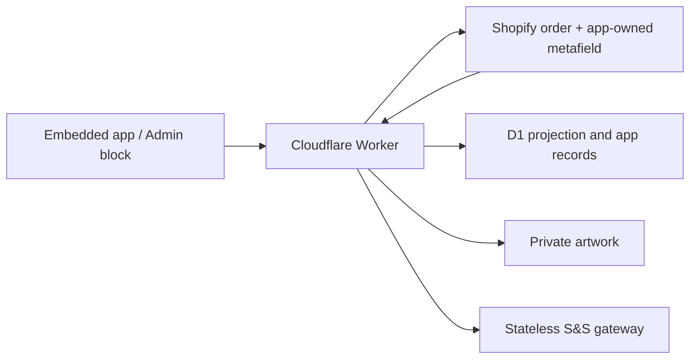

# Shopify-Primary Candidate Data Plane

## Use This When

- You are changing the Shopify-backed board, production metadata, D1, R2, webhooks, reconciliation, migration, or the Admin order block.
- You need to determine whether an operation belongs to the legacy Redis board or the isolated Shopify candidate.

## Skip This When

- You are changing only the legacy Redis queue or Electron IPC: read `ipc-and-storage.md`.
- You are changing only card layout: read `../workflows/order-ingestion-kanban.md`.

## Current Release Boundary

Candidate deployment on 2026-07-23:

- Worker version: `c7622432-0a5b-4071-a8be-cb10014dd0f5`
- Pages deployment: `4b211eb8.print-mo-order-manager.pages.dev`
- Shopify app version: `task3-shopify-primary-2026-07-23`
- Stateless supplier gateway commit: `420ff72`

The Shopify app version is released, but canonical writes/migration remain gated until the production installation approves the added scopes.

The application currently contains two deliberately isolated order sources:

| View | Purpose | Reads/writes |
|---|---|---|
| **Legacy Redis** | Existing production fallback during acceptance | Existing Render/Redis routes only |
| **Shopify board** | Redis-free candidate and future production path | Shopify metafield + D1 + R2 only |

Changing a stage, note, readiness flag, printed count, bundle, or archive state in the Shopify board or Admin block does **not** mutate `shopifyOrdersQueue` or a Redis v1 hash. Incoming paid-order webhooks may still be forwarded to the legacy ingestion route while `LEGACY_INGEST_ENABLED=1`; that bridge preserves the old board before cutover and is not used by candidate reads or edits.

## Ownership

- Shopify owns commerce facts.
- `$app:printmo.production_state_v1` is the only writable per-order production record.
- D1 `order_projection` is a rebuildable board index, not a second order record.
- D1 owns mutation requests, audit events, webhook receipts, reconciliation checkpoints, batches, supplier attempts, asset manifests, and migration ledgers.
- R2 owns private asset bytes.
- The Render service exposes a candidate S&S endpoint that accepts validated aggregate lines and never reads Redis.

## Canonical Production Metafield

The JSON metafield contains:

- `schemaVersion`, monotonic `revision`, and `lastMutationId`;
- `stage`;
- `readiness.blanksReady`, `readiness.printsOrdered`, and `readiness.printsReady`;
- `printedCount`, `bundleId`, `batchRefs`, and `internalNotes`;
- attention/archive fields and actor/timestamps.

Allowed stages are `received`, `to_order`, `blanks_cart`, `blanks_ordered`, `print`, and `completed`.

Every client mutation supplies an expected revision and idempotency key. The Worker records the request in D1, reads the metafield digest, calls Shopify `metafieldsSet` with `compareDigest`, and then commits the D1 projection/audit result. If Shopify commits before D1 finalization, `lastMutationId` lets a retry repair D1. A concurrent edit returns `409 VERSION_CONFLICT`.

## D1 Schema

Migration `order-manager-proxy/migrations/0001_redis_free.sql` creates:

- `shops`
- `order_projection`
- `mutation_requests`
- `production_events`
- `webhook_receipts`
- `reconciliation_checkpoints`
- `batches`
- `batch_orders`
- `supplier_attempts`
- `asset_manifests`
- `migration_ledger`

The Worker binding is `ORDER_DB`. The production database is `printmo-order-manager`.

## Board Reads

`GET /order-manager/v1/orders` enumerates D1 projection rows in pages of at most 50. On a new or rebuilt database, the per-shop Durable Object performs one bounded read-only bootstrap of up to 50 recent paid/open Shopify orders, reads any existing canonical metafields, refreshes summaries in `nodes` chunks, and records a `bootstrap` checkpoint. Until that Shopify read succeeds, the endpoint returns `BOARD_NOT_INITIALIZED` instead of presenting an authoritative empty board. Stale commerce summaries then refresh through the same coordinator.

`GET /order-manager/v1/orders/:gid` loads rich Shopify detail on demand and merges it with the canonical production metafield and D1 asset manifests.

`order-manager-web/web-shim.js` maps the candidate DTO into the existing board renderer. Source-aware mutation methods route only the Shopify view to canonical endpoints; the legacy branch retains its existing URLs and payloads.

## Webhooks and Reconciliation

- HMAC is verified against the raw body before JSON parsing.
- Shopify delivery IDs are deduplicated in D1.
- `orders/paid` enrolls the order by creating the canonical metafield when absent.
- Webhooks mark projections stale and schedule a coalesced refresh.
- Five-minute reconciliation uses an overlap window and a D1 checkpoint.
- Nightly integrity checks stuck mutations, projection errors, and confirmed batches whose Shopify state needs repair.

## Batches

`POST /order-manager/v1/batches/commit`:

1. validates selected active projections and their stages;
2. aggregates non-print garment SKUs;
3. stores a D1 `prepared` batch and selected order revisions;
4. makes the single allowed transition to `submitting`;
5. calls `/order-manager/v1/supplier/ss/commit` on the stateless Render gateway;
6. records `confirmed` or `unknown`;
7. advances Shopify production state only after supplier confirmation.

An ambiguous supplier result becomes `unknown` and cannot be blindly retried. Nightly reconciliation repairs post-confirmation Shopify metadata if the supplier succeeded but a subsequent metadata write failed.

## Assets and Migration

The migration bridge is available only while `MIGRATION_UPSTREAM_ENABLED=1`. It may read the immutable legacy source, but writes canonical production state to Shopify, manifests/ledgers to D1, and bytes to private R2. R2 uploads are read back and SHA-256 verified before a manifest becomes active.

Asset reads resolve the manifest from D1 and issue a signed 60-second ticket. R2 object keys are not returned in the ticket response.

## Environment Flags

| Variable | Pre-cutover | After cutover |
|---|---:|---:|
| `LEGACY_INGEST_ENABLED` | `1` | remove or `0` |
| `MIGRATION_UPSTREAM_ENABLED` | `1` only during migration | remove or `0` |
| `SS_TEST_ORDER` | `1` | `0` only after explicit production approval |

These are server-side Worker variables. Credentials remain secrets and never enter browser code.

## Security Baseline and Remaining Hardening

Active controls include signed Shopify/OIDC bearer validation, configured-shop and partner-user allowlists, raw-body webhook HMAC verification, webhook deduplication, prepared D1 statements, allowlisted production patches, Shopify compare-digest concurrency, mutation idempotency, private R2 storage, short-lived authenticated asset tickets, and server-only infrastructure credentials.

Before final cutover, complete these defense-in-depth items:

- replace broad Pages suffix CORS with exact deployed origins;
- deliver a response-header CSP with Shopify-specific `frame-ancestors`, then remove broad `https:` and `'unsafe-inline'` script allowances where practical;
- enforce per-identity/per-route request limits at the Worker and supplier gateway;
- use dedicated, rotatable cursor/asset-ticket signing secrets and constant-time verification;
- alert on authentication spikes, Worker/D1 failures, failed webhook receipts, `SYNC_PENDING` mutations, projection errors, and `unknown` supplier batches;
- disable the migration and legacy-ingestion bridges immediately after their approved windows.

These remaining items are cutover gates, not claims about current shipped behavior.
