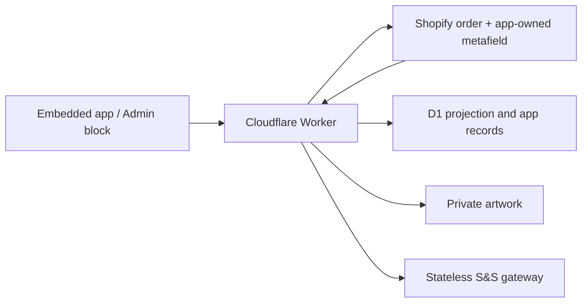

# Shopify-Primary Candidate Data Plane

## Use This When

- You are changing the Shopify-backed board, production metadata, D1, R2, webhooks, reconciliation, migration, or the Admin order block.
- You need to determine whether an operation belongs to the legacy Redis board or the isolated Shopify candidate.

## Skip This When

- You are changing only the legacy Redis queue or Electron IPC: read `ipc-and-storage.md`.
- You are changing only card layout: read `../workflows/order-ingestion-kanban.md`.

## Section Map

- [Current Release Boundary](#current-release-boundary)
- [Ownership](#ownership)
- [Canonical Production Metafield](#canonical-production-metafield)
- [D1 Schema](#d1-schema)
- [Board Reads](#board-reads)
- [Webhooks and Reconciliation](#webhooks-and-reconciliation)
- [Batches](#batches)
- [Assets and Migration](#assets-and-migration)
- [Environment Flags](#environment-flags)
- [Security Baseline and Remaining Hardening](#security-baseline-and-remaining-hardening)
- [Common Failure Modes & Recovery](#common-failure-modes--recovery)

## Current Release Boundary

Candidate deployment on 2026-07-25:

- Worker version: `bbcaa359-2cc9-4115-b612-c58f950c0cf6`
- Pages deployment: `177d9bb7.print-mo-order-manager.pages.dev`
- Shopify app version: `designer-assets-idempotency-2026-07-23`
- Stateless supplier gateway commit: `420ff72`

The production installation has approved the candidate write/all-orders scopes, and canonical Shopify-board/Admin-block writes are live for acceptance. Final cutover, live S&S enablement, and permanent Redis retirement remain owner-gated.

The application currently contains two deliberately isolated order sources:

| View | Purpose | Reads/writes |
|---|---|---|
| **Legacy Redis** | Existing production fallback during acceptance | Existing Render/Redis routes only |
| **Shopify board** | Redis-free candidate and future production path | Shopify metafield + D1 + R2 only |

Changing a stage, note, readiness flag, printed count, bundle, or archive state in the Shopify board or Admin block does **not** mutate `shopifyOrdersQueue` or a Redis v1 hash. Incoming paid-order webhooks may still be forwarded to the legacy ingestion route while `LEGACY_INGEST_ENABLED=1`; that bridge preserves the old board before cutover and is not used by candidate reads or edits.

## Ownership

- Shopify owns commerce facts.
- `$app:printmo.production_state_v1` is the only writable per-order production record.
- D1 `order_projection` is a rebuildable board index, not a second order record.
- D1 owns mutation requests, audit events, webhook receipts, reconciliation checkpoints, batches, supplier attempts, asset manifests, and migration ledgers.
- R2 owns private asset bytes.
- The Render service exposes a candidate S&S endpoint that accepts validated aggregate lines and never reads Redis.

## Canonical Production Metafield

The JSON metafield contains:

- `schemaVersion`, monotonic `revision`, and `lastMutationId`;
- `stage`;
- `readiness.blanksOrdered`, `readiness.blanksReady`, `readiness.printsOrdered`, and `readiness.printsReady`;
- `printedCount`, `bundleId`, `batchRefs`, and `internalNotes`;
- attention/archive fields and actor/timestamps.

Allowed stages are `received`, `to_order`, `blanks_cart`, `blanks_ordered`, `print`, and `completed`.

Every client mutation supplies an expected revision and idempotency key. Keys use only the Worker-accepted `[A-Za-z0-9._:-]` character set and are generated independently of Shopify GIDs; a GID contains `/` separators and must never be embedded in a fallback key. The Worker records the request in D1, reads the metafield digest, calls Shopify `metafieldsSet` with `compareDigest`, and then commits the D1 projection/audit result. If Shopify commits before D1 finalization, `lastMutationId` lets a retry repair D1. A concurrent edit returns `409 VERSION_CONFLICT`.

## D1 Schema

Migration `order-manager-proxy/migrations/0001_redis_free.sql` creates:

- `shops`
- `order_projection`
- `mutation_requests`
- `production_events`
- `webhook_receipts`
- `reconciliation_checkpoints`
- `batches`
- `batch_orders`
- `supplier_attempts`
- `asset_manifests`
- `migration_ledger`

Migration `0002_designer_asset_metadata.sql` adds line-item, design-reference, role, and side metadata to `asset_manifests`. These fields let the shared renderer place private Designer Studio mockups and print files without exposing R2 object keys.

The Worker binding is `ORDER_DB`. The production database is `printmo-order-manager`.

## Board Reads

`GET /order-manager/v1/orders` enumerates D1 projection rows in pages of at most 50. On a new or rebuilt database, the per-shop Durable Object performs one bounded read-only bootstrap of up to 50 recent paid/open Shopify orders, reads any existing canonical metafields, refreshes summaries in `nodes` chunks, and records a `bootstrap` checkpoint. Until that Shopify read succeeds, the endpoint returns `BOARD_NOT_INITIALIZED` instead of presenting an authoritative empty board. Once initialized, ordinary board reads return the existing D1 projection immediately and schedule stale commerce-summary refreshes through the coordinator in the request background. An explicit `refresh=1` request still waits for the refresh and returns the newly reprojected page.

`GET /order-manager/v1/orders/:gid` loads rich Shopify detail on demand and merges it with the canonical production metafield and D1 asset manifests.

`order-manager-web/web-shim.js` maps the candidate DTO into the existing board renderer. Source-aware mutation methods route only the Shopify view to canonical endpoints; the legacy branch retains its existing URLs and payloads. Candidate queue loads are generation-guarded, cached private preview URLs are preserved between polls, and the shared renderer discards superseded responses and repaints only columns whose render-relevant order data changed.

Summary identity uses explicit customer first/last name, then shipping name, then billing name, falling back to `Name unavailable` when none of those fields are returned. Candidate detail commerce includes exact Shopify subtotal, discount, and total values from `currentSubtotalPriceSet`, `currentTotalDiscountsSet`, and `currentTotalPriceSet`. A manual **Refresh Shopify** request bypasses the 60-second summary TTL for the currently paged projection so newly returned identity fields can be reprojected immediately.

Candidate mutations are serialized per order in the browser. A board move sends one canonical patch containing the resulting stage (including `blanks_cart` versus `blanks_ordered`), rather than separate status/readiness requests. The UI applies the move optimistically, then rolls it back only if the canonical write fails. On `409 VERSION_CONFLICT`, the Worker returns the current revision and production state under `error.details`; the client adopts that state, treats an already-satisfied patch as success, or retries once with the current revision. It never retries indefinitely or overwrites a newer edit blindly.

## Webhooks and Reconciliation

- HMAC is verified against the raw body before JSON parsing.
- Shopify delivery IDs are deduplicated in D1.
- `orders/paid` enrolls the order by creating the canonical metafield when absent.
- Webhooks mark projections stale and schedule a coalesced refresh.
- Five-minute reconciliation uses an overlap window and a D1 checkpoint.
- Nightly integrity checks stuck mutations, projection errors, and confirmed batches whose Shopify state needs repair.

## Batches

`POST /order-manager/v1/batches/commit`:

1. validates selected active projections and their stages;
2. aggregates non-print garment SKUs;
3. stores a D1 `prepared` batch and selected order revisions;
4. makes the single allowed transition to `submitting`;
5. calls `/order-manager/v1/supplier/ss/commit` on the stateless Render gateway;
6. records `confirmed` or `unknown`;
7. advances Shopify production state only after supplier confirmation.

An ambiguous supplier result becomes `unknown` and cannot be blindly retried. Nightly reconciliation repairs post-confirmation Shopify metadata if the supplier succeeded but a subsequent metadata write failed.

## Assets and Migration

The migration bridge is available only while `MIGRATION_UPSTREAM_ENABLED=1`. It may read the immutable legacy source, but writes canonical production state to Shopify, manifests/ledgers to D1, and bytes to private R2. R2 uploads are read back and SHA-256 verified before a manifest becomes active.

Shopify summary reads retain the Designer Studio line-item properties `_designref`/`_design_ref` and `design_preview_url`/`design-preview-url`. Reconciliation converts only valid HTTPS `previews/YYYY-MM-DD/<designRef>/<file>` paths into asset candidates. It does not fetch the supplied hostname, so a line-item property cannot become an SSRF target. The Worker resolves bytes through the bound `PREVIEWS` bucket:

1. try the original `previews/...` object key;
2. if Designer Studio already promoted the purchase, search the bounded `orders/<orderNumber>_.../<designRef>/<file>` prefix/suffix;
3. copy the object into `R2_BUCKET` under a deterministic private key;
4. read it back and require the same SHA-256 before activating the D1 manifest.

The first release runs a bounded active-order backfill of at most 50 orders and records the `designer-studio-assets-v1` reconciliation checkpoint only when every discovered candidate resolves. An incomplete run leaves no completion checkpoint and retries from the board background task or five-minute cron. Normal future summary/webhook refreshes use the same deterministic import path, so retries do not duplicate manifests.

Production backfill evidence on 2026-07-23: 12 active orders scanned, 12 candidates resolved, 12 active `designer-studio-sync` manifests, zero failures, checkpoint `2026-07-24T03:28:53.220Z` (UTC).

Board DTOs include manifest metadata but never private object keys. `web-shim.js` renders commerce/production cards first, then exchanges manifest IDs for signed 60-second tickets in the background and repaints affected columns when private previews are ready. Artwork latency therefore cannot block the operational board. Asset role, side, line-item ID, and filename—not a public URL shape—drive mockup/design placement.

## Environment Flags

| Variable | Pre-cutover | After cutover |
|---|---:|---:|
| `LEGACY_INGEST_ENABLED` | `1` | remove or `0` |
| `MIGRATION_UPSTREAM_ENABLED` | `1` only during migration | remove or `0` |
| `SS_TEST_ORDER` | `1` | `0` only after explicit production approval |

These are server-side Worker variables. Credentials remain secrets and never enter browser code.

## Security Baseline and Remaining Hardening

Active controls include signed Shopify/OIDC bearer validation, configured-shop and partner-user allowlists, raw-body webhook HMAC verification, webhook deduplication, prepared D1 statements, allowlisted production patches, Shopify compare-digest concurrency, mutation idempotency, private R2 storage, short-lived authenticated asset tickets, and server-only infrastructure credentials.

Before final cutover, complete these defense-in-depth items:

- replace broad Pages suffix CORS with exact deployed origins;
- deliver a response-header CSP with Shopify-specific `frame-ancestors`, then remove broad `https:` and `'unsafe-inline'` script allowances where practical;
- enforce per-identity/per-route request limits at the Worker and supplier gateway;
- use dedicated, rotatable cursor/asset-ticket signing secrets and constant-time verification;
- alert on authentication spikes, Worker/D1 failures, failed webhook receipts, `SYNC_PENDING` mutations, projection errors, and `unknown` supplier batches;
- disable the migration and legacy-ingestion bridges immediately after their approved windows.

These remaining items are cutover gates, not claims about current shipped behavior.

## Common Failure Modes & Recovery

| Failure | Boundary violated | Recovery |
|---|---|---|
| Candidate production edit changes Redis | Legacy and candidate mutation paths were coupled | Stop, restore source-aware routing, and run Phase 2 verification. |
| D1 projection is treated as canonical order state | Projection/authority distinction was lost | Rebuild from Shopify commerce and the canonical production metafield. |
| Failed bootstrap renders an empty board | `BOARD_NOT_INITIALIZED` was suppressed | Preserve the last usable board and surface the structured error. |
| Ambiguous supplier result is resent | `unknown` was treated as retryable | Reconcile the supplier result; never blindly resubmit. |
| Private asset key or URL reaches the browser | Manifest/ticket boundary was bypassed | Return manifest metadata only and require a short-lived authenticated ticket. |
