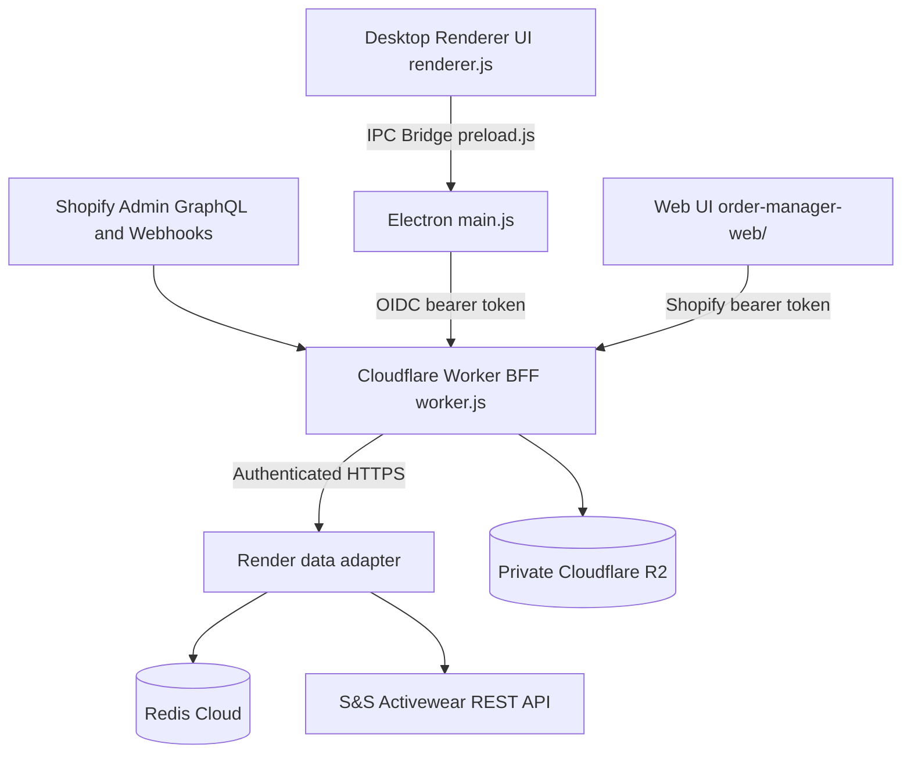

# System Overview Architecture

## Use This When
- You need a high-level conceptual understanding of the PrintMO Order Management architecture.
- You are evaluating the boundaries between the Electron desktop app, Web/Shopify Admin client, Redis queue layer, and Cloudflare proxy.

## Skip This When
- You are debugging specific IPC handler calls or Redis list mutations $\rightarrow$ read [architecture/ipc-and-storage.md](file:///e:/PrintMO/PrintMO-Order-Management/docs/official-docs/architecture/ipc-and-storage.md).
- You are looking for S&S Activewear API schemas or webhook HMAC logic $\rightarrow$ read [architecture/external-apis.md](file:///e:/PrintMO/PrintMO-Order-Management/docs/official-docs/architecture/external-apis.md).

## Section Map
- [1. High-Level System Architecture](#1-high-level-system-architecture)
- [2. Execution Environments](#2-execution-environments)
- [3. Key System Invariants](#3-key-system-invariants)
- [Common Failure Modes & Recovery](#common-failure-modes--recovery)

---

## 1. High-Level System Architecture

PrintMO Order Management is designed as a hybrid desktop and web operational platform that manages Shopify order fulfillment and S&S Activewear blank-apparel batch purchasing.

---

## 2. Execution Environments

### A. Electron Desktop Runtime
- **Entry point**: `main.js` (Node.js runtime).
- **Security model**: `contextIsolation: true`, `nodeIntegration: false`. Preload script `preload.js` exposes IPC methods via `window.api`.
- **Primary Responsibility**: Manages local app windows, token custody, and the IPC bridge. It calls the authenticated Worker API and has no direct Redis or S&S connection.

### B. Web / Shopify Admin Runtime (`order-manager-web/`)
- **Entry point**: `index.html` within `order-manager-web/`.
- **Target**: Embedded within Shopify Admin iframe or standalone web browsers.
- **Data abstraction**: Uses `web-shim.js` and `storage-browser.js` to simulate IPC methods, delegating data calls to local storage or Cloudflare proxy.

### C. Cloudflare Proxy (`order-manager-proxy/`)
- **Entry point**: `worker.js`.
- **Target**: Cloudflare Workers serverless environment.
- **Primary Responsibility**: Authenticates both clients, accesses Shopify, assembles stable DTOs, coordinates cache refreshes, verifies webhooks, and mediates R2. Redis/S&S operations are delegated to the authenticated Render adapter.

---

## 3. Key System Invariants

1. **Order Persistence**: During Phase 2 shadow mode, `shopifyOrdersQueue` remains operationally authoritative while Shopify commerce facts and the v1 Redis hash/index projection are synchronized in parallel.
   The embedded web surface also offers a Shopify live preview backed by a bounded GraphQL list query plus an on-demand detail query. Shopify commerce fields remain read-only and the detail query itself never reads Redis. A separate PrintMO production panel reads and writes the v1 metadata hash; supported changes use compare-and-set and atomically mirror to the legacy queue during the transition. The Redis board remains the default after reload and its rendering/mutation path is unchanged. Customer PII is rendered only when Shopify returns approved protected fields.
2. **Viewport Parity**: Both desktop and web platforms MUST maintain complete functional parity (viewing orders, batching blanks, adding attachments).
3. **Secret Isolation**: Frontend code in `renderer.js` or `order-manager-web/` must never contain hardcoded API keys or database URLs.

---

## Common Failure Modes & Recovery

| Symptom / Trap | Root Cause | Diagnosis & Recovery |
|---|---|---|
| Web client fails to load orders | `web-shim.js` or `storage-browser.js` fallback failed to contact proxy | Check Cloudflare Worker proxy logs in `order-manager-proxy/worker.js` and verify CORS settings. |
| Desktop app fails to load orders | OIDC or Worker connectivity failure | Check the Worker URL/public OIDC configuration and Worker logs; Electron must not contain `REDIS_URL`. |
| API key exposure build warning | Secret embedded in renderer code | Move the secret to Cloudflare Worker or Render environment secrets according to ownership. |
