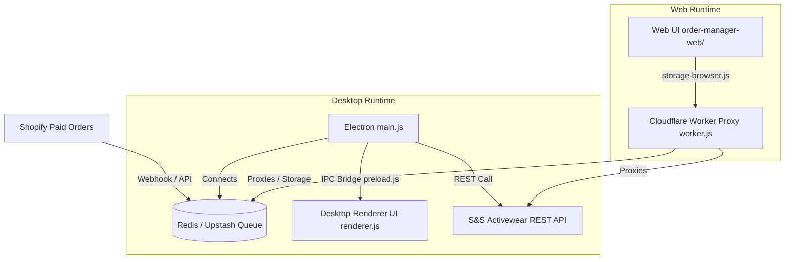

# System Overview Architecture

## Use This When
- You need a high-level conceptual understanding of the PrintMO Order Management architecture.
- You are evaluating the boundaries between the Electron desktop app, Web/Shopify Admin client, Redis queue layer, and Cloudflare proxy.

## Skip This When
- You are debugging specific IPC handler calls or Redis list mutations $\rightarrow$ read [architecture/ipc-and-storage.md](file:///e:/PrintMO/PrintMO-Order-Management/docs/official-docs/architecture/ipc-and-storage.md).
- You are looking for S&S Activewear API schemas or webhook HMAC logic $\rightarrow$ read [architecture/external-apis.md](file:///e:/PrintMO/PrintMO-Order-Management/docs/official-docs/architecture/external-apis.md).

## Section Map
- [1. High-Level System Architecture](#1-high-level-system-architecture)
- [2. Execution Environments](#2-execution-environments)
- [3. Key System Invariants](#3-key-system-invariants)
- [Common Failure Modes & Recovery](#common-failure-modes--recovery)

---

## 1. High-Level System Architecture

PrintMO Order Management is designed as a hybrid desktop and web operational platform that manages Shopify order fulfillment and S&S Activewear blank-apparel batch purchasing.

---

## 2. Execution Environments

### A. Electron Desktop Runtime
- **Entry point**: `main.js` (Node.js runtime).
- **Security model**: `contextIsolation: true`, `nodeIntegration: false`. Preload script `preload.js` exposes IPC methods via `window.api`.
- **Primary Responsibility**: Direct connection to Redis (`shopifyOrdersQueue`), managing local app windows, executing S&S batch orders via `node-fetch`, saving attachments.

### B. Web / Shopify Admin Runtime (`order-manager-web/`)
- **Entry point**: `index.html` within `order-manager-web/`.
- **Target**: Embedded within Shopify Admin iframe or standalone web browsers.
- **Data abstraction**: Uses `web-shim.js` and `storage-browser.js` to simulate IPC methods, delegating data calls to local storage or Cloudflare proxy.

### C. Cloudflare Proxy (`order-manager-proxy/`)
- **Entry point**: `worker.js`.
- **Target**: Cloudflare Workers serverless environment.
- **Primary Responsibility**: Proxies API calls for the web client, handles CORS, and encapsulates API credentials.

---

## 3. Key System Invariants

1. **Order Persistence**: Order state is managed via Redis queue items. Order state transitions (`Payment Received` $\rightarrow$ `Blanks Ordered` $\rightarrow$ `Ready to Print`) are reflected directly in the queue records.
2. **Viewport Parity**: Both desktop and web platforms MUST maintain complete functional parity (viewing orders, batching blanks, adding attachments).
3. **Secret Isolation**: Frontend code in `renderer.js` or `order-manager-web/` must never contain hardcoded API keys or database URLs.

---

## Common Failure Modes & Recovery

| Symptom / Trap | Root Cause | Diagnosis & Recovery |
|---|---|---|
| Web client fails to load orders | `web-shim.js` or `storage-browser.js` fallback failed to contact proxy | Check Cloudflare Worker proxy logs in `order-manager-proxy/worker.js` and verify CORS settings. |
| Desktop app fails to start | Missing `.env` file or invalid `REDIS_URL` | Check `.env` path resolution in `main.js:7-21`. Ensure Redis client is accessible. |
| API key exposure build warning | Secret embedded in renderer code | Move secret to `.env` (Electron) or Cloudflare secret bindings. |
