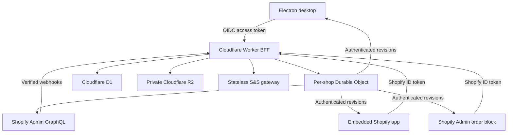

# Shopify Live API Sync, Admin Blocks, and Redis-Free Cutover Plan

- **Status**: `[Implemented Candidate]`
- **Owner / Target Milestone**: `v1.4`
- **Last Updated**: `2026-07-23`
- **Remaining Delivery Unit**: `Owner permission approval, migration/acceptance evidence, and cutover`

---

## Summary & Intent

PrintMO will graduate the proven Shopify Live preview and Admin order block into the complete operational order manager while removing Redis from the runtime architecture.

## Current Continuation State

- **Current state**: The Shopify/D1/R2 candidate is implemented and live for acceptance; Legacy Redis remains an isolated fallback.
- **Next safe action**: Execute the remaining read-only acceptance and parity evidence in the cutover runbook, then present the owner go/no-go gates.
- **Remaining blockers**: Final acceptance evidence, security hardening gates, cutover window, and post-cutover observation.
- **Owner / external actions**: Owner approval is required for final cutover, live S&S, migration overwrite, and Redis retirement.
- **Last verified evidence**: `npm run verify:phase2`, proxy tests/build, production D1 migration/backfill checkpoints, and the release evidence recorded in the current architecture/runbook.

The finished application preserves the workflow and familiarity of the current Redis board, but uses purpose-specific durable sources:

- Shopify owns commerce facts.
- One app-owned Shopify order metafield owns each order's PrintMO production state.
- Cloudflare D1 owns app-only relational records and a rebuildable board projection.
- Cloudflare R2 owns artwork and other large files.
- The Cloudflare Worker is the only public backend used by Electron, the embedded app, and Shopify Admin extensions.
- Redis and Redis-capable Render routes have no read, write, cache, rollback, or availability role after cutover.

Tasks 0-2 proved Shopify reads, rich detail, authentication, metadata projection, and cross-surface editing. They also introduced an unintended transition design in which production writes were mirrored into a Redis v1 hash and `shopifyOrdersQueue`. **Final Task 3 replaces that transition design; it does not extend it.**

## Planning Boundary

Task 3 is now implemented as an isolated candidate. Current behavior belongs in `architecture/shopify-primary-data-plane.md`; deployment, migration, acceptance, and recovery procedures belong in `runbooks/shopify-candidate-cutover.md`. This plan retains requirements, decisions, and remaining cutover gates. Legacy Redis remains the production default until the owner approves cutover.

Non-negotiable boundaries:

1. The current Redis board remains behaviorally and visually untouched while the Shopify-backed candidate is built and verified.
2. Candidate writes never mirror into `shopifyOrdersQueue`, Redis hashes, or any other Redis key.
3. No client merges Shopify, D1, R2, or legacy Redis records locally.
4. No cutover occurs with unexplained migration mismatches, missing assets, incomplete line-item pagination, or an untested recovery path.
5. Infrastructure failure produces an explicit stale or read-only state; it never looks like an authoritative empty board or successful mutation.
6. Redis retirement means no deployed runtime contains `REDIS_URL`, invokes Redis, or requires Redis to start.

## Open Questions & Brainstorming

No architecture or ownership decision remains open. Shopify metafield, D1, R2, Worker, and Redis-retirement responsibilities are locked.

The only remaining external validation gates are operational rather than design questions:

- the owner must approve the minimum Shopify scope update on the real store;
- production D1 must report the production storage backend and working Time Travel;
- representative orders and legacy assets must satisfy the acceptance matrix;
- S&S production remains blocked until test-mode duplicate/timeout reconciliation passes.

Failure of a gate blocks cutover; it does not silently reopen Redis dual-writing.

---

## 1. Locked Target Architecture



### Source-of-truth matrix

| Data | Authoritative owner | D1 role | Prohibited |
|---|---|---|---|
| Order, line items, prices, customer, payment, cancellation, shipping, and fulfillment | Shopify order | Bounded, rebuildable board summary | A permanent copied order JSON |
| Stage, readiness, printed count, bundle, production notes, attention, archive, and revision | One app-owned JSON metafield on the Shopify order | Search/index projection and audit | Redis or two writable production copies |
| S&S batches, PO numbers, attempts, and reconciliation | D1 relational tables | Authoritative app state | Cache/client/order-array state |
| Artwork and PDFs | Private R2 objects | Authoritative manifest/checksum records | Base64 in Redis/D1/Shopify or public URLs |
| Webhook receipts, idempotency, checkpoints, audit | D1 | Authoritative app state | Memory-only deduplication |
| Live coordination and Shopify cost reservations | Durable Object | D1 persists outcomes | Durable Object memory as sole durable copy |
| Redis backup | Immutable migration evidence | None | Runtime fallback or dual-write target |

The existing Render service may remain temporarily as a stateless S&S gateway, but its Redis routes, dependencies, environment variables, and data responsibilities must be removed. Moving S&S networking later is a separate optimization.

---

## 2. Canonical Production State on Shopify

Task 3 declares one app-owned order metafield:

| Property | Contract |
|---|---|
| Logical namespace | `$app:printmo` |
| Key | `production_state_v1` |
| Type | `json` |
| Admin access | Merchant read-only outside PrintMO controls |
| Storefront/customer-account access | None |
| Writer | Worker only, using a server-side Shopify token |

One JSON value is used so a transition cannot partially persist. Shopify `metafieldsSet` must always use `compareDigest`.

```json
{
  "schemaVersion": 1,
  "revision": 7,
  "lastMutationId": "01K0...",
  "stage": "blanks_ordered",
  "readiness": {
    "blanksReady": true,
    "printsOrdered": true,
    "printsReady": false
  },
  "printedCount": 2,
  "bundleId": null,
  "batchRefs": ["batch_01K0..."],
  "internalNotes": "Keep fronts with batch 14.",
  "attention": {
    "required": false,
    "reasons": [],
    "acknowledgedAt": null
  },
  "archivedAt": null,
  "archivedBy": null,
  "updatedAt": "2026-07-23T18:20:00Z",
  "updatedBy": "shopify-user:12345"
}
```

It contains no customer PII, credentials, signed URLs, or artwork.

### Canonical stages

| Stage | Meaning | Active |
|---|---|---|
| `received` | Paid order awaiting production handling | Yes |
| `to_order` | Selected for a future blanks batch | Yes |
| `blanks_cart` | Prepared internally; S&S not confirmed | Yes |
| `blanks_ordered` | Supplier order confirmed/reconciled | Yes |
| `print` | Blanks ready and printing underway | Yes |
| `completed` | Production complete | No |

Archived orders remain addressable but leave the default board.

### Mutation safety

Every production mutation:

1. Authenticates/authorizes the actor and validates an allowlisted patch.
2. Inserts or recovers a D1 `mutation_request` by unique idempotency key.
3. Reads the Shopify metafield and `compareDigest`.
4. Calls one atomic `metafieldsSet` with the digest, next revision, and `lastMutationId`.
5. In one D1 transaction, updates the projection, appends the audit event, and completes the request.
6. Broadcasts only after D1 commits.

If execution stops after Shopify commits but before D1 finalizes, retry/reconciliation recognizes `lastMutationId` and repairs D1. A digest mismatch returns `409 VERSION_CONFLICT`; no unconditional retry occurs. D1 failure before the request record makes the app read-only. D1 failure after Shopify commits returns `202 SYNC_PENDING`, never a false success.

---

## 3. D1 Durable Schema and Recovery

D1 uses its production backend, prepared statements, indexes, foreign keys where applicable, unique constraints, and transactional batches.

| Table | Purpose / key constraint |
|---|---|
| `shops` | Authorized installation; unique shop domain |
| `order_projection` | Rebuildable board membership/summary; primary key `(shop_id, order_gid)` |
| `production_events` | Append-only audited outcomes; unique event ID |
| `mutation_requests` | Unique `(shop_id, actor_id, idempotency_key)` |
| `webhook_receipts` | Unique Shopify delivery ID |
| `reconciliation_checkpoints` | Last fully committed reconciliation window |
| `batches` | Unique batch ID and PO number; durable state machine |
| `batch_orders` | Unique `(batch_id, order_gid)` and captured revision/hash |
| `supplier_attempts` | Redacted S&S attempts and outcomes |
| `asset_manifests` | Unique asset/object key, MIME, size, SHA-256, lifecycle |
| `migration_ledger` | Idempotent result and checksum for every legacy record/asset |

Projection rules:

- `order_projection` is a materialized read model, never an independently edited order.
- It stores only board-required summary data. No address, email, phone, payment-instrument data, or complete order payload.
- Customer display-name cache expires or refreshes within 24 hours.
- Rows carry Shopify update time, metafield revision, fetch time, stale time, and last error.
- Invalidation marks rows dirty/stale; it does not delete the last-known value.
- Projection rebuild from Shopify plus D1 app records is mandatory and tested.

Recovery rules:

- Verify D1 Time Travel before cutover.
- Export D1 daily to a separate private R2 backup prefix with 90-day retention.
- Capture a D1 bookmark/export before every schema migration.
- Test both point-in-time restore and projection rebuild from Shopify.

---

## 4. Shopify Reads, Webhooks, and Rate Limits

### Board and detail

1. Enumerate active GIDs from indexed D1 projection rows, not one Shopify query per card.
2. Return fresh projections immediately.
3. Mark stale rows and coalesce refreshes through the Durable Object.
4. Refresh with measured Shopify `nodes`/order chunks, initially no more than 20 IDs, adapting to returned `throttleStatus`.
5. Paginate every connection. `lineItemsComplete` stays false until all required pages load.
6. Fetch full rich detail only when an order opens.
7. Reserve Bulk Operations for initial/history import and exceptional integrity scans.

The API remains cursor-paginated with a maximum page size of 50. Shopify is pinned to Admin API `2026-07`; CI checks the next supported version before upgrades.

### Webhooks and reconciliation

Subscribe to `orders/paid`, `orders/updated`, `orders/cancelled`, `refunds/create`, `app/uninstalled`, and applicable compliance topics.

- Verify raw-body HMAC using timing-safe comparison.
- Deduplicate Shopify delivery IDs in D1.
- Webhooks mark orders dirty; payload fragments never overwrite full projections.
- Reconcile updated orders every five minutes using an overlap window; advance only after the full paginated window commits.
- Nightly, verify every active GID and repair missing/stale projections.
- Require `read_all_orders` before cutover so unfinished work remains accessible past Shopify's default order window.

At or after `blanks_ordered`, line/SKU/quantity/cancellation/refund/destination changes raise attention instead of silently changing purchased requirements. Resolution requires actor, reason, expected digest/revision, and idempotency key.

---

## 5. R2 Assets

- Buckets remain private.
- Keys are immutable/order-scoped: `shops/{shop_id}/orders/{order_id}/assets/{asset_id}/{safe_filename}`.
- D1 owns manifests; Shopify holds only stable references when needed.
- V1 accepts PNG, JPEG, WebP, and PDF up to a configurable 50 MiB.
- Short-lived upload tickets bind key and content type.
- Finalization verifies size, detected type/magic bytes, and SHA-256.
- Short-lived read URLs never enter logs, audits, metafields, or persistent caches.
- Delete tombstones D1 first, then removes R2 asynchronously with retry/audit.

Legacy Base64 migration decodes under a strict limit, detects type, hashes, uploads pending, reads back, verifies, then commits the manifest/ledger. Cutover requires every in-scope byte verified or explicitly quarantined with owner approval.

---

## 6. S&S Batch Safety

Batch state lives in D1, never a client, cache, order JSON, or Redis.

Preview fetches selected orders live with complete line items, reads their production digests/revisions, validates attention/cancellation/SKUs/quantities, checks S&S within its rate limit, and stores a 15-minute `prepared` record with a unique batch ID, PO number, revision set, and quantity hash.

```text
prepared -> submitting -> confirmed
                      -> unknown
                      -> failed
```

- Only one D1 transition may enter `submitting`.
- Repeated commits return the stored result.
- Ambiguous timeouts/5xx become `unknown`; POST is never blindly repeated.
- Reconcile unknown outcomes by unique PO number.
- Only `confirmed` advances Shopify production state to `blanks_ordered`.
- A post-confirmation metafield conflict raises explicit reconciliation; supplier reality is never hidden.
- Staging always uses S&S test mode; production commit requires an explicit binding and recent authentication.

---

## 7. UI and Cross-Surface Contract

### Shopify-backed order manager

The candidate reuses the current Redis board's information hierarchy and interaction model. It must include:

- the same operational columns and recognizable cards;
- Shopify identity, customer, received time, current quantities, totals, payment, fulfillment, and delivery indicators;
- production stage, readiness, printed count, bundle, batch/PO, attention, and notes;
- drag/drop transitions with conflict handling;
- S&S selection, preview, commit, and reconciliation;
- R2 mockup/design previews and downloads;
- rich detail with totals, discounts, line items, shipping/pickup, conversion, notes, tags, and timeline when returned;
- explicit freshness, partial-data, permission, and outage indicators.

No error may convert a non-empty last-known board into a displayed zero. One malformed row/asset must not abort sibling cards.

### Shopify Admin order block

The block controls the same canonical production state. Stage, attention, labeled readiness controls, printed count, bundle, and batch/PO are primary. Notes and uncommon controls follow. Saving, success, conflict, stale, and read-only states are explicit.

Shopify controls initial block collapse. Task 3 must not claim otherwise. The summary/collapsed content should communicate stage and attention; expanded controls must remain labeled and compact.

### Transition

Before cutover, **Redis board** remains the production default and **Shopify candidate** is isolated. Candidate writes affect Shopify/D1/R2 only.

At cutover, **Shopify board** becomes the default. The legacy board becomes a hidden read-only migration snapshot. No production switch routes new activity back to Redis. Rollback means reverting the app release or restoring/rebuilding D1 while Shopify remains canonical—not resuming dual-writes.

---

## 8. Security and Privacy

- Verify Shopify token signature, `aud`, `iss`, `dest`, `exp`, `nbf`, and `sub`; require configured shop and allowed staff.
- Electron uses OIDC Authorization Code + PKCE in the system browser and OS `safeStorage`.
- Derive shop/actor from verified identity; never trust client-supplied shop identity.
- Authorize each order against the verified shop.
- Use allowlisted patches, lifecycle validation, size limits, prepared SQL, idempotency, and rate limits by verified actor.
- Verify webhook HMAC before parsing/processing and deduplicate delivery IDs.
- CORS is defense in depth, not authentication.
- Supplier commits, archive/restore, reconciliation, and asset deletion require recent authentication and audit.
- Redact secrets, tokens, signed URLs, contacts, addresses, payment data, and notes from logs.
- Clients receive no Shopify Admin token, D1/R2 credentials, S&S key, or infrastructure secret.
- Minimum expected Shopify scopes are `read_orders`, `write_orders`, and `read_all_orders`, plus only scopes already justified by verified rich detail.
- Production metafields have no storefront or customer-account access.
- Before cutover, replace broad Pages-suffix CORS with exact origins.
- Move CSP to response headers with Shopify-specific `frame-ancestors`; narrow script sources and remove `'unsafe-inline'` where feasible.
- Add per-identity/per-route limits at the Worker and supplier gateway.
- Use dedicated rotatable cursor/asset-ticket signing secrets with constant-time verification.
- Alert on auth spikes, `5xx`, D1 errors, failed webhook receipts, `SYNC_PENDING`, reconciliation failures, and `unknown` supplier batches.

---

## 9. Failure and Recovery Matrix

| Failure | Required behavior | Recovery |
|---|---|---|
| Shopify read outage | Timestamped stale projection; disable dependent/supplier actions | Bounded retry and reconciliation |
| Shopify mutation ambiguity | No blind retry | Compare `lastMutationId`/digest |
| D1 unavailable before mutation | Read-only, no optimistic success | Restore/retry same key |
| D1 fails after Shopify commit | `202 SYNC_PENDING` | Finalize pending request from Shopify |
| R2 unavailable | Order controls continue; assets unavailable | Retry manifests/objects |
| Missed/duplicate webhook | Duplicate acknowledged; missed event found later | Overlap/nightly repair |
| Durable Object restart | No durable outcome lost | Rehydrate from D1 |
| S&S timeout after send | `unknown`, never auto-resend | PO reconciliation |
| Client disconnect during save | No local success assumption | Refetch idempotency/current digest |
| Bad projection/render field | Isolate row; never blank whole board | Rebuild row |
| Accidental D1 mutation | Stop writes, preserve Shopify | Time Travel/export + rebuild |

---

## 10. Technical Specification & Task Checklist — Final Task 3

This is one delivery task with ordered internal work packages. Compilation or one correct-looking order is not completion.

### A. Neutralize the accidental path

- [x] Inventory every Redis import, command, variable, endpoint, Lua script, broadcast, and `UPSTREAM_BASE` route.
- [x] Disable candidate-to-Redis mirroring before any new candidate mutation.
- [x] Keep the current Redis board/data byte-stable during candidate verification.
- [x] Add a test that fails if a candidate request invokes Redis/legacy storage.

### B. Establish canonical storage

- [x] Declare the app-owned order metafield in Shopify app configuration.
- [ ] Release `write_orders` and `read_all_orders` and obtain owner approval.
- [x] Create separate staging/production D1 databases; bind production as `ORDER_DB`.
- [ ] Complete the operational backup/export schedule (schema, migrations, and Time Travel are verified).
- [x] Implement Shopify compare-digest mutations and recoverable D1 request state.
- [x] Implement projection, audit, webhook, reconciliation, batch, asset, and migration repositories.

### C. Migrate and verify

- [x] Capture an immutable Redis export plus order/attachment checksums.
- [ ] Reuse the approved 19-order mapping; keep legacy `#1000` quarantined absent a new owner decision.
- [ ] Convert approved production records to Shopify metafields without altering commerce.
- [x] Build projections only from Shopify canonical values.
- [x] Implement artwork migration with R2 read-back checksum verification.
- [x] Implement matched/migrated/quarantined/failed ledger reports.
- [ ] Run the final migration and require zero unexplained order mismatches and zero unaccounted asset bytes.

### D. Complete the board and block

- [x] Replace the diagnostic table as the long-term candidate with full Kanban/detail workflow.
- [x] Preserve the current Redis board until the cutover flag changes.
- [x] Route production edits only to the canonical Shopify endpoint.
- [x] Connect batches/audit/assets to D1/R2 and commerce detail to Shopify.
- [x] Add labeled compact block controls and useful summary content.
- [x] Add stale, conflict, partial, read-only, permission, and recovery states.
- [ ] Refresh both surfaces from the same committed revision event.

### E. Prove consistency and resilience

- [x] Run syntax/build checks and all Phase 0-2 regressions.
- [ ] Add schema, migration, DTO, authorization, CAS, idempotency, pagination, throttle, webhook, asset, batch, and rendering tests.
- [ ] Verify block-to-board and board-to-block changes without Redis changing.
- [ ] Exercise simultaneous conflicting edits; exactly one succeeds.
- [ ] Replay mutation/webhook/batch/migration; each durable effect occurs once.
- [ ] Interrupt after Shopify commit and before D1 finalize; verify repair.
- [ ] Test Shopify, D1, R2, Durable Object, and supplier failures.
- [ ] Prove a failed fetch cannot show an authoritative empty board.
- [ ] Restore staging D1 and rebuild its projection from Shopify.
- [ ] Run S&S duplicate/ambiguous-outcome tests in test mode.
- [ ] Confirm no client/log contains long-lived secrets or protected payloads.

### F. Cut over and retire Redis

- [ ] Obtain owner go/no-go after the acceptance matrix passes.
- [ ] Pause legacy writes for a short final-delta window.
- [ ] Capture final export and migrate/verify the delta idempotently.
- [ ] Switch production to Shopify primary and run smoke tests.
- [ ] Remove `REDIS_URL`, packages, routes, Lua, broadcasts, health checks, and fallback configuration.
- [ ] Prove production works with Redis network access unavailable.
- [ ] Retain only dated export/read-only service snapshot pending deletion approval; neither is a runtime dependency.
- [ ] Graduate contracts into current-state docs and mark this plan `[Graduated]`.

### G. Complete security hardening

- [ ] Restrict CORS to exact approved production/staging origins.
- [ ] Deliver and verify response-header CSP and Shopify Admin `frame-ancestors`.
- [ ] Add and test Worker/supplier rate limits without breaking Shopify webhook retries.
- [ ] Separate and rotate asset-ticket/cursor signing secrets; use constant-time verification.
- [ ] Configure actionable security/reliability alerts and verify redacted logs.
- [ ] Verify MFA and least privilege for Cloudflare, Shopify, Render, and GitHub operators.

---

## 11. Acceptance Matrix

| Area | Required evidence |
|---|---|
| Ownership | Shopify metafield is the only writable per-order production record |
| Migration | All approved orders accounted for; zero unexplained mismatch |
| Assets | All bytes checksum-verified or explicitly quarantined |
| Board parity | Current stages/actions work from Shopify board |
| Shopify facts | Representative simple/discounted/refunded/edited/fulfilled/pickup/shipping/large orders match Shopify |
| Cross-surface | Block and board converge after committed mutations |
| Concurrency | Digest conflict prevents lost updates |
| Idempotency | Replays have one durable effect |
| Rate limits | Bounded batch refresh honors returned throttle state |
| Failures | No tested outage produces false success/empty board |
| Recovery | D1 restore and Shopify rebuild both pass |
| Security | Token/HMAC/auth/input/secret tests pass |
| Supplier | Ambiguous outcomes never duplicate submission |
| Redis retirement | Production passes with Redis unreachable and no runtime `REDIS_URL` |
| Documentation | Graduation completed; no shipped doc calls Redis active afterward |

Passing every gate raises confidence above 99% for tested workflows. It does not claim vulnerability-free software; it supplies evidence for known correctness, security, migration, and recovery risks.

---

## 12. Manual Owner Actions

The implementation agent uses CLI/API workflows and does not operate the owner's browser. The owner only:

1. Approves the Shopify permission update on the real `Print-MO` store.
2. Exercises representative candidate orders and gives final go/no-go.
3. Approves permanent Redis service/export deletion after the chosen retention period.

D1/R2 setup, bindings, schema, tooling, deployments, tests, and reports belong to Task 3.

---

## 13. Out of Scope

- Redesigning stage vocabulary beyond current workflow parity.
- Redis as disaster recovery.
- Direct client access to Shopify Admin GraphQL, D1, R2, or S&S.
- D1 as a permanent full Shopify-order copy.
- Public artwork or persistent signed URLs.
- Forcing Shopify's host-controlled block expansion.
- Unrelated visual redesign after workflow parity.

---

## 14. Authoritative References

### Shopify

- [GraphQL rate limits](https://shopify.dev/docs/api/usage/limits#compare-rate-limits-by-api)
- [Session tokens](https://shopify.dev/docs/apps/build/authentication-authorization/session-tokens)
- [Webhook verification](https://shopify.dev/docs/apps/build/webhooks/verify-deliveries)
- [App-owned metafields](https://shopify.dev/docs/apps/build/metafields)
- [`metafieldsSet` atomic CAS](https://shopify.dev/docs/api/admin-graphql/latest/mutations/metafieldsSet)
- [Order access window/scopes](https://shopify.dev/docs/api/admin-graphql/latest/objects/Order)
- [API versioning](https://shopify.dev/docs/api/usage/versioning)

### Cloudflare

- [D1 Worker API](https://developers.cloudflare.com/d1/worker-api/)
- [D1 prepared statements](https://developers.cloudflare.com/d1/worker-api/prepared-statements/)
- [D1 Time Travel](https://developers.cloudflare.com/d1/reference/time-travel/)
- [D1 security](https://developers.cloudflare.com/d1/reference/data-security/)
- [Durable Object storage](https://developers.cloudflare.com/durable-objects/api/sqlite-storage-api/)
- [R2 durability](https://developers.cloudflare.com/r2/reference/durability/)
- [R2 security](https://developers.cloudflare.com/r2/reference/data-security/)
- [R2 presigned URLs](https://developers.cloudflare.com/r2/api/s3/presigned-urls/)

### Client and supplier

- [Electron `safeStorage`](https://electronjs.org/docs/latest/api/safe-storage)
- [OAuth for native apps](https://datatracker.ietf.org/doc/html/rfc8252)
- [S&S Activewear API](https://api.ssactivewear.com/V2/)

---

## Progress Log

- **2026-07-21**: Initial live Shopify synchronization proposal created.
- **2026-07-22**: Phase 0 backup/fixtures, Phase 1 transport, and Phase 2 Shopify preview/detail/shadow infrastructure implemented.
- **2026-07-23**: Rich Shopify detail verified after scope release.
- **2026-07-23**: Task 1 projected 19 approved records, quarantined `#1000`, archived two stale shadow-only records, and kept the legacy queue unchanged.
- **2026-07-23**: Task 2 shipped Shopify Live production controls and the Admin block, but the transition path still targets Redis metadata/mirrored queue writes.
- **2026-07-23**: Live testing clarified the final goal: preserve the current board experience while completely removing Redis.
- **2026-07-23**: Planning consolidated into one final Task 3. Shopify app-owned order metadata is the per-order production authority; D1 is limited to projections/app-only state; R2 owns assets; Redis dual-write/rollback assumptions are retired.
- **2026-07-23**: Task 3 candidate implemented. Production mutations now use Shopify compare-digest writes plus D1 recovery/audit; the full Kanban source-switch uses the same renderer; webhooks/reconciliation/assets/migration use D1/R2; S&S candidate batching uses a D1 state machine and Redis-free supplier gateway. Production and staging D1 schemas and Time Travel were verified. Owner scope approval, live migration evidence, acceptance, and final cutover remain.
