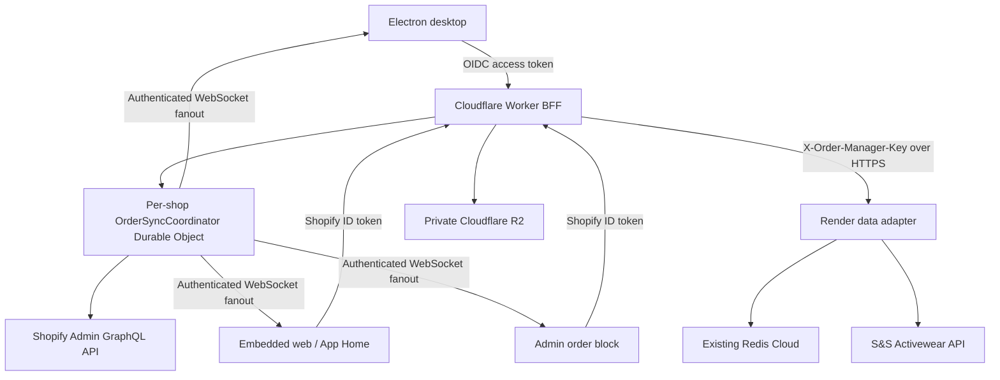

# Shopify Live API Sync, Decoupled Architecture & Zero-Trust Partner Security Plan

- **Status**: `[In Progress]`
- **Owner / Target Milestone**: `v1.4 Backlog`
- **Last Updated**: `2026-07-22`

---

## 1. Summary & Intent

PrintMO will replace the static Redis list snapshot (`shopifyOrdersQueue`) with a live, decoupled order architecture:

- **Shopify Admin GraphQL API** owns commerce facts: order identity, current line items, quantities, prices, customer details, financial state, cancellation state, and fulfillment state.
- **The existing Redis Cloud database** owns PrintMO production facts: workflow stage, bundles, S&S batch/PO references, readiness flags, print progress, internal notes, asset manifests, production snapshots, acknowledgements, and archive state. It is reached only through the authenticated Render data adapter; Redis is never exposed to Cloudflare or clients over a public REST credential.
- **Cloudflare R2** owns artwork bytes. Redis stores immutable R2 object keys and file metadata, never Base64 payloads or expiring URLs.
- **One Cloudflare Worker backend-for-frontend (BFF)** is the only public API used by Electron, the embedded web app, and Shopify Admin extensions. The Worker owns authentication, Shopify access, DTOs, R2, and coordination, and calls the existing Render service over authenticated HTTPS for Redis-backed operations. Electron no longer connects directly to Redis or carries Redis, Shopify, R2, or S&S secrets.
- **One per-shop Durable Object coordinator** serializes Shopify cost reservations, coalesces cache refreshes, and hosts authenticated WebSocket fanout.

### Final technology choices

| Concern | Selected direction | Explicitly rejected |
|---|---|---|
| Production metadata | Existing Redis Cloud hashes, sorted sets, streams, and Lua scripts behind the authenticated Render adapter | Cloudflare Workers KV for transactional state; a second Redis vendor/database |
| Live client updates | Durable Object WebSockets with hibernation | Keeping both SSE and WebSockets indefinitely |
| Artwork delivery | Private R2 with backend-issued short-lived presigned URLs | Public R2 objects or origin-only authorization |
| Electron sign-in | OIDC Authorization Code + PKCE in the system browser | Embedded login webviews, client HMAC secrets, or mTLS as user authentication |
| Shopify Admin sign-in | Shopify OpenID Connect ID token verification | Treating CORS or an iframe origin as authentication |
| S&S duplicate protection | Persistent batch state machine + unique `poNumber` + GET reconciliation | Sending an undocumented `idempotency_key` field |
| Audit trail | Redis Stream plus structured Workers logs exported with Logpush | Calling mutable KV an immutable audit ledger |

`UPSTREAM_BASE` is the private Redis/S&S adapter for this rollout and is not a browser-facing API. Keeping the existing Render service and Redis Cloud database avoids an unnecessary datastore migration during Shopify cutover. A later consolidation may remove it, but that is not a Phase 2–5 requirement.

## Open Questions & Brainstorming (Non-blocking Validation Gates)

No architecture or data-ownership decision remains open. The following facts must be validated during Phase 0 because they depend on deployed accounts, credentials, or representative production data rather than further design:

- Select the concrete OIDC provider, register the Electron loopback client, and record the two allowed subject identifiers in deployment configuration.
- Confirm Shopify protected-customer-data approval and the exact production scopes before enabling any field containing customer PII.
- Measure actual GraphQL requested/actual costs against representative orders, including large line-item sets, and tune the initial chunk size from the specified starting value of 20 without changing the coordinator contract.
- Exercise S&S `testOrder`, multi-warehouse split responses, PO lookup, and timeout reconciliation with the production account configuration before allowing a live commit.
- Confirm the default R2 retention window with the business owner and any applicable legal/accounting policy; changing the configured duration does not alter the object-key, access, or deletion contracts.

Failure of any gate blocks the affected rollout phase and is recorded in the progress log. It does not reopen the chosen architecture silently.

---

## 2. Target Runtime Architecture



### Component ownership

| Component | Responsibilities |
|---|---|
| Worker BFF | Authentication, authorization, API validation, Shopify access, DTO merge, R2 access, webhook verification, and stable public `/v1` contracts |
| `OrderSyncCoordinator` Durable Object | Per-shop Shopify request queue, cost reservations, refresh single-flight, dirty-GID coalescing, WebSocket ticket redemption, and revision fanout |
| Render data adapter | The only process holding `REDIS_URL`; executes Redis commands/Lua and existing S&S operations for authenticated Worker requests |
| Redis Cloud | Durable production metadata, indexes, Shopify cache, migration ledger, webhook dedupe, batch state machine, and audit stream |
| R2 | Private artwork objects and temporary migration objects |
| Electron preload/main | Token custody, safe API bridge, OS keychain encryption, and downloads; no business secrets or direct datastore connections |

All Worker-to-Render, Worker-to-Shopify, Worker-to-R2, and Render-to-Redis/S&S credentials are server-side secrets. Browser and renderer code receive no long-lived infrastructure secrets.

---

## 3. Production Workflow Lifecycle

The migration preserves the shipped workflow before any future column redesign. The new canonical values use snake case, while adapters accept legacy values during rollout.

| Canonical stage | Meaning | Legacy mapping | Active board? |
|---|---|---|---|
| `received` | Paid Shopify order waiting for blank selection | `received` or documented `payment_received` | Yes |
| `to_order` | Operator staged order for the next S&S batch | `toOrder` | Yes |
| `blanks_cart` | Internal batch prepared, but S&S POST not confirmed | `blanks` with no PO and `blanksOrdered = 0` | Yes |
| `blanks_ordered` | One or more S&S confirmations exist | Any record with `blanks_po`/`ss_order_id`, otherwise `blanks` with `blanksOrdered = 1` | Yes |
| `print` | Blanks are ready and production/printing is underway | `print` or documented `ready`/`printing` | Yes |
| `completed` | Production finished; record retained but removed from active indexes | New canonical terminal stage | No |

Existing readiness fields (`blanksStatus`, `printsStatus`, `printsOrdered`) are migrated to snake-case metadata fields and retained until a separate workflow redesign explicitly removes them.

### Lifecycle invariants

1. `orders/paid` creates missing production metadata at `received`.
2. A missed webhook discovered by reconciliation creates the same default record idempotently.
3. Entering `blanks_cart` does **not** create a production snapshot and does not imply a supplier purchase.
4. The first confirmed S&S response atomically moves affected orders to `blanks_ordered` and records their production snapshots.
5. Entering `print` refreshes the production snapshot only after an operator resolves any outstanding Shopify diff.
6. Shopify cancellation or refund never deletes or auto-completes an active PrintMO record. It sets `attention.required = true`.
7. “Delete” becomes an auditable archive operation (`archived_at`, `archived_by`). Archived records cannot reappear merely because Shopify still returns them.
8. Restoring an archived order re-adds it to the appropriate active and stage indexes.
9. `completed` and archived records remain addressable by GID for history, but are excluded from default board queries.

### Active-order definition

The board is enumerated from PrintMO indexes, not `orders(query: "status:open")`. An active record is one whose stage is not `completed` and whose `archived_at` is empty. This prevents Shopify closure/fulfillment from hiding unfinished shop work.

---

## 4. Canonical DTO and API Contracts

All clients consume versioned `/v1` DTOs. They never merge Shopify and Redis locally.

### Board order DTO

```json
{
  "id": "gid://shopify/Order/60129381",
  "displayName": "#1001",
  "createdAt": "2026-07-20T15:30:00Z",
  "shopifyUpdatedAt": "2026-07-22T14:05:00Z",
  "customer": {
    "displayName": "Jane Customer"
  },
  "commerce": {
    "financialStatus": "PAID",
    "fulfillmentStatus": "UNFULFILLED",
    "cancelledAt": null,
    "currencyCode": "USD",
    "subtotal": "125.00",
    "total": "135.42",
    "currentLineItemQuantity": 12,
    "lineItemsComplete": true,
    "lineItems": [
      {
        "id": "gid://shopify/LineItem/7001",
        "variantId": "gid://shopify/ProductVariant/8001",
        "sku": "2000-WHT-L",
        "title": "Gildan Ultra Cotton Tee",
        "variantTitle": "White / L",
        "quantity": 12,
        "currentQuantity": 12,
        "unitPrice": "10.00"
      }
    ]
  },
  "production": {
    "stage": "received",
    "version": 4,
    "bundleId": null,
    "blanksPo": [],
    "printedCount": 0,
    "blanksStatus": 0,
    "printsStatus": 0,
    "printsOrdered": 0,
    "internalNotes": "",
    "assets": []
  },
  "attention": {
    "required": false,
    "reasons": [],
    "acknowledgedAt": null
  },
  "sync": {
    "fetchedAt": "2026-07-22T14:05:02Z",
    "freshUntil": "2026-07-22T14:06:02Z",
    "hardExpiresAt": "2026-07-23T14:05:02Z",
    "stale": false,
    "partial": false,
    "cacheRevision": 183,
    "errors": []
  }
}
```

Money values are decimal strings plus an explicit currency code. IDs are immutable Shopify GIDs. Display labels and customer names are never used as keys.

### Detail DTO additions

`GET /v1/orders/:gid` returns the board DTO plus:

- Complete paginated line items and custom attributes.
- Full discount allocations and MoneyBag values.
- Shipping address, fulfillment events, and order note when authorized.
- Production snapshot and normalized diff.
- Asset read tickets.

Shipping addresses are detail-only and are not stored in the 24-hour board cache.

### Production snapshot

```json
{
  "capturedAt": "2026-07-22T14:10:00Z",
  "shopifyUpdatedAt": "2026-07-22T14:05:00Z",
  "batchId": "batch_01J4...",
  "lineItemHash": "sha256:...",
  "lineItems": [
    {
      "id": "gid://shopify/LineItem/7001",
      "sku": "2000-WHT-L",
      "currentQuantity": 12
    }
  ]
}
```

Snapshots exclude customer names, contact information, and addresses.

### HTTP endpoints

| Method and path | Purpose |
|---|---|
| `GET /v1/orders?stage=&limit=&cursor=` | Cursor-paginated board DTOs; `limit` defaults to 50 and cannot exceed 50 |
| `GET /v1/orders/:gid` | Fully merged detail DTO |
| `PATCH /v1/orders/:gid/production` | Version-checked metadata mutation |
| `POST /v1/orders/:gid/attention/resolve` | Record an operator reconciliation decision |
| `POST /v1/orders/:gid/archive` | Auditable archive/tombstone |
| `POST /v1/orders/:gid/restore` | Restore an archived order |
| `POST /v1/batches/preview` | Live Shopify/S&S validation and deterministic batch preparation |
| `POST /v1/batches/:batchId/commit` | Commit a prepared batch exactly once from PrintMO’s perspective |
| `GET /v1/batches/:batchId` | Batch state and S&S reconciliation status |
| `POST /v1/assets/upload-ticket` | Authorize one pending R2 upload |
| `POST /v1/assets/:assetId/finalize` | Validate and activate a pending upload |
| `GET /v1/assets/:assetId/read-ticket` | Issue a short-lived private read URL |
| `POST /v1/ws-ticket` | Exchange the current HTTPS identity for a one-use WebSocket ticket |
| `POST /v1/webhooks/shopify` | Shopify HMAC-authenticated webhook endpoint |

### Version-checked mutation

```json
{
  "expectedVersion": 4,
  "patch": {
    "stage": "to_order",
    "internalNotes": "Rush job"
  },
  "idempotencyKey": "01J4CLIENTGENERATEDULID"
}
```

Success returns the updated production object and version. A stale version returns HTTP `409`:

```json
{
  "error": {
    "code": "VERSION_CONFLICT",
    "message": "Production metadata changed on another client.",
    "currentVersion": 5,
    "current": {}
  }
}
```

Clients refetch and show the conflicting current state. Automatic retry is allowed only for commutative operations explicitly marked by the server, such as incrementing a counter with a unique idempotency key.

### List cursor

Board cursors are opaque, signed Base64URL values containing the stage-index score, GID, filter hash, and schema version. Clients must not construct or edit them.

### Standard error envelope

All non-2xx responses use `{ "error": { "code", "message", "requestId", "details" } }`. GraphQL partial errors are preserved in `sync.errors`; data is never labeled fresh when required fields are partial or line-item pagination is incomplete.

---

## 5. Shopify Query, Pagination, Cache, and Rate-Limit Contract

### API version

- Production is pinned to Shopify Admin API `2026-07`, the current stable version at specification time.
- Every response must be checked for `X-Shopify-API-Version`; a fall-forward mismatch is an alert.
- Each quarter, CI runs contract queries against the next stable/release-candidate schema before the pinned version is advanced.

### Board population

1. Board membership comes from Redis stage sorted sets.
2. The Worker reads cached Shopify summaries for those GIDs.
3. Fresh entries are returned immediately.
4. Stale entries are returned with `sync.stale = true` while the coordinator performs one shared refresh.
5. Missing entries are fetched through the coordinator in cost-bounded chunks; clients do not independently query Shopify.
6. A cache revision is broadcast only after refreshed data is committed.

### Cache records

| Cache | Fresh window | Hard retention | Contents |
|---|---:|---:|---|
| Order summary | 60 seconds | 24 hours | Board fields, customer display name, complete minimal line items, source timestamps |
| Order detail | 5 minutes | 15 minutes | Detail-only fields including shipping address and fulfillment events |
| Production snapshot | Milestone-based | Until metadata retention expiry | Non-PII normalized production facts |

Invalidation never deletes the last known value. It adds the GID to `dirty_orders` and makes the entry stale. If the 24-hour summary expires during a prolonged outage, the board still renders production metadata and snapshot quantities, labels Shopify fields unavailable, and keeps S&S commit disabled.

### GraphQL pagination

- All connections request `pageInfo { hasNextPage endCursor }`.
- The public board page may contain 50 orders, but Shopify refresh chunks start at 20 orders and adapt downward when measured requested cost is high.
- Minimal line items begin with `first: 25`. Orders with `hasNextPage` are paginated to completion through individual order queries before `lineItemsComplete` becomes true.
- `currentQuantity` is used for current production requirements; `quantity` is retained for original-order comparison.
- A partial line-item cache can render a count using `currentSubtotalLineItemsQuantity`, but the order cannot enter an S&S commit until a full live preflight succeeds.
- S&S preview always re-fetches every selected order and all line-item pages, regardless of board cache freshness.

### Cost-aware request queue

The per-shop Durable Object is the only component allowed to send Shopify Admin API requests.

1. Each named GraphQL operation keeps its last observed `requestedQueryCost` as the next reservation estimate.
2. Before dispatch, the coordinator reserves estimated cost from its local view of `currentlyAvailable`.
3. After each response, it replaces local state with Shopify’s returned `throttleStatus` and records actual/requested cost metrics.
4. When capacity is insufficient, wait time is calculated from the deficit and `restoreRate`, plus bounded jitter.
5. GraphQL `THROTTLED` errors and HTTP `429` responses are retried for idempotent reads only, with a maximum of three attempts.
6. Mutations are never blindly retried.
7. CI and staging use `Shopify-GraphQL-Cost-Debug=1` to establish cost budgets. The plan intentionally does not promise an unmeasured “10–25 point” query.

Regular queries must remain below Shopify’s single-query maximum. Bulk Operations are reserved for initial/historical backfills and large integrity scans; they are not used for interactive board loading.

### Reconciliation

- Every five minutes, query orders updated after `checkpoint - 2 minutes`, paginate fully, and deduplicate by GID plus `updatedAt`.
- Advance the checkpoint only after the full page set is stored.
- Nightly, compare active Redis GIDs with Shopify in bounded pages; use Bulk Operations only when normal pagination would be materially larger or for the initial historical import.
- A manual “Reconcile now” action invokes the same checkpointed job and is rate limited per partner.

---

## 6. Redis Cloud Schema and Atomicity

Cloudflare Workers KV is not used for production metadata, caching, indexes, locks, webhook dedupe, batches, or audit events. Those features require Redis semantics.

### Keys

| Key | Redis type | Purpose |
|---|---|---|
| `printmo:{shop}:order:{numeric_order_id}` | Hash | Production metadata; includes canonical `shopify_gid` and `_v` |
| `printmo:{shop}:active_orders` | Sorted set | Active GIDs scored by immutable Shopify `createdAt` |
| `printmo:{shop}:stage:{stage}` | Sorted set | Stage membership scored by immutable Shopify `createdAt` |
| `printmo:{shop}:shopify_summary:{numeric_order_id}` | String/JSON | 24-hour commerce summary cache |
| `printmo:{shop}:shopify_detail:{numeric_order_id}` | String/JSON | 15-minute detail cache |
| `printmo:{shop}:dirty_orders` | Set | GIDs requiring one shared refresh |
| `printmo:{shop}:webhook:{webhook_id}` | String with TTL | Delivery dedupe |
| `printmo:{shop}:batch:{batch_id}` | Hash | S&S batch state machine |
| `printmo:{shop}:batches_by_po` | Hash | PrintMO PO to batch ID lookup |
| `printmo:{shop}:migration:{source_digest}` | Hash | Idempotent migration ledger |
| `printmo:{shop}:audit` | Stream | Structured application audit events |

Redis keys use the numeric tail of the Shopify GID to avoid embedding slashes in operational key names; the full GID remains in the hash and DTO.

### Atomic production mutation

One short Lua script performs each conditional mutation:

1. Verify `expectedVersion` and idempotency key.
2. Read the old stage/archive state.
3. Apply only allowlisted hash fields.
4. Remove the GID from the old stage sorted set when needed.
5. Add it to the new stage sorted set using the existing `createdAt` score.
6. Add/remove active membership for `completed` or archive transitions.
7. Increment `_v`.
8. Record the mutation idempotency result.
9. Return the new version and changed fields.

The script declares every touched key through `KEYS` and executes atomically inside Redis. Pipelines may reduce round trips for reads but are never used for conditional writes.

### Index integrity

A scheduled integrity job verifies that every active hash has exactly one stage membership and that completed/archived hashes have none. It repairs indexes from hashes and emits an audit event; hashes are authoritative over derived indexes.

---

## 7. Mid-Production Shopify Edits

The diff engine compares the normalized live Shopify order with the last production snapshot.

### Attention reasons

- `LINE_ITEM_ADDED`
- `LINE_ITEM_REMOVED`
- `SKU_CHANGED`
- `QUANTITY_INCREASED`
- `QUANTITY_DECREASED`
- `ORDER_CANCELLED`
- `ORDER_REFUNDED`
- `ADDRESS_CHANGED_AFTER_BATCH`

Commerce changes before `blanks_ordered` refresh the board normally. Changes at or after `blanks_ordered` set `attention.required` and do not silently alter the snapshot used for already-purchased blanks.

### Operator resolutions

| Resolution | Effect |
|---|---|
| `UPDATE_PRODUCTION_PLAN` | Accept live quantities as the new plan, capture a new snapshot, retain the diff in audit history |
| `RETAIN_EXISTING_PO` | Keep the current snapshot and PO; acknowledge the known divergence |
| `CANCEL_PRODUCTION` | Archive or complete the production record after explicit confirmation; never auto-cancel S&S |

Every resolution requires `expectedVersion`, actor identity, reason text, and a unique idempotency key.

---

## 8. S&S Batch Safety and Reconciliation

S&S documents `poNumber` on POST and supports GET lookup by PO number, but does not document a request idempotency key. PrintMO therefore prevents duplicate intent locally and reconciles uncertain remote outcomes.

### Preview

`POST /v1/batches/preview`:

1. Fetches all selected orders live from Shopify, including every line-item page.
2. Rejects cancelled orders, unresolved attention, missing SKUs, stale versions, or unsupported quantities.
3. Aggregates SKUs and obtains required S&S pricing/inventory data within S&S’s documented 60-request-per-minute limit.
4. Produces a server-generated ULID `batchId`, normalized line hash, order revision set, expiry, and unique `poNumber` such as `PMO-01J4ABC123`.
5. Stores state `prepared`; preview expiry defaults to 15 minutes.

### Commit state machine

```text
prepared -> submitting -> confirmed
                      -> unknown
                      -> failed
```

- A Lua transition permits only one `prepared -> submitting` operation.
- A confirmed batch returns the stored response on repeated commit requests.
- The S&S POST includes the unique PrintMO `poNumber` and stores every returned order because S&S can split one request across warehouses.
- A definite validation rejection becomes `failed` and may be replaced by a new preview.
- A timeout, connection reset, or ambiguous 5xx after bytes may have been sent becomes `unknown`; it is never automatically POSTed again.
- Unknown batches are reconciled with `GET /v2/orders/PO,{poNumber}`. A matching response becomes `confirmed`.
- If no match appears, the backend retries GET with bounded delays and then requires an operator to choose “continue reconciliation” or “create replacement batch.” The original PO remains blocked from reuse.
- Only `confirmed` creates production snapshots and advances orders to `blanks_ordered`.

Staging always sends `testOrder: true`. Production requires an explicit environment binding and sends `testOrder: false`; production credentials are unavailable in preview deployments.

---

## 9. Webhooks, Cache Invalidation, and WebSockets

### Subscriptions

The Shopify app configuration subscribes to:

- `orders/paid`: initialize missing production metadata and mark the order dirty.
- `orders/updated`: mark commerce cache dirty.
- `orders/cancelled`: mark dirty and raise cancellation attention after refresh.
- `refunds/create`: mark the related order dirty and evaluate quantity/refund differences.
- `app/uninstalled`: revoke shop tokens and block all user access.
- Required compliance topics when applicable to the app’s distribution model.

Webhook payloads are minimized to identifiers and timestamps, but include `updated_at` so Shopify does not debounce distinct updates into identical reduced payloads.

### Delivery protocol

1. Preserve the raw body and verify `X-Shopify-Hmac-SHA256` with timing-safe comparison.
2. Store `X-Shopify-Webhook-Id` with a 48-hour TTL and acknowledge duplicates successfully.
3. Acknowledge valid deliveries immediately; refresh work runs asynchronously.
4. Any valid order event marks the GID dirty. Because webhooks are invalidation signals, a late event is harmless and is not dropped solely because its timestamp is older.
5. Store the maximum observed `X-Shopify-Triggered-At` for diagnostics and reconciliation checkpoints.
6. The coordinator coalesces dirty GIDs for up to two seconds, refreshes each GID once, commits the cache, and then broadcasts one revision event.

### WebSocket protocol

The selected transport is a Durable Object WebSocket using hibernation.

1. Authenticated HTTPS clients request a one-use, 30-second WS ticket.
2. Ticket redemption atomically marks it used and binds the socket to shop, actor, and session ID.
3. The server sends `{ "type": "ORDERS_CHANGED", "revision": 184, "orderIds": [...] }` only after cache writes succeed.
4. Clients debounce refreshes, ignore revisions at or below their last applied value, and use exponential reconnect capped at 30 seconds.
5. Logout, partner removal, or refresh-token revocation closes associated sockets.

---

## 10. Authentication, Authorization, and Secrets

### Shopify surfaces

Admin UI extensions and the embedded Shopify surface use short-lived Shopify App Bridge ID/session tokens. Requests to the Worker domain explicitly call `shopify.idToken()` and send the result as a bearer token.

The Phase 1 Worker validates Shopify’s documented `HS256` token signature with the app secret plus `aud`, `iss`, `dest`, `exp`, `nbf`, and `sub`. The verified shop must equal `SHOPIFY_SHOP_DOMAIN`, and the subject must appear in `PARTNER_USER_IDS`. A valid Shopify identity is authentication, not sufficient authorization by itself.

### Electron

Electron uses OIDC Authorization Code with PKCE:

1. Open the authorization URL in the system browser, never an Electron `BrowserWindow` login webview.
2. Receive the callback on a random loopback port bound only to `127.0.0.1`.
3. Verify redirect URI, `state`, `nonce`, issuer, audience, PKCE verifier, and subject.
4. Require the subject to match the partner allowlist.
5. Use 15-minute access tokens and rotating refresh tokens.
6. Encrypt the refresh token with Electron `safeStorage` in the main process; expose no refresh token to the renderer.
7. If OS encryption is unavailable, use session-only authentication and require sign-in after restart.

The deployment provides `OIDC_ISSUER`, `OIDC_CLIENT_ID`, and the two allowed subject IDs. Choosing the company’s identity provider is configuration, not an application protocol fork.

Phase 1 deployment bindings are fail-closed: the Worker requires Shopify client/secret/shop and partner-user bindings for web requests, plus `OIDC_ISSUER`, `OIDC_CLIENT_ID` or `OIDC_AUDIENCE`, and `PARTNER_SUBJECT_IDS` for Electron. Electron packages contain only the Worker URL and public OIDC configuration generated at build time; `.env`, Redis, Shopify Admin API, and S&S credentials are never packaged.

### Authorization

- Read/write production permissions are checked per endpoint and actor.
- Sensitive actions—S&S commit, production-diff resolution, archive, restore, and asset deletion—require a recent authenticated session and are always audited.
- Rate limits are per verified actor and endpoint; IP limits are only a secondary abuse control.
- CORS remains a browser hardening layer, never an authorization decision.

### Secrets

Shopify access tokens, Shopify app secret, Worker-to-Render key, Redis URL, R2 bindings, S&S credentials, OIDC configuration secrets, and signing keys remain only in their server runtimes. Electron `.env` packaging for infrastructure credentials is removed before cutover.

---

## 11. Private R2 Asset Contract

- R2 buckets remain private.
- Redis stores `asset_id`, R2 object key, filename, normalized MIME type, byte size, SHA-256, uploader, and timestamps. It never stores a public or presigned URL.
- Object keys use the immutable numeric Shopify order ID: `orders/{order_id}/assets/{asset_id}/{safe_filename}`.
- Allowed initial types are PNG, JPEG, WebP, and PDF. HEIC/HEIF must be converted before finalization.
- Default maximum upload size is 50 MiB and is configurable downward.
- Upload tickets are presigned PUT URLs valid for two minutes and bound to one object key and content type.
- Uploaded objects remain `pending` until finalize verifies expected size, content type/magic bytes, and SHA-256. Failed validation deletes the pending object.
- Read tickets are presigned GET URLs valid for 60 seconds. They are bearer credentials and must never be written to Redis, logs, or audit events.
- Delete removes the manifest entry atomically first, then deletes the R2 object asynchronously with retry/audit handling.
- Migrated legacy Base64 remains in the old queue until the R2 checksum and manifest have been verified.

Default retention is active production lifetime plus 90 days after completion; a configured legal/business hold overrides deletion. Production snapshots and audit events contain object identifiers, not signed URLs or artwork bytes.

---

## 12. Offline, Partial Failure, and PII Policy

### Offline behavior

- Up to 60 seconds: normal fresh board.
- From 60 seconds through 24 hours: serve stale commerce summary with a timestamped warning; permit production metadata mutations.
- After 24 hours without Shopify: show production metadata and non-PII production snapshots, label commerce fields unavailable, and keep S&S preview/commit disabled.
- Detail-only customer addresses expire after 15 minutes and are not available offline.
- Redis/R2 unavailability makes production mutations read-only; clients must not pretend an optimistic write persisted.

### Shopify scopes

- Baseline: `read_orders`.
- `read_all_orders` is requested only if migration or active production must access orders older than 60 days.
- `write_orders` is not requested by this feature because PrintMO does not mutate Shopify orders.
- Protected customer-data fields are requested individually and limited to what the UI demonstrably uses.

### Retention defaults

| Data | Default retention |
|---|---:|
| Customer display name in summary cache | 24 hours |
| Shipping/contact detail cache | 15 minutes |
| Webhook delivery IDs | 48 hours |
| WS tickets | 30 seconds or one use |
| Production metadata | Active lifetime plus 1 year after completion |
| Artwork | Active lifetime plus 90 days after completion |
| Application audit stream/export | 1 year |

No customer address, email, phone, access token, presigned asset URL, or artwork content is written to application audit logs.

---

## 13. Audit and Observability

Every production mutation writes a structured Redis Stream event containing request ID, event ID, shop, actor subject, action, resource GID, old/new version, changed field names, timestamp, and outcome. Sensitive values are redacted.

Each event includes `previous_event_hash` and `event_hash` so deletion/reordering is detectable. A daily digest is exported with Workers structured logs through Logpush to a separately permissioned destination. This is described as **tamper-evident**, not immutable.

Required metrics and alerts:

- Shopify requested/actual cost, throttle waits, `THROTTLED`, and 429 counts.
- Cache hit/stale/miss rates and refresh latency.
- Reconciliation checkpoint age.
- Webhook verification failures and dedupe counts.
- Redis version conflicts and index repairs.
- WebSocket connections/reconnects per actor.
- R2 pending/finalize failures.
- S&S remaining request budget and any batch in `unknown` longer than five minutes.
- DTO partial-response count and API-version fall-forward mismatch.

---

## 14. Migration, Cutover, and Rollback

### Legacy record matching

Match in this order:

1. Existing `admin_graphql_api_id`.
2. Existing numeric Shopify order ID converted to a GID.
3. Exact Shopify order name/number within the configured shop, accepted only when unique.
4. Anything missing or ambiguous enters a migration quarantine report and is never guessed.

Each legacy source record receives a stable SHA-256 digest. `printmo:{shop}:migration:{source_digest}` records match result, GID, metadata version, asset counts/checksums, timestamps, and errors so reruns are idempotent.

### Metadata mapping

- `received` -> `received`
- `toOrder` -> `to_order`
- `blanks` with a supplier PO/order ID -> `blanks_ordered`
- `blanks` without a PO and with `blanksOrdered = 1` -> `blanks_ordered`
- remaining `blanks` -> `blanks_cart`
- `print`, `ready`, or documented `printing` -> `print`
- Unknown values -> quarantine, not a default stage

Bundles are re-keyed from mutable order names to GIDs. Display names remain labels only.

### Attachment migration

1. Decode each Base64 payload with strict size limits.
2. Calculate SHA-256 and normalize filename/MIME.
3. Upload to a pending R2 key.
4. Verify stored object and finalize its manifest.
5. Record the checksum in the migration ledger.
6. Leave the legacy payload untouched until cutover verification succeeds.

### Rollout phases

#### Phase 0 — Backup and fixtures

- [x] Export an immutable-dated backup of `shopifyOrdersQueue` and attachment counts/checksums.
- [x] Capture representative sanitized Shopify/order fixtures.
- [ ] Establish and verify staging Shopify/S&S credentials; S&S staging uses `testOrder: true`.

#### Phase 1 — Unify transport while retaining legacy storage

- [x] Ship Worker API adapters for the legacy queue, with atomic Lua mutation/delete operations.
- [x] Move web and Electron onto the authenticated Worker API.
- [x] Remove Electron direct Redis/S&S calls and packaged infrastructure secrets.
- [ ] Complete deployed staging smoke tests proving the user-visible workflow is unchanged on both surfaces.

#### Phase 2 — Shadow v1 data plane

- [x] Implement the Redis Cloud hash/index/cache schema in the authenticated Render adapter, plus Worker Shopify cache/coordinator, migration, parity, private-R2 read, and v1 DTO paths.
- [ ] Deploy the Render adapter and Worker configuration, provision/bind the private R2 bucket and SQLite-backed Durable Object, and smoke-test live Shopify token acquisition.
- [ ] Run the idempotent metadata/assets migration against the backed-up legacy queue.
- [ ] Compare legacy and v1 boards for order membership, quantities, stages, bundles, notes, progress, and attachment counts.
- [ ] Require zero unexplained mismatches for seven consecutive days before Phase 3.

#### Phase 3 — Dual-write canary

- Make v1 the write path for one surface while the backend mirrors compatible production mutations to the legacy list.
- All clients already use the backend, so no direct legacy writer can bypass the mirror.
- Canary the embedded web surface first, then Electron.
- Retain automated parity checks and a server-side read-source feature flag.

#### Phase 4 — Cutover

- During a short mutation freeze, run final delta migration and parity verification.
- Switch reads to v1 for both surfaces.
- Keep dual writes and the rollback flag for seven additional days.

#### Phase 5 — Retire legacy

- Stop legacy writes, retain the backed-up list read-only for 30 days, and then remove legacy queue adapters.
- Retain or consolidate `UPSTREAM_BASE` based on a separate post-cutover operational decision; it remains the supported Redis Cloud adapter in this plan.
- Graduate shipped facts into current-state architecture/workflow docs.

### Rollback

- During Phases 3–4, switch the read-source flag back to the legacy mirror; no client downgrade is required.
- Preserve v1 writes/audit events for diagnosis.
- If rollback occurs after legacy writes stop, replay versioned production mutations from the audit stream into a restored legacy snapshot before exposing legacy reads.
- R2 migration is non-destructive until final retirement, so rollback does not lose original Base64 assets.

---

## 15. Verification and Acceptance Matrix

### Automated contract tests

- Board, detail, mutation, error, asset, attention, and batch DTO schemas.
- Mapping every legacy stage/flag combination, including PO precedence and quarantine.
- Shopify outer and nested cursor pagination, including more than 25 line items.
- `currentQuantity` behavior after edits/refunds/removals.
- GraphQL partial errors, `THROTTLED`, HTTP 429, calculated wait, and three-read retry cap.
- Per-shop coordinator reservation with parallel requests.
- Fresh/stale/hard-expired cache behavior and single-flight refresh.
- Redis Lua compare-and-set plus hash/stage/active index atomicity.
- Mutation idempotency and explicit `409` client behavior.
- Webhook raw-body HMAC, duplicate delivery, late delivery, coalescing, and missed-webhook reconciliation.
- WS ticket expiry, replay rejection, partner revocation, reconnect, and revision dedupe.
- R2 unauthenticated denial, upload expiry, type/size/hash validation, signed URL expiry, and cleanup retry.
- Production snapshot diffs for additions, removals, quantity changes, refunds, cancellation, and address changes.
- S&S preview expiry, one commit, multi-warehouse responses, timeout-to-unknown, PO lookup reconciliation, and no blind POST retry.
- PII redaction and retention expiry.
- Migration rerun idempotency, ambiguous-match quarantine, asset checksums, dual-write parity, and rollback replay.
- Desktop/web parity against the same fixtures.

### Load and resilience tests

- 500 active orders, two clients, reconnect storms, and burst webhook delivery.
- 50 concurrent metadata mutations with expected conflicts and no index drift.
- Shopify outage, Redis outage, R2 outage, and S&S ambiguous timeout.
- Worker/Durable Object restart during refresh and while sockets are connected.

### Release acceptance criteria

- P95 cached board response under 500 ms from the production region.
- No request path fetches Shopify once per visible card.
- No incomplete line-item set can enter S&S commit.
- No unauthenticated Redis, R2, order, batch, or WebSocket access.
- Zero unexplained legacy/v1 parity mismatches for seven days.
- No S&S batch remains `unknown` without an alert and operator-visible recovery action.
- Both partners can complete the full workflow on Electron and embedded web.

---

## 16. Technical Specification & Task Checklist

### Foundation

- [ ] Scaffold the Shopify app/Admin UI extension and pin API `2026-07`.
- [x] Implement Worker auth middleware and OIDC partner allowlists.
- [x] Implement the existing Redis Cloud adapter and declare private R2 plus per-shop Durable Object bindings.
- [ ] Provision/deploy the R2 bucket, SQLite-backed Durable Object namespace, and updated Render service.
- [ ] Add v1 schema validation and standard errors.

### Data plane

- [x] Implement Redis Lua mutations and integrity repair.
- [x] Implement Shopify request coordinator, cache, pagination, and reconciliation.
- [x] Implement canonical DTO adapters and detail projections.
- [ ] Implement WebSocket ticketing/fanout.

### Operational safeguards

- [ ] Implement snapshots, diff reasons, and resolution workflow.
- [ ] Implement S&S preview/commit/unknown reconciliation state machine.
- [ ] Implement R2 upload/finalize/read/delete lifecycle.
- [ ] Implement audit stream, structured logs, metrics, and alerts.

### Migration and rollout

- [x] Move both clients behind the authenticated legacy adapter.
- [ ] Run shadow migration and seven-day parity window.
- [ ] Run dual-write canary and cutover.
- [ ] Retire legacy queue/upstream after the rollback window.
- [ ] Execute the documentation Graduation Protocol.

---

## 17. Authoritative References

### Shopify

- [API limits and calculated GraphQL cost](https://shopify.dev/docs/api/usage/limits)
- [GraphQL orders query, filters, and pagination](https://shopify.dev/docs/api/admin-graphql/latest/queries/orders)
- [LineItem fields including `currentQuantity`](https://shopify.dev/docs/api/admin-graphql/latest/objects/LineItem)
- [Bulk Operations queries](https://shopify.dev/docs/api/usage/bulk-operations/queries)
- [Webhook delivery behavior and reconciliation](https://shopify.dev/docs/apps/build/webhooks)
- [Webhook delivery verification and deduplication](https://shopify.dev/docs/apps/build/webhooks/verify-deliveries)
- [Webhook payload shaping and `updated_at`](https://shopify.dev/docs/apps/build/webhooks/delivery-structure)
- [Admin UI extension ID-token authentication](https://shopify.dev/docs/api/admin-extensions/latest/index)
- [Shopify OpenID Connect ID Token API](https://shopify.dev/docs/api/app-home/apis/authentication-and-data/id-token-api)
- [Protected customer data](https://shopify.dev/docs/apps/launch/protected-customer-data)
- [Access scopes](https://shopify.dev/docs/api/usage/access-scopes)
- [Quarterly API versioning](https://shopify.dev/docs/api/usage/versioning)

### S&S Activewear

- [POST Orders schema, `poNumber`, and split responses](https://api.ssactivewear.com/v2/Orders_Post.aspx)
- [GET Orders lookup by PO/order/invoice/GUID](https://api.ssactivewear.com/V2/Orders.aspx)
- [S&S API rate limit](https://api.ssactivewear.com/v2/)

### Cloudflare, Redis, and Electron

- [Durable Object WebSocket hibernation](https://developers.cloudflare.com/durable-objects/best-practices/websockets/)
- [R2 presigned URLs and bearer-token considerations](https://developers.cloudflare.com/r2/api/s3/presigned-urls/)
- [Workers KV eventual consistency and transaction limitations](https://developers.cloudflare.com/kv/concepts/how-kv-works/)
- [Workers Logs and Logpush](https://developers.cloudflare.com/workers/observability/logs/workers-logs/)
- [Redis transactions](https://redis.io/docs/latest/develop/using-commands/transactions/)
- [Redis Lua atomic execution](https://redis.io/docs/latest/develop/programmability/eval-intro/)
- [Electron `safeStorage`](https://electronjs.org/docs/latest/api/safe-storage)
- [OAuth 2.0 for native apps: external browser and loopback redirects](https://datatracker.ietf.org/doc/html/rfc8252)

---

## Progress Log

- **2026-07-21**: Initial proposal for live Shopify API sync created.
- **2026-07-22**: Added unified backend, GraphQL/Redis/R2 safeguards, production diff workflow, webhooks, offline behavior, and initial test plan.
- **2026-07-22**: Finalized implementation contracts after authoritative platform research: canonical lifecycle and DTO/API, cache/pagination/coordinator behavior, Redis Lua schema, S&S PO reconciliation, surface authentication, R2 lifecycle, migration/rollback, rollout phases, and acceptance criteria. Status advanced to `[Spec Ready]`.
- **2026-07-22**: Implemented the local Phase 2 shadow plane using the existing Redis Cloud database behind the authenticated Render adapter. Added Shopify client-credential token refresh, cost-aware GraphQL reads, summary/detail caches, webhook invalidation, Durable Object reconciliation, CAS production metadata, migration/quarantine/parity tooling, and private R2 read tickets. Deployment, live migration, and the seven-day zero-mismatch gate remain open.
- **2026-07-22**: Implemented Phase 0 backup/fixture tooling and the Phase 1 authenticated legacy adapter. Added Shopify token validation, generic Electron OIDC Authorization Code + PKCE, safe refresh-token storage, atomic Lua queue changes, authenticated R2 reads, unified web/Desktop routes, packaging secret removal, and focused Phase 1 contract verification. Status advanced to `[In Progress]`; deployed staging smoke tests and credential/provider configuration remain rollout gates.
