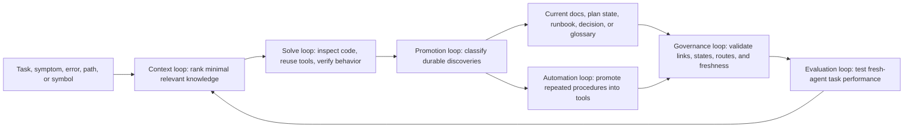

# Living Documentation as an Operational Memory System

## Use This When

- You want to understand, adopt, or evaluate a self-maintaining documentation system for software agents and human developers.
- You are designing repository memory that minimizes repeated investigation and unnecessary context consumption.
- You need principles for routing, promoting, validating, and retiring durable knowledge.

## Skip This When

- You only need a repository-specific command: read [tool-registry.md](tool-registry.md).
- You are making an ordinary PrintMO code change: run `npm run repo -- route "<task>"`.
- You want historical task narration; this system intentionally does not preserve routine recaps.

## Section Map

- [Purpose and Design Goals](#purpose-and-design-goals)
- [System Model](#system-model)
- [The Memory Planes](#the-memory-planes)
- [Authority and Conflict Resolution](#authority-and-conflict-resolution)
- [Progressive Retrieval](#progressive-retrieval)
- [Knowledge Capture and Promotion](#knowledge-capture-and-promotion)
- [Reusable Tool Promotion](#reusable-tool-promotion)
- [Feature Continuity and Graduation](#feature-continuity-and-graduation)
- [Failures, Decisions, and Operational Knowledge](#failures-decisions-and-operational-knowledge)
- [Freshness, Confidence, and Evidence](#freshness-confidence-and-evidence)
- [Automated Governance and Drift Detection](#automated-governance-and-drift-detection)
- [Token-Efficiency Techniques](#token-efficiency-techniques)
- [Evaluation Through Fresh-Agent Tasks](#evaluation-through-fresh-agent-tasks)
- [Adoption Blueprint for Another Repository](#adoption-blueprint-for-another-repository)
- [What Not to Build](#what-not-to-build)
- [Common Failure Modes & Recovery](#common-failure-modes--recovery)

## Purpose and Design Goals

Ordinary repository documentation explains software. An operational memory system also improves how future work is performed.

Its job is to preserve knowledge that is expensive to rediscover, retrieve only the portion relevant to the current task, connect that knowledge to executable tools and verification, and retire it when it stops being true. The system serves both humans and software agents, but it is optimized around a fresh contributor who has no conversational history.

A successful system should let that contributor answer five questions quickly:

1. What source is authoritative?
2. What is the smallest context needed for this task?
3. Has this problem or procedure already been solved?
4. What must remain true, and how is it verified?
5. If work is partially complete, what is the next safe action?

The design is intentionally not a diary. It does not preserve everything that happened. It preserves reusable understanding, rationale, constraints, operational procedures, and verified failure recovery.

The core goals are:

- **Correctness**: current-state documentation agrees with executable behavior.
- **Retrieval precision**: tasks route to exact sections, source symbols, tools, and checks.
- **Continuity**: important partial work can resume without reconstructing prior reasoning.
- **Compounding value**: repeated procedures become tools and repeated failures become prevention.
- **Low ceremony**: trivial changes do not require extensive documentation work.
- **Retirement**: obsolete knowledge is corrected, superseded, or quarantined.

## System Model

The system contains five cooperating loops:



No single file performs all of these jobs:

- the entry instructions define universal behavior;
- a router selects context;
- leaf documents explain contracts and procedures;
- feature plans preserve meaningful incomplete work;
- tools encode deterministic operations;
- tests and validators enforce what prose cannot;
- historical material is quarantined from normal retrieval.

This separation prevents a giant instruction file from becoming both expensive and untrustworthy.

## The Memory Planes

### Always-loaded guidance

The root agent instructions should remain small. They contain only:

- authority precedence;
- universal security and architecture invariants;
- retrieval instructions;
- knowledge-promotion thresholds;
- definition of done.

Subsystem details do not belong here because every task would pay their context cost.

### Scoped guidance

Major execution environments may have their own instruction files. These load only when work enters that scope. Appropriate scopes include a Worker/backend, embedded web client, database migrations, reusable scripts, or documentation itself.

Scoped guidance should describe constraints that apply broadly within that subtree. It should not repeat the architecture guide.

### Current-state documentation

Current documents describe behavior that is verified to exist. Useful categories include:

- architecture: ownership, boundaries, contracts, invariants;
- workflows: trigger-to-outcome execution paths;
- runbooks: known procedures with expected outcomes;
- reference: schemas, mappings, terminology, tools, and verification.

They must not contain speculative future behavior presented as fact.

### Feature and task state

Feature plans preserve meaningful incomplete work:

- intent and scope;
- locked decisions and open questions;
- current implementation state;
- next safe action;
- blockers and owner actions;
- task checklist;
- acceptance criteria;
- concise progress evidence.

This is the only plane that should contain partially implemented or planned behavior.

### Candidate knowledge

An observation is not automatically a repository fact. Unconfirmed findings remain task-local or in the relevant active plan as an open question. Candidate knowledge is promoted only after evidence establishes its reusable value.

A global candidate inbox often becomes an unreviewed dumping ground, so it should be avoided unless the repository has enough discovery volume and ownership to maintain one.

### Executable memory

Tools, tests, migrations, linters, fixtures, and validators are stronger than prose for deterministic behavior.

- Documentation explains why and when.
- A tool encodes how.
- A test proves expected behavior.
- A guardrail prevents forbidden behavior.

Repeated prose instructions should move upward through this enforcement ladder when practical.

### Historical memory

Obsolete plans and superseded explanations may retain useful rationale. Quarantine them from default search and label them clearly. Historical material must be deliberately requested and checked against current code before reuse.

## Authority and Conflict Resolution

Every repository needs an explicit precedence order. A practical default is:

```text
Executable code, tests, migrations, and executable configuration
→ current-state architecture/workflow/runbook/reference
→ active feature state
→ historical material
```

This does not mean stale documentation is harmless because code wins. High-authority prose shapes the agent's first search and assumptions. When live code disproves current documentation, correcting that documentation is durable maintenance, not optional cleanup.

Each important concept should have one named authority:

| Concept | Example authority |
|---|---|
| Database schema | migrations |
| Public API contract | route implementation plus contract tests |
| Design tokens | token source file |
| Feature continuation state | active plan |
| Verification selection | test map |
| Reusable commands | executable command registry |
| Architectural rationale | accepted ADR |

Duplicate explanations should link to the authority rather than restating it.

## Progressive Retrieval

Efficient retrieval is a staged narrowing process:

```text
Observable task signal
→ route identifier
→ exact document section
→ relevant source symbols
→ existing tool
→ targeted verification
→ stop condition
```

### Useful routing signals

Routes may match:

- task type: implementation, diagnosis, migration, build, design;
- changed paths;
- function, class, route, selector, table, or migration names;
- exact error strings and error codes;
- domain terminology;
- external system or architectural boundary;
- required verification;
- approval or risk boundary.

Path-only routing is insufficient because the same file may implement unrelated workflows. Keyword-only routing is also insufficient because synonyms and historical names create noise. Combining task, path, symbol, error, and domain signals produces better retrieval.

### Route result contract

A route should return:

- why it matched;
- the first section to read;
- optional secondary section;
- exact source symbols or search strings;
- existing command;
- minimum verification;
- explicit stop/approval condition.

The route should not return a long explanation. Its job is navigation.

### Human and machine interfaces

A Markdown router is valuable for browsing and review. A machine-readable manifest enables deterministic validation, command-line lookup, generated indexes, and future integrations.

Both should represent the same route vocabulary. The manifest should be the structural authority, while human prose remains in the leaf documents.

### Stable references

Prefer:

- `worker.js → handleProductionMutation`;
- `POST /orders/:gid/production`;
- `renderer.js → splitOrderAssets`;
- `.pipeline-card`;
- `VERSION_CONFLICT`;
- named test cases.

Avoid depending on numeric line ranges. Lines change when unrelated code is inserted and silently send future readers to the wrong place.

## Knowledge Capture and Promotion

Knowledge is captured while solving real work, not through mandatory task essays.

After verification, classify new understanding:

| Class | Destination |
|---|---|
| Task-local implementation detail | Nowhere permanent |
| Unconfirmed but important observation | Active plan open question |
| Reusable deterministic procedure | Tool or runbook |
| Repository invariant | Architecture or scoped instructions plus test |
| Semantic distinction | Domain glossary |
| Verified recurring failure | Troubleshooting entry or playbook |
| Consequential rationale | ADR |
| Partial feature state | Active plan current-state block |
| Obsolete knowledge | Correct, supersede, consolidate, or quarantine |

### Promotion thresholds

A useful lightweight policy is:

- ordinary first occurrence: keep task-local;
- second independent occurrence: consider a known issue, playbook, or route;
- first high-risk occurrence: promote immediately;
- repeated manual sequence: make it a tool;
- repeated agent mistake: add scoped guidance or enforcement;
- repeated system failure: fix the system instead of adding more prose.

Promotion also makes sense on the first occurrence when the investigation was expensive, the constraint is non-obvious, reconstruction would be dangerous, or the knowledge crosses multiple subsystems.

### Quality of a durable entry

A durable failure or procedure entry should capture:

- observable trigger or symptom;
- affected boundary;
- actual cause or invariant;
- misleading clues;
- fastest safe diagnostic step;
- confirmed resolution or procedure;
- verification;
- cases where it does not apply;
- related command and owning subsystem.

The entry should be written for someone currently facing the problem, not as a narrative of the original investigation.

## Reusable Tool Promotion

A temporary script becomes repository tooling when it:

- solves a likely recurring task;
- encodes non-obvious repository knowledge;
- replaces multiple error-prone commands;
- performs required validation;
- would be risky or time-consuming to reconstruct.

It should join a coherent parent command rather than becoming an isolated filename agents must remember.

A strong command interface provides:

- discoverable help;
- safe defaults;
- explicit mutation modes;
- exact target confirmation for destructive or remote changes;
- environment-only secret input;
- structured output where useful;
- stable exit codes;
- bounded work;
- verification guidance.

The tool must be registered in the retrieval system so the task that needs it discovers it automatically.

When a procedure depends on judgment, branching investigation, or uncertain state, it belongs in a playbook rather than a command.

## Feature Continuity and Graduation

Chronological progress logs are useful evidence but poor resumability interfaces. Active plans should lead with a compact continuation block:

```text
Current state
Next safe action
Remaining blockers
Owner/external actions
Last verified command or artifact
```

The task checklist supplies detail. The progress log records significant milestones only.

When a feature ships:

1. Move stable architecture, workflow, reference, and operational facts into current-state documents.
2. Update retrieval routes and tools.
3. Update verification mapping.
4. Mark the plan graduated.
5. Preserve the plan only when its rationale or history remains useful.
6. Remove stale next steps and duplicate explanations.

Graduation is a knowledge migration, not merely a status label.

## Failures, Decisions, and Operational Knowledge

Different knowledge types should not be collapsed into one troubleshooting file.

### Runbook

A known sequence that achieves a predictable outcome. It should state prerequisites, safety level, procedure, expected result, rollback, and verification.

### Playbook

A disciplined investigation strategy for a class of uncertain problems. It orders evidence collection, branches hypotheses, prevents dangerous assumptions, and identifies escalation boundaries.

### Known issue

A recurring, verified problem that remains possible. It records symptom, cause, workaround or mitigation, verification, scope, and resolution status.

### Postmortem

An analysis of a consequential incident, including contributing conditions and preventive actions. The postmortem is not itself the fix.

### Architecture Decision Record

A record of a consequential choice:

```text
Status
Context
Decision
Consequences
Alternatives
Revisit when
Supersedes / superseded by
```

ADRs preserve why. Current architecture documents preserve what.

Create these artifact types on demand. Empty taxonomies and ceremonial templates add retrieval noise.

## Freshness, Confidence, and Evidence

Current knowledge should be tied to evidence appropriate to its risk:

- relevant tests;
- executable configuration;
- migration version;
- release identifier;
- live acceptance result;
- source symbols;
- commit when useful.

Useful metadata may include:

```yaml
status: verified
last_verified_commit: abc1234
evidence:
  - npm run verify:phase2
applies_to:
  paths: [src/worker/**]
  symbols: [handleMutation]
```

Do not require this metadata on every small page. Apply it to high-risk contracts, environment-sensitive runbooks, release boundaries, and entries likely to become stale.

Confidence states should distinguish:

- candidate: observed but not established;
- verified: supported by current code or tests;
- canonical: named authority for the concept;
- superseded: retained only for rationale or history.

“Last updated” alone is weak evidence. A recently edited document may still be wrong.

## Automated Governance and Drift Detection

Rules that matter should be executable where practical.

A documentation validator can check:

- required document sections;
- local links;
- machine-specific paths;
- allowed feature lifecycle states;
- roadmap/plan status consistency;
- route IDs and referenced anchors;
- referenced files and source symbols;
- registered tools and scripts;
- numeric source ranges that exceed file length;
- future-plan markers in current-state documents.

Additional checks can be introduced only when real drift demonstrates their value. The validator should stay fast enough to run during ordinary completion.

Automated checks do not prove prose is semantically correct. They catch structural drift so human or agent attention can focus on meaning.

## Token-Efficiency Techniques

### Keep the root small

Always-loaded instructions should contain universal rules only. Route subsystem facts on demand.

### Route to anchors

Long documents are acceptable when tasks load one section rather than the whole file.

### Use contract snapshots

Long architecture documents may begin with a compact release boundary, authority list, key invariants, and primary verification. Many tasks can stop there.

### Quarantine default search

Large generated files, backups, build output, and legacy documentation should be excluded from ordinary search. Deliberate access remains possible.

### Prefer references over repetition

Link to one authority instead of copying the same schema, diagram, or command into multiple documents.

### Use semantic boundaries

A compact glossary prevents repeated investigation when similar terms have different authority or behavior.

### Connect tools and tests

Retrieval should return the command and verification alongside prose. Otherwise the agent spends context reconstructing operational steps.

### Add stop conditions

A route should say when enough context has been read and when approval or deeper architecture review is required.

## Evaluation Through Fresh-Agent Tasks

Documentation quality should be evaluated by task performance, not page count.

Give a fresh contributor only the repository and its entry instructions, then ask it to:

- locate the authority for a production field;
- continue a partially implemented feature;
- diagnose a known misleading error;
- find an existing migration or validation tool;
- select the minimum correct tests;
- distinguish shipped behavior from a future proposal;
- avoid violating a system invariant.

Measure:

- files and sections opened;
- tokens consumed before correct localization;
- time to first useful action;
- incorrect assumptions;
- duplicated tools;
- missed or excessive verification;
- invariant violations;
- whether partial work resumed at the correct next step.

Use failures to improve routing, terminology, tools, or enforcement. Do not respond by indiscriminately adding more prose.

## Adoption Blueprint for Another Repository

### Stage 1: Establish authority

1. Write a compact root instruction file.
2. Declare executable code/configuration as primary.
3. Separate current state, future work, and history.
4. Identify important ownership and security invariants.

### Stage 2: Create a minimal router

1. List the ten to twenty most common task and symptom classes.
2. Map each to one document section, a few source symbols, a command, verification, and a stop condition.
3. Provide a command-line lookup over a machine-readable manifest.

### Stage 3: Normalize durable artifacts

Create only the artifact types already demanded by the repository:

- architecture;
- workflows;
- runbooks;
- reference;
- active feature state;
- quarantined history.

Add playbooks, ADRs, or postmortems when the first real entry justifies them.

### Stage 4: Promote tools

Inventory existing scripts. Group recurring capabilities beneath a parent interface. Document mutation mode and safe defaults. Register tools with the routes that need them.

### Stage 5: Add validation

Start with structural checks: links, required sections, lifecycle values, route targets, and tool registration. Add semantic or repository-specific checks only after actual drift appears.

### Stage 6: Introduce the solve/promotion loop

Require contributors to search first and make a promotion decision after verified work. Explicitly reject routine task diaries.

### Stage 7: Evaluate and prune

Run fresh-agent scenarios. Consolidate duplicates, shorten always-loaded context, fix bad routes, and quarantine obsolete material.

The system should become simpler to use as it matures, even if its total knowledge grows.

## What Not to Build

Avoid:

- mandatory detailed recaps for every task;
- automatic promotion of unverified agent conclusions;
- one enormous instruction or context file;
- documentation of obvious local code behavior;
- empty taxonomies created in anticipation of possible future use;
- vector search before deterministic routing is insufficient;
- manual indexes that duplicate executable registries without validation;
- freshness based only on edit timestamps;
- troubleshooting prose as a substitute for fixing recurring system failures;
- metrics that reward page creation instead of successful task completion.

The desired outcome is not maximum documentation. It is minimum rediscovery.

## Common Failure Modes & Recovery

| Failure | Why it happens | Recovery |
|---|---|---|
| Documentation grows but retrieval becomes slower | Every discovery is promoted and routes remain document-level | Tighten promotion thresholds and route to exact anchors/symbols. |
| Fresh agents follow obsolete architecture | High-authority prose drifted from code | Repair the entry instructions first and add structural drift checks. |
| The same script is recreated repeatedly | Tools are stored as filenames without task routing | Add a parent command and register it with relevant routes. |
| Plans and current docs both claim authority | Graduation copied facts without retiring plan claims | Name the current authority, mark the plan graduated, and remove duplicate current-state prose. |
| A blank UI triggers dangerous data restoration | Symptom was treated as proof of data loss | Add a playbook with safe read-only diagnostics and explicit mutation stop conditions. |
| The validator becomes burdensome | It enforces style that does not protect retrieval or truth | Remove low-value rules; keep checks tied to observed drift. |
| Historical files consume search context | Quarantine exists conceptually but not in search behavior | Exclude legacy material from default search and require deliberate access. |
