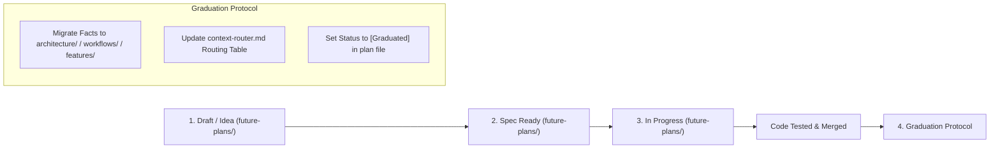

# Documentation Governance & Maintenance Runbook

## Use This When
- You are updating existing documentation or introducing a new document.
- You are graduating a feature from `future-plans/` into live current-state docs.
- You are verifying Definition of Done compliance for a pull request or task.

## Skip This When
- You are looking for technical troubleshooting steps $\rightarrow$ read [runbooks/troubleshooting.md](file:///e:/PrintMO/PrintMO-Order-Management/docs/official-docs/runbooks/troubleshooting.md).

## Section Map
- [1. Core Documentation Rules](#1-core-documentation-rules)
- [2. Feature Progression & Graduation Protocol](#2-feature-progression--graduation-protocol)
- [3. Definition of Done Checklist](#3-definition-of-done-checklist)
- [Common Failure Modes & Recovery](#common-failure-modes--recovery)

---

## 1. Core Documentation Rules

1. **Single Source of Truth**: Never duplicate architectural diagrams or API contracts across multiple files. Keep general models in `architecture/system-overview.md` and detailed contracts in their respective specific doc files.
2. **Mandatory Header Contract**: All current-state docs MUST feature `## Use This When`, `## Skip This When`, `## Section Map`, and `## Common Failure Modes & Recovery`.
3. **Strict Plan Isolation**: Never describe planned or hypothetical features inside `architecture/`, `workflows/`, `features/`, or `runbooks/`. Planned work MUST remain in `future-plans/` until live code is merged.

---

## 2. Feature Progression & Graduation Protocol

When a feature transitions from a plan to shipped code:

1. **Migrate Facts**: Extract permanent architectural contracts, UI workflows, and runbook procedures into their respective folders (`features/`, `workflows/`, `architecture/`).
2. **Update Router**: Add new task/symptom lookup rows to [docs/official-docs/context-router.md](file:///e:/PrintMO/PrintMO-Order-Management/docs/official-docs/context-router.md).
3. **Mark Graduated**: Update the plan file status header in `future-plans/` to `**Status**: [Graduated]`.

---

## 3. Definition of Done Checklist

Every code pull request or agent task MUST meet this documentation definition of done:

- [ ] Code changes verified using syntax commands (`node --check`) and manual runbooks.
- [ ] Any modified IPC handlers, API schemas, or workflows documented in `docs/official-docs/`.
- [ ] Relative markdown links verified and operational.
- [ ] If a feature was completed, Graduation Protocol executed.

---

## Common Failure Modes & Recovery

| Failure / Violation | Root Cause | Action Required |
|---|---|---|
| AI agent updates doc with unreleased plan | Mixing future ideas with current state | Revert edit; move planned feature description to `future-plans/`. |
| Broken links in router or AGENTS.md | Renamed or moved document file | Audit all relative markdown links using `file:///` format. |
