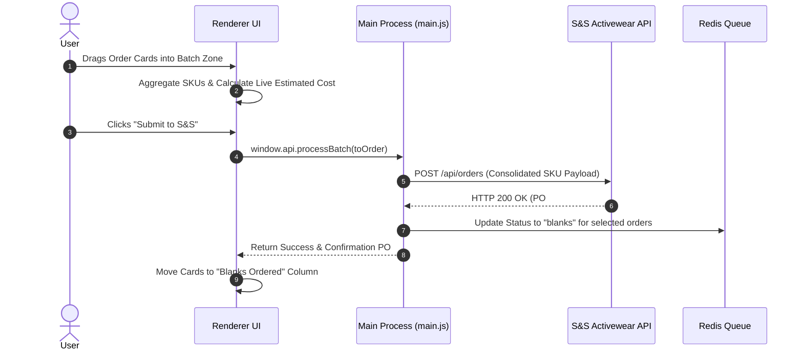

# Blanks Batching & Purchasing Workflow

## Use This When
- You are modifying the blank-apparel batching zone, SKU consolidation, or S&S ordering logic.
- You are debugging batch submit failures or price aggregation errors.

## Skip This When
- You are working on general Kanban board card layout $\rightarrow$ read [workflows/order-ingestion-kanban.md](file:///e:/PrintMO/PrintMO-Order-Management/docs/official-docs/workflows/order-ingestion-kanban.md).
- You are editing external API authorization parameters $\rightarrow$ read [architecture/external-apis.md](file:///e:/PrintMO/PrintMO-Order-Management/docs/official-docs/architecture/external-apis.md).

## Section Map
- [1. Blanks Batching Sequence](#1-blanks-batching-sequence)
- [2. SKU Aggregation Algorithm](#2-sku-aggregation-algorithm)
- [3. Batch Submission & State Update](#3-batch-submission--state-update)
- [Common Failure Modes & Recovery](#common-failure-modes--recovery)

---

## 1. Blanks Batching Sequence

---

## 2. SKU Aggregation Algorithm

When orders are dragged into the batch zone:

1. Extract `line_items` array from each selected order object.
2. Filter items containing valid supplier `sku` strings.
3. Group by `sku` and aggregate total required quantities:
   $$\text{TotalQty}(\text{SKU}_k) = \sum_{i \in \text{SelectedOrders}} \text{ItemQty}_i(\text{SKU}_k)$$
4. Query live per-unit pricing from S&S REST API and compute total estimated batch cost.

---

## 3. Batch Submission & State Update

1. `main.js:process-batch` constructs the S&S PO payload and dispatches the request using basic authentication header (`SS_API_KEY`).
2. Upon receiving a valid confirmation:
   - For each order in the batch, set `.status = 'blanks'`.
   - Record S&S purchase order reference ID into order metadata.
   - Mutate entries in Redis via `LSET`.
3. UI updates real-time board columns, shifting affected order cards to `Blanks Ordered`.

---

## Common Failure Modes & Recovery

| Symptom / Trap | Root Cause | Diagnosis & Recovery |
|---|---|---|
| Batch submit button disabled | Selected orders contain missing or empty SKUs | Inspect order items in detail modal; assign supplier SKU before batching. |
| API Error 400 invalid SKU payload | SKU format mismatch in S&S catalog | Verify SKU string against S&S catalog convention (e.g. `STYLE-COLOR-SIZE`). |
| Duplicate S&S orders placed | Network retry on timeout without idempotent key | Verify S&S dashboard before re-submitting failed batch calls. |
