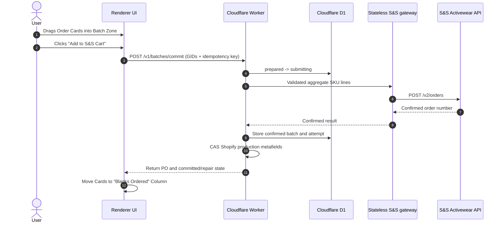

# Blanks Batching & Purchasing Workflow

## Use This When
- You are modifying the blank-apparel batching zone, SKU consolidation, or S&S ordering logic.
- You are debugging batch submit failures or price aggregation errors.

## Skip This When
- You are working on general Kanban board card layout $\rightarrow$ read [workflows/order-ingestion-kanban.md](file:///e:/PrintMO/PrintMO-Order-Management/docs/official-docs/workflows/order-ingestion-kanban.md).
- You are editing external API authorization parameters $\rightarrow$ read [architecture/external-apis.md](file:///e:/PrintMO/PrintMO-Order-Management/docs/official-docs/architecture/external-apis.md).

## Section Map
- [1. Blanks Batching Sequence](#1-blanks-batching-sequence)
- [2. SKU Aggregation Algorithm](#2-sku-aggregation-algorithm)
- [3. Batch Submission & State Update](#3-batch-submission--state-update)
- [Common Failure Modes & Recovery](#common-failure-modes--recovery)

---

## 1. Blanks Batching Sequence

---

## 2. SKU Aggregation Algorithm

When orders are dragged into the batch zone:

1. Resolve selected GIDs from active D1 projections and validate their production stages.
2. Read complete Shopify-derived line items from the projection; exclude known print-service lines.
3. Filter items containing valid supplier `sku` strings.
4. Group by `sku` and aggregate total required quantities:
   $$\text{TotalQty}(\text{SKU}_k) = \sum_{i \in \text{SelectedOrders}} \text{ItemQty}_i(\text{SKU}_k)$$
5. Hash the canonical sorted line set and capture every selected production revision.

---

## 3. Batch Submission & State Update

1. The Worker inserts an idempotent D1 batch and allows only one transition to `submitting`.
2. The Render gateway validates the already-aggregated lines, adds server-held credentials/payment/shipping configuration, performs pricing lookups, and posts to S&S without reading Redis.
3. A confirmed S&S response is stored before Shopify metadata is advanced.
4. Each selected order receives the PO in `batchRefs` and advances to `blanks_ordered` through compare-digest mutation.
5. If the supplier confirms but metadata is incomplete, the response lists repair-required GIDs and nightly integrity reconciliation repairs them. The supplier order is never resent.
6. A timeout or ambiguous gateway result is stored as `unknown` and requires reconciliation.

Confirmed batches also set `readiness.blanksOrdered`. Operators may change that readiness checkbox manually without moving an order between board stages; while an order is in the Blanks column, the same edit continues to select the In S&S Cart versus Ordered view.

Legacy Redis mode continues using its existing process-batch route until final cutover; candidate mode never calls it.

---

## Common Failure Modes & Recovery

| Symptom / Trap | Root Cause | Diagnosis & Recovery |
|---|---|---|
| Batch submit button disabled | Selected orders contain missing or empty SKUs | Inspect order items in detail modal; assign supplier SKU before batching. |
| API Error 400 invalid SKU payload | SKU format mismatch in S&S catalog | Verify SKU string against S&S catalog convention (e.g. `STYLE-COLOR-SIZE`). |
| Duplicate S&S orders placed | Network retry on timeout without idempotent key | Verify S&S dashboard before re-submitting failed batch calls. |
