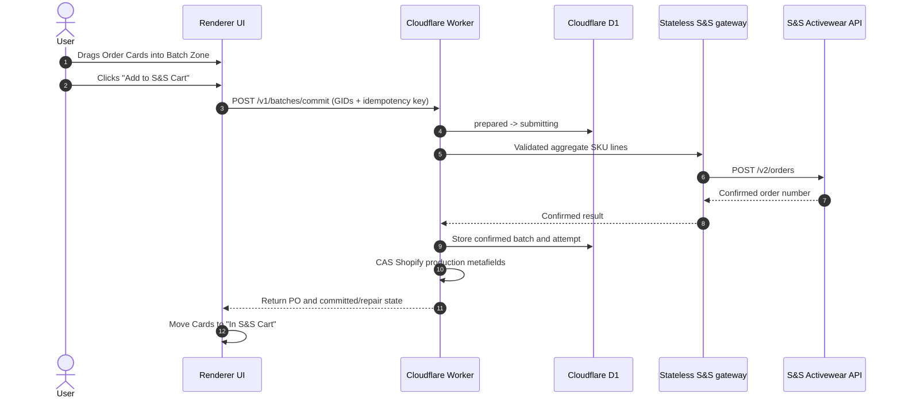

# Blanks Batching & Purchasing Workflow

## Use This When
- You are modifying the blank-apparel batching zone, SKU consolidation, or S&S ordering logic.
- You are debugging batch submit failures or price aggregation errors.

## Skip This When
- You are working on general Kanban board card layout → read [Order ingestion and Kanban](order-ingestion-kanban.md).
- You are editing external API authorization parameters → read [External APIs](../architecture/external-apis.md).

## Section Map
- [Blanks Batching Sequence](#blanks-batching-sequence)
- [SKU Aggregation Algorithm](#sku-aggregation-algorithm)
- [Batch Submission & State Update](#batch-submission--state-update)
- [Receiving Manifest and Batch Correction](#receiving-manifest-and-batch-correction)
- [Common Failure Modes & Recovery](#common-failure-modes--recovery)

---

## Blanks Batching Sequence

---

## SKU Aggregation Algorithm

When orders are dragged into the batch zone:

1. Resolve selected GIDs from active D1 projections and validate their production stages.
2. Read complete Shopify-derived line items from the projection; exclude known print-service lines.
3. Filter items containing valid supplier `sku` strings.
4. Group by `sku` and aggregate total required quantities:
   $$\text{TotalQty}(\text{SKU}_k) = \sum_{i \in \text{SelectedOrders}} \text{ItemQty}_i(\text{SKU}_k)$$
5. Hash the canonical sorted line set and capture every selected production revision.

---

## Batch Submission & State Update

1. The Worker inserts an idempotent D1 batch and allows only one transition to `submitting`.
2. The Render gateway validates the already-aggregated lines, adds server-held credentials/payment/shipping configuration, performs pricing lookups, and posts to S&S without reading Redis.
3. A confirmed S&S response is stored before Shopify metadata is advanced.
4. Each selected order receives the PO in `batchRefs` and advances to `blanks_cart` through compare-digest mutation.
5. If the supplier confirms but metadata is incomplete, the response lists repair-required GIDs and nightly integrity reconciliation repairs them. The supplier order is never resent.
6. A timeout or ambiguous gateway result is stored as `unknown` and requires reconciliation.

Confirmed batches leave `readiness.blanksOrdered` false so newly submitted cards appear in **In S&S Cart**. **Mark In Cart Ordered** atomically advances every current cart card to `blanks_ordered` and sets `readiness.blanksOrdered`, opens the Ordered view, and then records the receiving manifest. The Worker enforces that stage/readiness pairing for both Blanks substages so reloads cannot classify an ordered card as in-cart. Reconciliation preserves that later stage and readiness instead of moving cards backward.

Legacy Redis mode continues using its existing process-batch route until final cutover; candidate mode never calls it.

## Receiving Manifest and Batch Correction

After **Mark In Cart Ordered**, the browser records an authenticated receiving manifest through `/order-manager/blanks-batches`. This compatibility manifest currently lives in the private `PREVIEWS` R2 binding; it is separate from the durable supplier-order state machine in D1. Each new manifest stores both the immutable Shopify order GID and the display name so legacy name-only manifests remain readable while new membership checks use stable identity.

The receiving UI has two levels:

1. The normal order-detail garment sub-row exposes `−`, quantity, `+`, and **Save** controls. It updates the matching batch manifest line without opening another modal over Order Detail.
2. **Receive Batches** remains the aggregate manifest workspace for full-batch receiving, multiple historical memberships, and **Add Orders** correction.

**Add Orders** always requires an explicit checkbox selection. An unbatched In S&S Cart order is added and advanced to Ordered. An order already in another receiving batch is transferred in one Worker request: the source membership is removed, already-received quantity follows the order up to its expected quantity, the target is recalculated oldest-first, and an emptied accidental batch is removed from the active index. Creating a second active manifest for an already-batched order returns `409 ORDER_ALREADY_BATCHED`.

The one-active-receiving-batch rule is enforced by the Worker, not only by hidden or disabled controls. The current R2 operation uses a bounded multi-object write with best-effort rollback; migrating this compatibility manifest into normalized D1 receiving tables remains the route to database transactions and audit history.

---

## Common Failure Modes & Recovery

| Symptom / Trap | Root Cause | Diagnosis & Recovery |
|---|---|---|
| Batch submit button disabled | Selected orders contain missing or empty SKUs | Inspect order items in detail modal; assign supplier SKU before batching. |
| API Error 400 invalid SKU payload | SKU format mismatch in S&S catalog | Verify SKU string against S&S catalog convention (e.g. `STYLE-COLOR-SIZE`). |
| Duplicate S&S orders placed | Network retry on timeout without idempotent key | Verify S&S dashboard before re-submitting failed batch calls. |
| Print count says the garment total is `0` | `PrintMOProductionState` omitted `sku`, while validation excludes lines without a supplier SKU | Keep `sku` in the production-state query and its regression contract; refresh Shopify after deploying the Worker. |
| Receive Batches appears above Order Detail but cannot be clicked | A dynamically created overlay was omitted from the shared focus/inert dialog stack | Keep `#blanks-receive-overlay` and `#batch-correction-overlay` registered by `accessibility-hardening.js`. |
| A missed order creates a second receiving batch | The order was submitted through create instead of explicit add/transfer | Open the intended batch, choose **Add Orders**, select the missed order, and let the Worker transfer any existing membership. |
