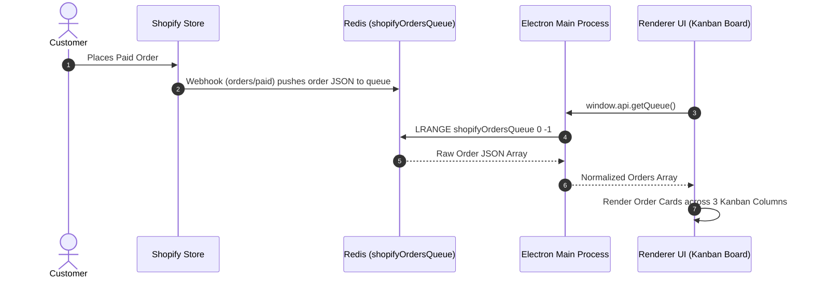

# Order Ingestion to Kanban Workflow

## Use This When
- You are modifying the order ingestion pipeline, state transitions, or Kanban UI board logic.
- You are debugging status transitions between `Payment Received`, `Blanks Ordered`, and `Ready to Print`.

## Skip This When
- You are working on blank-apparel SKU aggregation or S&S REST API calls $\rightarrow$ read [workflows/blanks-batching.md](file:///e:/PrintMO/PrintMO-Order-Management/docs/official-docs/workflows/blanks-batching.md).
- You are troubleshooting IPC serialization issues $\rightarrow$ read [architecture/ipc-and-storage.md](file:///e:/PrintMO/PrintMO-Order-Management/docs/official-docs/architecture/ipc-and-storage.md).

## Section Map
- [1. Order Ingestion Pipeline](#1-order-ingestion-pipeline)
- [2. Kanban Board Columns & State Ownership](#2-kanban-board-columns--state-ownership)
- [3. Card Interactions & Detail Modal](#3-card-interactions--detail-modal)
- [Common Failure Modes & Recovery](#common-failure-modes--recovery)

---

## 1. Order Ingestion Pipeline

---

## 2. Kanban Board Columns & State Ownership

The board maintains three operational columns:

| Column Name | Status Enum | Description & Available Actions |
|---|---|---|
| **Payment Received** | `payment_received` | Newly ingested Shopify orders. User can drag to batch zone, view order details, add notes/attachments, or delete. |
| **Blanks Ordered** | `blanks` | Orders whose blank apparel has been purchased via S&S Activewear. Cards retain supplier PO numbers. |
| **Ready to Print** | `ready` | Blank apparel received; order is ready for shop printing and final fulfillment. |

---

## 3. Card Interactions & Detail Modal

- **Drag-and-Drop**: Dragging a card triggers HTML5 drag events. Dropping onto a new column fires `window.api.updateStatus(index, newStatus)` which calls `LSET` on Redis.
- **Detail Overlay**: Clicking a card opens the order detail modal (`renderer.js:1080+`), presenting:
  - Customer contact info & order timestamp.
  - SKU breakdown with variant title, unit cost, line item quantities, and discount subtotals.
  - Attachment upload/view tab (`add-file`, `remove-files`).
  - Production notes and status toggle switches.

---

## Common Failure Modes & Recovery

| Symptom / Trap | Root Cause | Diagnosis & Recovery |
|---|---|---|
| Card reverts to previous column after drop | IPC `update-status` failed or Redis connection dropped | Check console logs in devtools. Verify Redis is running and reachable. |
| Time-ago badge displays invalid date | `created_at` timestamp format mismatch in Shopify payload | Ensure ISO-8601 string parsing in `renderer.js` time-ago calculations. |
| Card order shifts incorrectly | Out-of-sync list array index | Refresh board (`getQueue`) prior to executing batch index operations. |
