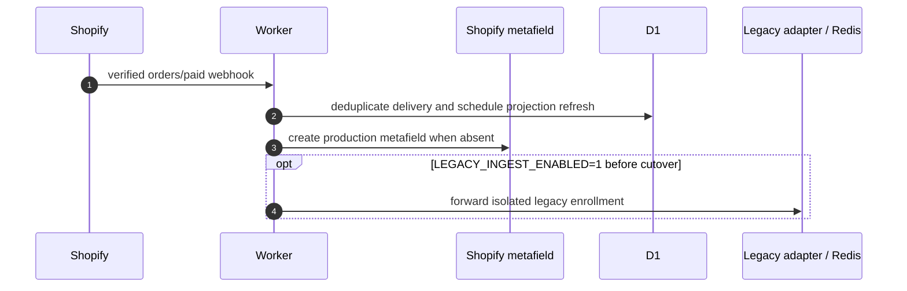
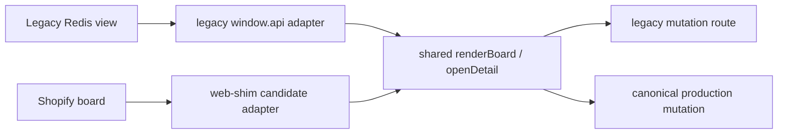

# Order Ingestion and Shared Kanban Workflow

## Use This When

- You are changing order enrollment, shared board rendering, stage transitions, card drag/drop, or detail opening.
- You need to understand how Legacy Redis and Shopify-board data reach the same renderer without sharing mutation authority.

## Skip This When

- You are changing supplier aggregation or submission → read [Blanks batching](blanks-batching.md).
- You are changing Electron transport → read [IPC and storage](../architecture/ipc-and-storage.md).
- You are changing Shopify production ownership or D1/R2 → read [Shopify-primary data plane](../architecture/shopify-primary-data-plane.md).

## Section Map

- [Order Enrollment](#order-enrollment)
- [Shared Board Render and Mutation Flow](#shared-board-render-and-mutation-flow)
- [Stage and View Semantics](#stage-and-view-semantics)
- [Card and Detail Interactions](#card-and-detail-interactions)
- [Common Failure Modes & Recovery](#common-failure-modes--recovery)

## Order Enrollment

Candidate enrollment and legacy fallback ingestion may coexist before cutover, but their reads and mutations remain isolated.

## Shared Board Render and Mutation Flow

The desktop and embedded clients reuse the board renderer through different adapters:

- Legacy mode maps legacy queue objects into the renderer and persists through authenticated `/legacy/` routes.
- Shopify mode maps bounded Worker DTOs into the renderer and persists through canonical production endpoints.
- Source selection is a view/adapter choice, not a copy or dual-write operation.
- Candidate queue loads are generation-guarded and repaint only changed columns.
- Slow private assets hydrate after commerce/production cards are usable.

Candidate moves are optimistic and atomic:

1. Derive the complete destination stage.
2. Snapshot local status fields.
3. Repaint immediately.
4. Send one canonical production patch with expected revision and idempotency.
5. On one `VERSION_CONFLICT`, adopt current state and retry at most once when still needed.
6. On terminal failure, restore the snapshot and show a non-blocking error.

## Stage and View Semantics

Candidate stages are:

- `received`
- `to_order`
- `blanks_cart`
- `blanks_ordered`
- `print`
- `completed`

`blanks_cart` and `blanks_ordered` are distinct canonical stages. **In S&S Cart** and **Ordered** tabs filter those stages; selecting a tab alone is read-only. A confirmed supplier submission enters `blanks_cart`; an operator later marks it `blanks_ordered`. After confirmation, the client repaints both `to_order` and `blanks_cart` immediately and opens **In S&S Cart**. Adapter-side batch metadata must not preempt the renderer's source/destination-column calculation.

The Shopify board keeps commerce fulfillment separate from PrintMO production state. A `FULFILLED` Shopify order is omitted from the visible **Ready to Print** queue without rewriting its canonical `print` stage; partial, unknown, and unfulfilled statuses remain visible. The browser maps fulfillment status into its render fingerprint so the next webhook-backed projection refresh and board poll remove a newly fulfilled card.

Legacy status values remain compatibility data for the Legacy Redis view only.

## Card and Detail Interactions

- `renderer.js → renderBoard` owns shared card rendering.
- `renderer.js → openDetail` opens the shared detail overlay.
- `renderer.js → splitOrderAssets` normalizes legacy/manual/Designer Studio asset containers.
- Candidate summary cards use bounded board DTOs and never fetch rich detail during initial board load.
- Candidate rich detail is fetched on demand.
- Candidate source switching preserves the last usable board if the requested source fails.

## Common Failure Modes & Recovery

| Symptom | Cause | Recovery |
|---|---|---|
| Candidate card reverts after a move | Canonical write failed or concurrent revision advanced | Preserve optimistic rollback and bounded conflict reconciliation; inspect structured error details. |
| Legacy card reverts | Legacy adapter mutation failed | Confirm authenticated legacy transport and stable order identity; do not add direct Redis IPC. |
| Shopify board appears empty after failure | Failed bootstrap was treated as authoritative empty data | Preserve previous board and surface `BOARD_NOT_INITIALIZED`. |
| One malformed legacy asset blanks the board | Asset container was assumed to be an array | Preserve `splitOrderAssets` normalization and run regression verification. |
| Detail click throws before opening | Shared renderer assumed an optional surface-specific control exists | Keep optional controls guarded and run Phase 2 verification. |
