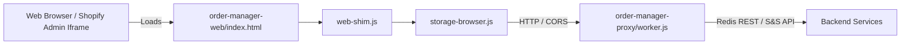

# Web & Shopify Admin Porting Workflow

## Use This When
- You are modifying files under `order-manager-web/` or `order-manager-proxy/`.
- You are updating web-shim handlers, browser local storage fallbacks, or Cloudflare Worker proxies.
- You are optimizing CSS layout for Shopify Admin embedded viewports or mobile devices.

## Skip This When
- You are working on Electron native IPC handlers in `main.js` $\rightarrow$ read [architecture/ipc-and-storage.md](file:///e:/PrintMO/PrintMO-Order-Management/docs/official-docs/architecture/ipc-and-storage.md).
- You are troubleshooting desktop electron builder packages $\rightarrow$ read [runbooks/dev-setup-and-build.md](file:///e:/PrintMO/PrintMO-Order-Management/docs/official-docs/runbooks/dev-setup-and-build.md).

## Section Map
- [1. Web Port Architecture Overview](#1-web-port-architecture-overview)
- [2. IPC Shim & Storage Abstraction](#2-ipc-shim--storage-abstraction)
- [3. Cloudflare Worker Proxy Integration](#3-cloudflare-worker-proxy-integration)
- [4. Viewport & CSS Decoupling](#4-viewport--css-decoupling)
- [Common Failure Modes & Recovery](#common-failure-modes--recovery)

---

## 1. Web Port Architecture Overview

The web port (`order-manager-web/`) enables running the entire PrintMO Kanban workspace directly inside standard web browsers or embedded within the Shopify Admin interface.

---

## 2. IPC Shim & Storage Abstraction

1. `web-shim.js`: Checks if `window.api` is defined. If undefined (running in browser environment), it injects a polyfill exposing `window.api` methods.
2. `storage-browser.js`: Implements the underlying storage and data handling for `web-shim.js`, using browser `localStorage` or making HTTP calls to `order-manager-proxy/worker.js`.

---

## 3. Cloudflare Worker Proxy Integration

- **File**: `order-manager-proxy/worker.js`
- **Deployment**: Deployed as a Cloudflare Worker.
- **Responsibilities**:
  - Serves as CORS middleware allowing requests from Shopify Admin origins.
  - Proxies calls to Redis and S&S Activewear without exposing API credentials client-side.
  - Handled via `scripts/prepare-cloudflare-pages-upload.sh`.

---

## 4. Viewport & CSS Decoupling

The web port must operate within constrained Shopify Admin viewports as well as mobile browser screens:

- `desktop.css`: High-density dashboard styles optimized for widescreen shop monitors.
- `mobile.css`: Responsive mobile and constrained iframe styles enforcing min 44x44px touch targets and full operational capabilities across columns.

---

## Common Failure Modes & Recovery

| Symptom / Trap | Root Cause | Diagnosis & Recovery |
|---|---|---|
| CORS error in browser console when fetching orders | Missing origin headers in Cloudflare Worker proxy | Inspect `order-manager-proxy/worker.js` CORS header headers (`Access-Control-Allow-Origin`). |
| Data changes not saved in browser | `storage-browser.js` falling back to read-only state | Check browser local storage permissions and network logs. |
| Layout broken inside Shopify Admin iframe | Mobile CSS media query override missing | Verify `mobile.css` breakpoint rules and container width limits. |
