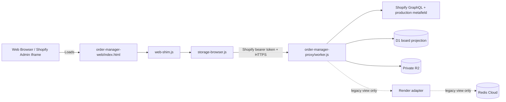

# Web & Shopify Admin Porting Workflow

## Use This When
- You are modifying files under `order-manager-web/` or `order-manager-proxy/`.
- You are updating web-shim handlers, browser local storage fallbacks, or Cloudflare Worker proxies.
- You are optimizing CSS layout for Shopify Admin embedded viewports or mobile devices.

## Skip This When
- You are working on Electron native IPC handlers in `main.js` $\rightarrow$ read [architecture/ipc-and-storage.md](file:///e:/PrintMO/PrintMO-Order-Management/docs/official-docs/architecture/ipc-and-storage.md).
- You are troubleshooting desktop electron builder packages $\rightarrow$ read [runbooks/dev-setup-and-build.md](file:///e:/PrintMO/PrintMO-Order-Management/docs/official-docs/runbooks/dev-setup-and-build.md).

## Section Map
- [1. Web Port Architecture Overview](#1-web-port-architecture-overview)
- [2. IPC Shim & Storage Abstraction](#2-ipc-shim--storage-abstraction)
- [3. Cloudflare Worker Proxy Integration](#3-cloudflare-worker-proxy-integration)
- [4. Viewport & CSS Decoupling](#4-viewport--css-decoupling)
- [Common Failure Modes & Recovery](#common-failure-modes--recovery)

---

## 1. Web Port Architecture Overview

The web port (`order-manager-web/`) enables running the entire PrintMO Kanban workspace directly inside standard web browsers or embedded within the Shopify Admin interface.

---

## 2. IPC Shim & Storage Abstraction

1. `web-shim.js`: Checks if `window.api` is defined. If undefined (running in browser environment), it injects a polyfill exposing `window.api` methods.
2. `storage-browser.js`: Implements the underlying storage and data handling for `web-shim.js`, using browser `localStorage` or making HTTP calls to `order-manager-proxy/worker.js`.

---

## 3. Cloudflare Worker Proxy Integration

- **File**: `order-manager-proxy/worker.js`
- **Deployment**: Deployed as a Cloudflare Worker.
- **Responsibilities**:
  - Enforces allowed origins plus Shopify App Bridge bearer-token signature, shop, audience, expiry, and partner-user validation.
  - Owns Shopify Admin GraphQL access, compare-digest production mutations, D1 projections/app records, webhook deduplication, reconciliation, and stable DTO assembly.
  - Requires authenticated short-lived tickets for private R2 bytes.
  - Sends only validated aggregate garment lines to the stateless S&S gateway.
  - Keeps Render/Redis calls behind explicitly named legacy or migration routes during acceptance.
  - Handled via `scripts/prepare-cloudflare-pages-upload.sh`.

The prepared Cloudflare Pages artifact injects the public Shopify client ID into the App Bridge meta tag. Source HTML intentionally contains a placeholder and must not be deployed without `npm run prepare:cloudflare`.

### Source-switched operational board

The header exposes **Legacy Redis / Shopify board**. Both use the established Kanban renderer; `web-shim.js` selects the data adapter and mutation endpoints.

- Legacy mode retains the existing queue URLs and payloads.
- Shopify mode pages `GET /order-manager/v1/orders`, maps the stable DTO into the existing card contract, and routes drag/drop, notes, readiness, bundle, progress, archive, and batch actions to canonical endpoints.
- A failed source switch restores the previous source and keeps its last rendered board. The Worker also rejects a false authoritative empty candidate until initial migration/reconciliation completes.
- Shopify commerce fields remain read-only. Production fields are changed through `PATCH /order-manager/v1/orders/:gid/production` with expected revision and idempotency key.
- Idempotency fallbacks generate `admin:...`, `board:...`, `detail:...`, or `batch:...` keys from timestamp plus random bytes. Never fall back to `${gid}:...`; Shopify GID slashes violate the Worker contract.
- Full detail comes from `GET /order-manager/v1/orders/:gid`; line-item connections are fully paginated.
- Summary line items retain the allowlisted Designer Studio properties. Reconciliation imports matching preview/promoted objects from the `PREVIEWS` binding into checksum-verified private R2 manifests. The board hydrates those manifests through authenticated one-minute tickets; it does not render or persist the public line-item URL.
- The earlier Shopify diagnostic list/detail endpoints remain available for targeted comparison, but they are no longer the primary candidate surface.
- Protected customer data is shown only when Shopify returns approved fields.
- The Admin order block reads and edits the same metafield. Shopify may host-collapse content over 300px; `collapsedSummary` communicates stage/progress and controls use explicit labels.

#### Current endpoint and data contract

| Endpoint | Shopify operation | Returned data | Cache / boundary |
|---|---|---|---|
| `GET /order-manager/v1/orders` | Bounded stale refresh as needed | Cursor-paged board DTO with Shopify commerce, canonical production state, and private asset manifest metadata | D1 enumeration; maximum 50; no Redis |
| `GET /order-manager/v1/orders/:gid` | Rich order detail and line-item pagination | Shopify facts, production state, attention, and asset manifests | On demand; no Redis |
| `GET /order-manager/v1/orders/:gid/production` | `PrintMOProductionState` | Canonical stage/revision/readiness/bundle/notes/progress/batch refs | Shopify metafield plus D1 asset manifests |
| `PATCH /order-manager/v1/orders/:gid/production` | `metafieldsSet` with `compareDigest` | Committed production revision or conflict/sync-pending state | D1 idempotency/audit; no Redis |
| `POST /order-manager/v1/batches/commit` | Production reads during validation/commit | Durable batch/S&S result and metadata repair list | D1 state machine; stateless supplier gateway |

The detail response is grouped under these stable UI-facing properties:

- `data.customer`: Shopify customer name/contact/locale when returned.
- `data.commerce`: display statuses, current totals, payment gateways, and transaction history.
- `data.delivery`: shipping/billing addresses, checkout shipping lines, fulfillment-order delivery method, and completed fulfillments/tracking.
- `data.conversion`: customer order index, days to conversion, and first/last attributed visit.
- `data.discounts`, `data.lineItems`, and `data.timeline`: normalized order discounts, all line items, and recent Shopify order events.
- `data.note` and `data.tags`: the Shopify order note and Shopify order tags. PrintMO `production.internalNotes` is loaded separately and is never confused with the Shopify order note.

The source adapter is `order-manager-web/web-shim.js`; source switching and diagnostic detail are in `shopify-preview.js`; canonical APIs live in `order-manager-proxy/worker.js`; the Admin block is under `order-manager-proxy/extensions/printmo-production-status/`.

**Candidate release (2026-07-23):** Worker `f9fee090-bffc-4316-b8c6-4156aa249192`, Pages deployment `3da86eec`, Shopify app version `designer-assets-idempotency-2026-07-23`, and supplier gateway commit `420ff72`. The Pages release includes the shared-renderer guard for the Shopify detail layout's intentionally absent legacy Files button. The Designer Studio backfill completed with 12/12 active candidates imported and zero failures. Final migration/acceptance and owner-approved cutover remain separate gates.

#### Shopify access requirements and current limitation

- `read_orders` covers the base order, line items, transactions, fulfillments, conversion summary, discounts, and events for the normal Shopify order-access window.
- `Order.fulfillmentOrders` returns `FulfillmentOrder` objects, which Shopify governs through fulfillment-order scopes. This order-management read requires at least `read_merchant_managed_fulfillment_orders`; include `read_third_party_fulfillment_orders` when the app must see orders assigned to third-party fulfillment services. See Shopify's [FulfillmentOrder access-scope contract](https://shopify.dev/docs/api/admin-graphql/latest/objects/FulfillmentOrder).
- Name, address, phone, and email are separately governed protected customer fields. Request only the fields the operational UI needs through Shopify's [protected customer data process](https://shopify.dev/docs/apps/launch/protected-customer-data).
- `write_orders` is required for the app-owned production metafield.
- `read_all_orders` keeps unfinished production work accessible beyond Shopify's default order window.

The rich-detail scopes plus candidate `write_orders` and `read_all_orders` scopes are approved on the production installation. Canonical Shopify-board/Admin-block writes have been verified; final cutover remains a separate owner decision.

Changing Shopify scopes is a deployment and merchant-approval operation: update `order-manager-proxy/shopify.app.toml`, release a new Shopify app version, and approve the permission update on the production `Print-MO` installation. A Worker or Pages deploy alone does not grant Shopify scopes.

---

## 4. Viewport & CSS Decoupling

The web port must operate within constrained Shopify Admin viewports as well as mobile browser screens:

- `desktop.css`: High-density dashboard styles optimized for widescreen shop monitors.
- `mobile.css`: Responsive mobile and constrained iframe styles enforcing min 44x44px touch targets and full operational capabilities across columns.

### Shopify Embedded Mobile Interaction Contract

The mobile web surface is an application viewport inside Shopify Admin, not a
document page. Its outer shell remains fixed to the iframe viewport while the
active queue, detail view, or workflow sheet owns vertical scrolling.

- Phone order and production cards are tap targets, not draggable desktop
  tiles. Native card dragging is disabled at the mobile breakpoint so it cannot
  steal taps or vertical swipes on iOS.
- Vertical gestures that start outside an active scroll owner, or reach the top
  or bottom of one, are contained inside the app instead of chaining into the
  surrounding Shopify Admin page.
- Storage Browser is the exception to the fixed workflow-screen pattern: its
  full view is top-anchored and owns vertical scrolling, while horizontal
  scrolling and scroll chaining into Shopify Admin remain disabled.
- Queue cards use a compact two-column grid in embedded mobile viewports. Card
  mockups, names, and counts reduce proportionally so both columns remain
  readable without horizontal clipping.
- Regression checks must include working stage-navigation taps, order/bundle
  opening, card `draggable=false`, a fixed root shell, and scroll containment at
  both `320px` and `393px` widths.

---

## Common Failure Modes & Recovery

| Symptom / Trap | Root Cause | Diagnosis & Recovery |
|---|---|---|
| CORS error in browser console when fetching orders | Missing origin headers in Cloudflare Worker proxy | Inspect `order-manager-proxy/worker.js` CORS header headers (`Access-Control-Allow-Origin`). |
| Shopify board fails while Legacy Redis works | Shopify token exchange, permission approval, D1 initialization, GraphQL response, or throttling failure | Keep production work on Legacy Redis. Inspect the structured Worker error and request ID; `BOARD_NOT_INITIALIZED` means migration/bootstrap has not established the candidate and must not be treated as an empty board. |
| Shopify detail again shows `404 - [object Object]` while the order exists | A released/installed scope regressed or another optional GraphQL field is denied; a null order is being mistaken for not found | The 2026-07-22 fulfillment-order gate is resolved in production. If it returns, inspect the structured GraphQL error path, compare released versus installed scopes, and preserve partial data rather than assuming deletion. |
| Shopify detail shows customer fields as not returned | Guest checkout or protected customer data fields are not approved for the app | Confirm the order has customer data in Shopify Admin, then review the app's protected customer data API access request. Do not broaden scopes or expose credentials in the client. |
| Data changes not saved in browser | `storage-browser.js` falling back to read-only state | Check browser local storage permissions and network logs. |
| Layout broken inside Shopify Admin iframe | Mobile CSS media query override missing | Verify `mobile.css` breakpoint rules and container width limits. |
