# Web & Shopify Admin Porting Workflow

## Use This When
- You are modifying files under `order-manager-web/` or `order-manager-proxy/`.
- You are updating web-shim handlers, browser local storage fallbacks, or Cloudflare Worker proxies.
- You are optimizing CSS layout for Shopify Admin embedded viewports or mobile devices.

## Skip This When
- You are working on Electron native IPC handlers in `main.js` $\rightarrow$ read [architecture/ipc-and-storage.md](file:///e:/PrintMO/PrintMO-Order-Management/docs/official-docs/architecture/ipc-and-storage.md).
- You are troubleshooting desktop electron builder packages $\rightarrow$ read [runbooks/dev-setup-and-build.md](file:///e:/PrintMO/PrintMO-Order-Management/docs/official-docs/runbooks/dev-setup-and-build.md).

## Section Map
- [1. Web Port Architecture Overview](#1-web-port-architecture-overview)
- [2. IPC Shim & Storage Abstraction](#2-ipc-shim--storage-abstraction)
- [3. Cloudflare Worker Proxy Integration](#3-cloudflare-worker-proxy-integration)
- [4. Viewport & CSS Decoupling](#4-viewport--css-decoupling)
- [Common Failure Modes & Recovery](#common-failure-modes--recovery)

---

## 1. Web Port Architecture Overview

The web port (`order-manager-web/`) enables running the entire PrintMO Kanban workspace directly inside standard web browsers or embedded within the Shopify Admin interface.

```mermaid
flowchart LR
    Browser[Web Browser / Shopify Admin Iframe] -->|Loads| IndexHTML[order-manager-web/index.html]
    IndexHTML --> WebShim[web-shim.js]
    WebShim --> StorageBrowser[storage-browser.js]
    StorageBrowser -->|Shopify bearer token + HTTPS| CFWorker[order-manager-proxy/worker.js]
    CFWorker -->|Authenticated HTTPS| RenderAdapter[Render data adapter]
    RenderAdapter -->|Private connection| RedisCloud[(Redis Cloud)]
```

---

## 2. IPC Shim & Storage Abstraction

1. `web-shim.js`: Checks if `window.api` is defined. If undefined (running in browser environment), it injects a polyfill exposing `window.api` methods.
2. `storage-browser.js`: Implements the underlying storage and data handling for `web-shim.js`, using browser `localStorage` or making HTTP calls to `order-manager-proxy/worker.js`.

---

## 3. Cloudflare Worker Proxy Integration

- **File**: `order-manager-proxy/worker.js`
- **Deployment**: Deployed as a Cloudflare Worker.
- **Responsibilities**:
  - Enforces allowed origins plus Shopify App Bridge bearer-token signature, shop, audience, expiry, and partner-user validation.
  - Calls the authenticated Render adapter for atomic legacy/v1 Redis mutations and existing S&S operations; Redis and S&S credentials never reach clients or the Worker bundle.
  - Owns Shopify Admin GraphQL access, cost-aware cache refresh, webhook verification/invalidation, and stable v1 DTO assembly.
  - Requires authenticated fetches for R2 bytes; the browser renders returned blobs rather than public Worker object URLs.
  - Handled via `scripts/prepare-cloudflare-pages-upload.sh`.

The prepared Cloudflare Pages artifact injects the public Shopify client ID into the App Bridge meta tag. Source HTML intentionally contains a placeholder and must not be deployed without `npm run prepare:cloudflare`.

### Shopify live commerce preview and PrintMO production controls

The embedded web header exposes a **Redis board / Shopify live** data-view switch:

- **Redis board** is the default after every page load and remains the only operational Kanban during Phase 2 shadow mode.
- **Shopify live** calls authenticated `GET /order-manager/v1/shopify-preview/orders?limit=50`. The Worker issues one cost-bounded Shopify Admin GraphQL list query and keeps a 30-second in-isolate response cache.
- Clicking an order calls authenticated `GET /order-manager/v1/shopify-preview/orders/:gid`. This Shopify-only, read-only detail fetch is deferred until the operator opens an order, uses a five-minute in-isolate cache, and paginates all line-item pages before reporting `lineItemsComplete: true`.
- After commerce detail renders, the independent **PrintMO production** section calls `GET /order-manager/v1/orders/:gid/production`. It reads only the projected production hash and does not query Shopify or enumerate the legacy list.
- The production section can change the mirrored v1 fields: stage, bundle, internal notes, printed count, blanks-ready, prints-ordered, and prints-ready. It submits only changed fields to `PATCH /order-manager/v1/orders/:gid/production` with `expectedVersion` and an idempotency key.
- A successful supported patch updates the v1 hash/index and matching `shopifyOrdersQueue` item in one Redis Lua operation, then broadcasts `queue-changed`. A `409 VERSION_CONFLICT` refreshes the latest record rather than overwriting another operator's change.
- The Admin order-block extension exposes the same controls on `admin.order-details.block.render`. It gets the current order GID from Shopify's selected-order API and authenticates cross-domain Worker requests with `shopify.auth.idToken()`.
- Detail includes current totals, payment transactions, discounts, customer/contact fields when approved, shipping and billing destinations, shipping selection, Shopify delivery method/pickup classification, fulfillments and tracking, conversion attribution, and the 25 most recent Shopify timeline events.
- Customer identity, contact, and address fields are protected customer data. The detail view labels missing values as not returned and explains that the cause can be guest checkout or missing protected-data approval; it does not invent a customer identity.
- Shopify commerce remains read-only. The live view exposes no drag, batch, attachment, order-note, tag, customer, payment, fulfillment, or other Shopify mutation controls. Only the separate PrintMO production metadata section mutates the transition layer.
- Returning to **Redis board** immediately restores the unchanged production workflow. This diagnostic preview is not the Phase 3 read-source feature flag and does not advance cutover.
- Redis-board card rendering treats `item.assets` as legacy/untrusted input. Only arrays are enumerated; an object, scalar, or null container contributes no artwork and must not abort rendering of the remaining orders. This is display hardening only and does not rewrite Redis.

#### Current endpoint and data contract

| Endpoint | Shopify operation | Returned data | Cache / boundary |
|---|---|---|---|
| `GET /order-manager/v1/shopify-preview/orders?limit=50` | `PrintMOShopifyPreviewOrders` | GID/name, created/updated timestamps, customer display name when returned, item quantity, subtotal/total, payment, fulfillment, and cancellation status | Maximum 50 orders; 30-second Worker-isolate cache; no Redis/Render request |
| `GET /order-manager/v1/shopify-preview/orders/:gid` | `PrintMOShopifyPreviewOrderDetail` | Identity/timestamps, Shopify order note and tags, current totals, transactions, customer/contact fields, shipping/billing destinations, shipping lines, fulfillment orders/methods, fulfillments/tracking, conversion summary, discounts, line items, and 25 recent events | Fetched only when opened; five-minute Worker-isolate cache; no Redis/Render request |
| Detail line-item continuation | `PrintMOShopifyPreviewOrderLineItems` | Every remaining Shopify line item page, including SKU, variant, original/current quantities, pricing, discounts, and custom attributes | Pages at 50 until `hasNextPage` is false; `lineItemsComplete` records completion |
| `GET /order-manager/v1/orders/:gid/production` | None | Lightweight PrintMO stage, version, bundle, internal notes, printed count, readiness flags, and blanks PO references | Reads one projected v1 order hash; no Shopify call and no legacy-list enumeration |
| `PATCH /order-manager/v1/orders/:gid/production` | None | Updated production record, new version, and `mirroredLegacy` result | Requires expected version plus idempotency key; compatible fields update v1 and the matching legacy item atomically |

The detail response is grouped under these stable UI-facing properties:

- `data.customer`: Shopify customer name/contact/locale when returned.
- `data.commerce`: display statuses, current totals, payment gateways, and transaction history.
- `data.delivery`: shipping/billing addresses, checkout shipping lines, fulfillment-order delivery method, and completed fulfillments/tracking.
- `data.conversion`: customer order index, days to conversion, and first/last attributed visit.
- `data.discounts`, `data.lineItems`, and `data.timeline`: normalized order discounts, all line items, and recent Shopify order events.
- `data.note` and `data.tags`: the Shopify order note and Shopify order tags. PrintMO `production.internalNotes` is loaded separately and is never confused with the Shopify order note.

The controller is `order-manager-web/shopify-preview.js`; authenticated transport methods are `getShopifyPreviewOrders`, `getShopifyPreviewOrderDetail`, `getProductionMetadata`, and `updateProductionMetadata` in `web-shim.js`. GraphQL queries, caches, and Worker routing live in `order-manager-proxy/worker.js`; the Redis compare-and-set/mirror lives in the Render adapter's `phase2-data.js`. The Shopify Admin block is under `order-manager-proxy/extensions/printmo-production-status/`. The Pages build must include `shopify-preview.js` and `shopify-preview.css` through `scripts/prepare-cloudflare-pages-upload.sh`.

**Release state (2026-07-23):** Task 2 controls and the Admin block are implemented and build-verified locally. They are not active until the Task 1 Worker/Render routes, Pages bundle, and Shopify app extension version are deployed in the coordinated release task.

#### Shopify access requirements and current limitation

- `read_orders` covers the base order, line items, transactions, fulfillments, conversion summary, discounts, and events for the normal Shopify order-access window.
- `Order.fulfillmentOrders` returns `FulfillmentOrder` objects, which Shopify governs through fulfillment-order scopes. This order-management read requires at least `read_merchant_managed_fulfillment_orders`; include `read_third_party_fulfillment_orders` when the app must see orders assigned to third-party fulfillment services. See Shopify's [FulfillmentOrder access-scope contract](https://shopify.dev/docs/api/admin-graphql/latest/objects/FulfillmentOrder).
- Name, address, phone, and email are separately governed protected customer fields. Request only the fields the operational UI needs through Shopify's [protected customer data process](https://shopify.dev/docs/apps/launch/protected-customer-data).
- `read_all_orders` is separate and is needed only if the app must read orders older than Shopify's default order-access window.

**Deployed status (2026-07-23):** the required Shopify scopes were released and approved on the production `Print-MO` installation. Live rich detail is verified for payment, delivery, conversion, discounts, complete line items, and timeline data. Protected customer fields can still be absent when Shopify does not return them; the UI labels that state instead of inventing values.

Changing Shopify scopes is a deployment and merchant-approval operation: update `order-manager-proxy/shopify.app.toml`, release a new Shopify app version, and approve the permission update on the production `Print-MO` installation. A Worker or Pages deploy alone does not grant Shopify scopes.

---

## 4. Viewport & CSS Decoupling

The web port must operate within constrained Shopify Admin viewports as well as mobile browser screens:

- `desktop.css`: High-density dashboard styles optimized for widescreen shop monitors.
- `mobile.css`: Responsive mobile and constrained iframe styles enforcing min 44x44px touch targets and full operational capabilities across columns.

### Shopify Embedded Mobile Interaction Contract

The mobile web surface is an application viewport inside Shopify Admin, not a
document page. Its outer shell remains fixed to the iframe viewport while the
active queue, detail view, or workflow sheet owns vertical scrolling.

- Phone order and production cards are tap targets, not draggable desktop
  tiles. Native card dragging is disabled at the mobile breakpoint so it cannot
  steal taps or vertical swipes on iOS.
- Vertical gestures that start outside an active scroll owner, or reach the top
  or bottom of one, are contained inside the app instead of chaining into the
  surrounding Shopify Admin page.
- Storage Browser is the exception to the fixed workflow-screen pattern: its
  full view is top-anchored and owns vertical scrolling, while horizontal
  scrolling and scroll chaining into Shopify Admin remain disabled.
- Queue cards use a compact two-column grid in embedded mobile viewports. Card
  mockups, names, and counts reduce proportionally so both columns remain
  readable without horizontal clipping.
- Regression checks must include working stage-navigation taps, order/bundle
  opening, card `draggable=false`, a fixed root shell, and scroll containment at
  both `320px` and `393px` widths.

---

## Common Failure Modes & Recovery

| Symptom / Trap | Root Cause | Diagnosis & Recovery |
|---|---|---|
| CORS error in browser console when fetching orders | Missing origin headers in Cloudflare Worker proxy | Inspect `order-manager-proxy/worker.js` CORS header headers (`Access-Control-Allow-Origin`). |
| Shopify live preview fails while Redis board works | Shopify token exchange, scope approval, GraphQL response, or throttling failure | Keep production work on Redis board and inspect the Worker request log for `PrintMOShopifyPreviewOrders`, `PrintMOShopifyPreviewOrderDetail`, or its line-item pagination operation. |
| Shopify detail shows `404 - [object Object]` while the order exists | Current rich-detail query requests `fulfillmentOrders`, but the installed app has only `read_orders`; the Worker masks Shopify's `ACCESS_DENIED`/null-order response as not found | This is the known 2026-07-22 scope gate. Keep using Redis. Confirm the GraphQL error path is `order.fulfillmentOrders`; then either release/approve the minimum fulfillment-order read scopes or remove/fallback that enrichment in a future code change. |
| Shopify detail shows customer fields as not returned | Guest checkout or protected customer data fields are not approved for the app | Confirm the order has customer data in Shopify Admin, then review the app's protected customer data API access request. Do not broaden scopes or expose credentials in the client. |
| Data changes not saved in browser | `storage-browser.js` falling back to read-only state | Check browser local storage permissions and network logs. |
| Layout broken inside Shopify Admin iframe | Mobile CSS media query override missing | Verify `mobile.css` breakpoint rules and container width limits. |
