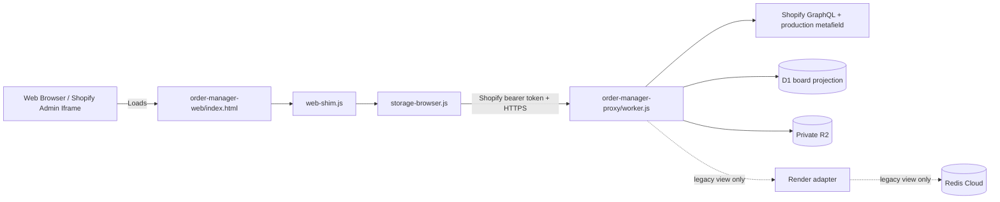

# Web & Shopify Admin Porting Workflow

## Use This When
- You are modifying files under `order-manager-web/` or `order-manager-proxy/`.
- You are updating web-shim handlers, browser local storage fallbacks, or Cloudflare Worker proxies.
- You are optimizing CSS layout for Shopify Admin embedded viewports or mobile devices.

## Skip This When
- You are working on Electron native IPC handlers in `main.js` → read [IPC and storage](../architecture/ipc-and-storage.md).
- You are troubleshooting desktop Electron Builder packages → read [Developer setup and build](../runbooks/dev-setup-and-build.md).

## Section Map
- [1. Web Port Architecture Overview](#1-web-port-architecture-overview)
- [2. IPC Shim & Storage Abstraction](#2-ipc-shim--storage-abstraction)
- [3. Cloudflare Worker Proxy Integration](#3-cloudflare-worker-proxy-integration)
- [4. Viewport & CSS Decoupling](#4-viewport--css-decoupling)
- [Common Failure Modes & Recovery](#common-failure-modes--recovery)

---

## 1. Web Port Architecture Overview

The web port (`order-manager-web/`) enables running the entire PrintMO Kanban workspace directly inside standard web browsers or embedded within the Shopify Admin interface.

---

## 2. IPC Shim & Storage Abstraction

1. `web-shim.js`: Checks if `window.api` is defined. If undefined (running in browser environment), it injects a polyfill exposing `window.api` methods.
2. `storage-browser.js`: Implements the underlying storage and data handling for `web-shim.js`, using browser `localStorage` or making HTTP calls to `order-manager-proxy/worker.js`.

---

## 3. Cloudflare Worker Proxy Integration

- **File**: `order-manager-proxy/worker.js`
- **Deployment**: Deployed as a Cloudflare Worker.
- **Responsibilities**:
  - Enforces allowed origins plus Shopify App Bridge bearer-token signature, shop, audience, expiry, and partner-user validation.
  - Owns Shopify Admin GraphQL access, compare-digest production mutations, D1 projections/app records, webhook deduplication, reconciliation, and stable DTO assembly.
  - Requires authenticated short-lived tickets for private R2 bytes.
  - Sends only validated aggregate garment lines to the stateless S&S gateway.
  - Keeps Render/Redis calls behind explicitly named legacy or migration routes during acceptance.
  - Handled via `scripts/prepare-cloudflare-pages-upload.sh`.

The prepared Cloudflare Pages artifact injects the public Shopify client ID, hashes its asset URLs, and records a release marker in the output HTML. Root `renderer.js` is copied into the artifact only; preparation must never rewrite the tracked `order-manager-web/renderer.js` fallback. Source HTML intentionally contains a placeholder and must not be deployed without `npm run prepare:cloudflare`.

For Pages publishing, `npm run prepare:cloudflare` only creates a local artifact. Use `npm run repo -- deploy cloudflare -- --production` for the live site or `npm run repo -- deploy cloudflare -- --preview <branch>` for a preview. The deployment command verifies the marker from its target before reporting success.

### Source-switched operational board

The normal header and mobile surface expose only the **Shopify board**. Both adapters remain in the codebase, but Legacy Redis is available only through the explicit `?printmo_debug_legacy=1` operational-debug URL; `web-shim.js` selects the data adapter and mutation endpoints.

- Legacy mode retains the existing queue URLs and payloads.
- Shopify mode pages `GET /order-manager/v1/orders`, maps the stable DTO into the existing card contract, and routes drag/drop, notes, readiness, bundle, progress, archive, and batch actions to canonical endpoints.
- Operational customer names use shipping name, then billing name, then customer first/last name. This keeps email-derived customer fields from replacing the fulfillment recipient; `Name unavailable` is reserved for orders where Shopify returns none of those approved fields.
- Manual invoice mockups remain in the dedicated R2 manual-mockup manifest. Shopify board cards hydrate those manifests after the first card paint, and the order detail upload, paste, preview, and removal controls merge manual mockups with Designer Studio assets.
- **In S&S Cart** and **Ordered** are keyboard-accessible views over the same blanks workflow. They filter on canonical `blanks_cart`/`blanks_ordered` state while keeping both counts visible. A drop into the blanks section persists the currently selected view as the destination stage; selecting a tab alone remains a read-only view change.
- A fully confirmed S&S submission always enters `blanks_cart` (**In S&S Cart**). For a partial supplier result, only orders whose complete garment set was accepted advance; orders with rejected SKUs stay in Build Order. The submission report shows accepted and rejected lines, supplier feedback, and a durable batch reference. The operator-controlled Mark Ordered action is the transition to `blanks_ordered`; later reconciliation preserves that advancement.
- Production & Fulfillment exposes **To Print** and **Printed** tabs in its top-level panel header over the canonical `print` and `completed` stages. The Shopify desktop board has no redundant Ready to Print subsection: `#col-print` is the panel's direct queue scroller, and an explicit view change resets that scroller before the newly selected queue is used. Reaching the nonzero garment total through the board saves `printed_count` and `stage: completed` atomically; lowering a completed count reverses the stage to `print`. Active completed orders stay in Printed even when Shopify reports fulfillment; the Admin block's manual customer-handoff action archives them, and its Reopen action returns them to the board.
- Print-count validation reads SKU on the first production-state line-item page and every pagination page before applying the non-print garment cap. Order Detail receiving edits use an inline per-garment stepper; the aggregate Receive Batches modal remains available without becoming inert when it opens above Order Detail.
- Receiving-manifest correction is explicit: **Add Orders** shows eligible In S&S Cart and Ordered orders, identifies orders that will move from another batch, and calls the Worker `assign-orders` action. The Worker rejects duplicate create membership and removes an emptied accidental source batch from the active index.
- Shopify moves are optimistic and atomic: the card repaints immediately, one production-metafield mutation persists the complete resulting stage, and a failed save restores the prior card. Per-order requests are serialized; one `VERSION_CONFLICT` is reconciled and retried at most once.
- In normal operation Shopify remains selected even while navigating between app views. In explicit debug mode, a failed source switch restores the previous source and keeps its last rendered board. The Worker also rejects a false authoritative empty candidate until initial migration/reconciliation completes.
- Shopify commerce fields remain read-only. Production fields are changed through `PATCH /order-manager/v1/orders/:gid/production` with expected revision and idempotency key.
- Idempotency fallbacks generate `admin:...`, `board:...`, `detail:...`, or `batch:...` keys from timestamp plus random bytes. Never fall back to `${gid}:...`; Shopify GID slashes violate the Worker contract.
- Full detail comes from `GET /order-manager/v1/orders/:gid`; line-item connections are fully paginated.
- Full detail reattaches every linked private asset to its Shopify line before repainting the Production tab. Design downloads use the stable opaque asset ID to renew an expired one-minute read ticket at click time.
- For Shopify manual-invoice orders, the Production tab can upload SVG, PNG, JPG, or WebP designs directly into Front, Back, or Extras. The Worker stores them through the canonical private R2/D1 asset path and the detail refreshes automatically. Only assets marked as manual uploads expose a Remove action; removal retires the association without hard-deleting the private bytes.
- The order breakdown is presentation-consolidated by item title, SKU, and variant. Quantities and current totals are summed, while Shopify line IDs, batch associations, asset links, and the underlying canonical payload remain unchanged.
- Candidate enrollment accepts paid, unfulfilled, non-cancelled orders. Fulfilled or closed update replays cannot create a new active projection, and a fulfilled default-stage projection is excluded from operational board views; deliberately completed production remains visible in Printed until operator archive. If Shopify later reports `cancelledAt` for an existing projection, webhook or reconciliation refresh marks it inactive without deleting production history, and neither a later production write nor clearing PrintMO archive state can reactivate it while the source cancellation remains.
- Summary line items retain the allowlisted Designer Studio properties. Reconciliation imports matching preview/promoted objects from the `PREVIEWS` binding into checksum-verified private R2 manifests and preserves repeated line-item associations through `asset_manifest_links`. Identical bytes in one order are stored once.
- The candidate read primes one representative mockup ticket per visible order before the initial card render; all other private artwork hydrates after the board becomes usable. This fast path is capped at 1.5 seconds, after which the commerce/production cards render and six concurrent per-asset fallbacks continue independently, so image infrastructure cannot block the board. Cards begin their first paint with every promptly available Designer URL and preview visibility never depends on the 30-second board poll. Manual-mockup manifest completion reconciles only the matching card and never rebuilds a status column over an already-resolved Designer preview. The browser multiplexes and decodes those eager card images directly; no detached-image monitor or timeout serializes otherwise independent previews. The initial queue token is reused only for its immediate ticket batch (at most 30 seconds and never near JWT expiry), with one forced refresh on `401`. One authenticated batch request returns opaque-ID, one-minute signed URLs without JavaScript blob buffering. Ticketed reads are browser-private-cacheable only for the ticket lifetime, so card repainting does not re-download the same private bytes. Mobile primes only the active workflow tab; other previews are deferred until their tab is selected. The complete linked asset set is hydrated only after order detail opens. An unavailable ticket leaves a placeholder without making hidden-stage print files part of the initial mobile load.
- The earlier Shopify diagnostic list/detail endpoints remain available for targeted comparison, but they are no longer the primary candidate surface.
- Protected customer data is shown only when Shopify returns approved fields.
- The Admin order block reads and edits the same metafield. Shopify may host-collapse content over 300px; `collapsedSummary` communicates stage/progress and controls use explicit labels.

#### Current endpoint and data contract

| Endpoint | Shopify operation | Returned data | Cache / boundary |
|---|---|---|---|
| `GET /order-manager/v1/orders` | Bounded stale refresh as needed | Cursor-paged board DTO with Shopify commerce, canonical production state, and one representative private asset | D1 enumeration; maximum 50; no Redis |
| `GET /order-manager/v1/orders/:gid` | Rich order detail and line-item pagination | Shopify facts, production state, attention, and complete linked asset metadata | On demand; no Redis |
| `GET /order-manager/v1/orders/:gid/production` | `PrintMOProductionState` | Canonical stage/revision/readiness/bundle/notes/progress/batch refs | Shopify metafield plus D1 asset manifests |
| `PATCH /order-manager/v1/orders/:gid/production` | `metafieldsSet` with `compareDigest` | Committed production revision or conflict/sync-pending state | D1 idempotency/audit; no Redis |
| `POST /order-manager/v1/orders/:gid/assets` | Order existence read | Uploaded design metadata with role and placement | Authenticated multipart; private R2 checksum readback plus D1 manifest/link; no object key returned |
| `DELETE /order-manager/v1/assets/:assetId?side=...` | None | Remaining safe asset metadata | Manual-upload links only; D1 soft retirement; R2 bytes retained |
| `POST /order-manager/v1/batches/commit` | Production reads during validation/commit | Durable confirmed/partial/rejected/unknown S&S report with accepted and rejected lines plus metadata repair list | D1 state machine; stateless supplier gateway |
| `GET /order-manager/v1/batches/latest` | None | Latest authenticated redacted S&S submission report | D1 batch record; no Redis |
| `GET/POST/PATCH /order-manager/blanks-batches` | None | Private receiving index/manifests, quantity updates, and add/transfer results | Authenticated R2 compatibility store; unique order membership enforced by Worker |

The detail response is grouped under these stable UI-facing properties:

- `data.customer`: Shopify customer name/contact/locale when returned.
- `data.commerce`: display statuses, current subtotal, discount, total, payment gateways, and transaction history.
- `data.delivery`: shipping/billing addresses, checkout shipping lines, fulfillment-order delivery method, and completed fulfillments/tracking.
- `data.conversion`: customer order index, days to conversion, and first/last attributed visit.
- `data.discounts`, `data.lineItems`, and `data.timeline`: normalized order discounts, all line items, and recent Shopify order events.
- `data.note` and `data.tags`: the Shopify order note and Shopify order tags. PrintMO `production.internalNotes` is loaded separately and is never confused with the Shopify order note.

The source adapter is `order-manager-web/web-shim.js`; Shopify-first source control and diagnostic detail are in `shopify-preview.js`; canonical APIs live in `order-manager-proxy/worker.js`; the Admin block is under `order-manager-proxy/extensions/printmo-production-status/`.

**Candidate release (2026-07-24):** Worker `d245b26a-da1a-4d7a-a96b-7737595f2f16`, Pages deployment `7e52d2e2`, Shopify app version `designer-assets-idempotency-2026-07-23`, and supplier gateway commit `420ff72`. The Pages/Worker release adds guest-name projection, atomic optimistic moves with bounded conflict recovery, a selected-view-aware Ordered destination, non-blocking private preview hydration, stable-width candidate card layouts, and mobile detail scroll ownership. The Worker also carries the checksum-guarded one-time position catch-up described in the cutover runbook; it is inert after its completion checkpoint is written. Final acceptance and owner-approved cutover remain separate gates.

**Task 2 release (2026-07-25):** Worker `bbcaa359-2cc9-4115-b612-c58f950c0cf6`, Pages deployment `177d9bb7`, and supplier gateway commit `420ff72`. This release restores manual R2 mockups, persists the independent Blanks Ordered readiness flag, prioritizes fulfillment-recipient names, deploys the previously committed Redis-free S&S route, keeps newly submitted cards in In S&S Cart until the operator marks them Ordered, and restores vertical-only scrolling throughout the embedded mobile order detail. Workflow acceptance remains owner-tested.

**Order-detail recovery release (2026-07-26):** Pages deployment `8aa312c1` restores the shared detail DOM/controller contract, featured mockup selection, accessible tabs, paired ordered-to-ready production states, expanded design-file workspace, inline mutation feedback, and the single-scroll-owner mobile workbench. Worker, Shopify app, supplier gateway, and cutover state are unchanged. Workflow acceptance remains owner-tested.

**Canonical detail workbench release (2026-07-26):** Worker `1552669a-4003-4f2a-8e27-45b8480165e1` and production Pages deployment `a708cc2c` connect the shared Shopify-board detail to the on-demand canonical order endpoint while preserving bounded board first paint and Legacy Redis isolation. The canonical query uses direct Order and LineItem fields rather than customer/product relations; shared detail now renders Shopify timeline and a separate PrintMO production history, conversion, checkout shipping/delivery windows, grouped collapsible tax detail, actual shipping or local-pickup labels, and design-file-linked size metadata. SKU is a separate line-item column and internal asset metadata stays out of the normal item table. Shopify scopes, app version, supplier gateway, and cutover state are unchanged. Workflow acceptance remains owner-tested.

**Dashboard workflow-foundation release (2026-08-06):** Production Pages release `1786040513631` removes the unfinished Bundle and Fullscreen entry points from the web dashboard, flattens the Shopify desktop Production & Fulfillment queue under its top-level To Print/Printed header, resets print scroll on explicit view changes, and gives candidate cards one stable preview/status anatomy with a quiet No preview state. Mobile retains separate Print and Blanks stages, its existing one-column phone/two-column wider-iframe card geometry, and 44px print tabs. Worker, database, authentication, Shopify permissions, Electron/Legacy renderer hooks, and private-preview loading boundaries are unchanged. Automated contract acceptance passed; owner visual acceptance remains manual.

**Production-count and receiving-correction release (2026-08-06):** Worker `989a3f57-1632-4cbe-b810-8f7916693529` and production Pages deployment `f00284c1` (release marker `1786045361453`) restore first-page SKU input to the printed-count garment cap, replace ordinary order-detail receiving modal stacking with inline quantity controls, register dynamic receiving/correction dialogs in the shared focus stack, and add explicit order selection with unique cross-batch transfer. Already-received quantity follows a moved order, and an emptied accidental source batch leaves the active index. No database migration, Shopify scope/app release, authentication, or supplier-gateway change was required. Automated contract acceptance passed; owner workflow acceptance remains manual.

**S&S submission-feedback release (2026-08-21):** Worker `b78339c7-e22d-4d13-b4a8-52e7bfbaa410`, production Pages release marker `1787368100178`, and supplier gateway commit `d3a0d5a` persist, safely forward, and display normalized confirmed, partial, rejected, and unknown supplier outcomes. Rejected rows identify the affected PrintMO order, human-readable garment/variant, supplier SKU, quantities, and operator-safe supplier reason when S&S returns a SKU or indexed line error. Partial batches advance only fully accepted orders, and uncertain results warn against blind retry. `SS_TEST_ORDER=1` remained enabled. The registered local simulator exercises the mapping without external requests or state changes.

**Order Detail Phase 1 reliability release (2026-08-24):** Production Pages deployment `5650b797` (release marker `17876050863N`) isolates note drafts by provider-aware immutable order identity, repaints production controls from canonical revision/progress/readiness state, limits dialog wrapping to rendered tabbables, capability-gates commerce-source customer-name editing, scopes the four readiness flags to materials, adds recoverable notes-save feedback, and closes the bounded mobile/accessibility defects documented by the audit. Worker, database, Shopify scopes/app version, production schema, and supplier gateway are unchanged. Syntax, Phase 1, Phase 2, documentation, artifact, upload, and live-marker verification passed; authenticated keyboard, populated-detail, mobile-geometry, and owner acceptance remain pending.

**Order Detail Overview v1 release (2026-08-24):** Production Pages deployment `ca4ad26c` (release marker `17876084003N`) makes Overview the default Shopify Order Detail workspace and derives a transparent navigation recommendation, workflow snapshot, recorded-attention summary, freshness label, and order facts from existing fields. Mobile material and print recommendations scroll and focus the actual production controls below the Overview. No Worker, database, Shopify scope/app version, production-schema, supplier-gateway, or customer/order-record change was required. Focused syntax, Phase 2, documentation, artifact, upload, and canonical-host release-marker verification passed; authenticated populated-detail visual acceptance remains owner-tested.

**Order Detail print-progress reliability release (2026-08-24):** Production Pages deployment `7a803619` (release marker `17876102743N`) removes the per-request `+1 Print` lock, paints rapid increments immediately, serializes one mutation at a time, and coalesces a burst to the latest desired total. Revision-aware detail hydration cannot rewind newer or pending progress, and the redesigned validated count dialog provides explicit decrement/increment and `Mark all printed` actions. Setting the exact garment total now persists `printed_count` and `completed` atomically; lowering it returns the canonical stage to `print`. No Worker, database, Shopify scope/app version, production-schema, supplier-gateway, or customer/order-record change was required. Focused syntax, executable concurrency/completion/rollback regressions, Phase 2, documentation, responsive dialog inspection, artifact, upload, and canonical-host release-marker verification passed.

**Manual design upload release (2026-08-25):** Worker `c21ae215-b7de-484c-915f-e0ad597509a8` and production Pages deployment `f0c24982` (release marker `1787679222819`) let authenticated operators attach SVG, PNG, JPG, or WebP artwork to a Shopify order as Front, Back, or Extras. Uploads use the existing private R2/D1 manifest path with size validation, SHA-256 readback verification, safe client metadata, placement-aware rendering, and source-gated removal that leaves private bytes recoverable. No D1 migration, Shopify scope/app release, production-metafield change, supplier-gateway change, or Google Drive integration was required. Syntax, proxy tests/build, Phase 1, Phase 2, documentation, Worker dry-run/binding checks, remote migration check, production upload, fail-closed probes, release-marker verification, and live asset-content checks passed.

**Mobile board recovery release (2026-08-25; accepted after environment correction):** Production Pages deployment `590f0abe` (release marker `17876858473N`) restores validated `shop`/`host` embedded context before App Bridge loads, allows the bridge a bounded startup window, and exposes a retryable board error instead of rendering authentication or transport failure as zero orders. Dashboard empty-state logic now runs only after a successful queue response, and the renderer's mobile tab state includes Storage and switches `data-active-view` explicitly. Syntax, Phase 2, documentation, artifact preparation, fixture-card rendering, Storage routing, error recovery at 393px and 320px, production upload, and canonical-host release-marker verification passed. The owner's first native-app check reported that cards still did not work, but a later retest after updating the Shopify mobile app confirmed that the board and cards render. Preserve the historical failed attempt, but treat the outdated app version as its confounder; do not introduce a same-origin authentication relay unless an updated app reproduces an authenticated request failure with direct evidence. Worker, database, Shopify scopes/app version, production metadata, supplier gateway, and existing manual-upload behavior remain unchanged.

**Mobile Order Detail navigation release (2026-08-26):** Production Pages deployment `2d498349` (release marker `17877829113N`) turns mobile Order Detail into a drill-in screen beneath the persistent Orders, Blanks, Print, and Storage command surface. The header exposes a touch-safe **Back** action; Back restores the originating stage and card focus, while selecting a global stage closes Detail before navigating. The covered board remains inert without disabling the mobile command surface, and desktop Detail retains its modal, Escape, and focus-isolation behavior. Focused syntax, Phase 2, documentation, 320px/393px interaction and layout checks, desktop modal regression checks, artifact preparation, production upload, and canonical-host marker verification passed. Worker, database, schema, authentication, Shopify app/scopes, supplier gateway, and order records were unchanged.

**Previous Orders release (2026-09-02):** Worker `d991db45-e13d-40d5-8c3d-6f0e3f335626` and production Pages deployment `56f49cab` (release marker `1788390148290`) remove exact Shopify `FULFILLED` orders from every active dashboard section, including Printed, while preserving D1, production, audit, and private artwork state. Desktop **Previous Orders** and mobile **History** load 25 lightweight fulfilled-only rows on selection, support signed-cursor pagination and server-side order/customer search, and omit asset summaries until a view-only detail is opened. Completed but unfulfilled orders remain in Printed; cancellation and operator archive retain their separate rules; fulfillment reversal restores the preserved stage when otherwise eligible. Syntax, Phase 1, expanded Phase 2, Admin-block verification, documentation, responsive review, Pages artifact preparation, Wrangler dry-run/bindings, remote-migration check, D1 recovery bookmark, Worker/Pages deployment records, canonical marker, unauthenticated API boundary, and read-only aggregate production acceptance passed. No migration, scope change, Etsy behavior, supplier change, or real-order mutation was performed. Owner authenticated UI acceptance remains pending.

#### Shopify access requirements and current limitation

- `read_orders` covers the base order, line items, transactions, fulfillments, conversion summary, discounts, and events for the normal Shopify order-access window.
- `Order.fulfillmentOrders` returns `FulfillmentOrder` objects, which Shopify governs through fulfillment-order scopes. This order-management read requires at least `read_merchant_managed_fulfillment_orders`; include `read_third_party_fulfillment_orders` when the app must see orders assigned to third-party fulfillment services. See Shopify's [FulfillmentOrder access-scope contract](https://shopify.dev/docs/api/admin-graphql/latest/objects/FulfillmentOrder).
- Name, address, phone, and email are separately governed protected customer fields. Request only the fields the operational UI needs through Shopify's [protected customer data process](https://shopify.dev/docs/apps/launch/protected-customer-data).
- `write_orders` is required for the app-owned production metafield.
- `read_all_orders` keeps unfinished production work accessible beyond Shopify's default order window.

The rich-detail scopes plus candidate `write_orders` and `read_all_orders` scopes are approved on the production installation. Canonical Shopify-board/Admin-block writes have been verified; final cutover remains a separate owner decision.

Changing Shopify scopes is a deployment and merchant-approval operation: update `order-manager-proxy/shopify.app.toml`, release a new Shopify app version, and approve the permission update on the production `Print-MO` installation. A Worker or Pages deploy alone does not grant Shopify scopes.

---

## 4. Viewport & CSS Decoupling

The web port must operate within constrained Shopify Admin viewports as well as mobile browser screens:

- `desktop.css`: High-density dashboard styles optimized for widescreen shop monitors.
- `mobile.css`: Responsive mobile and constrained iframe styles enforcing min 44x44px touch targets and full operational capabilities across columns.
- `dashboard-triage-enhancements.js` assigns the candidate-only `pipeline-main-card` and `production-card` contracts used by the final layout rules. A selector for either class is ineffective unless the renderer actually assigns it.
- Shopify-only repair rules are scoped under `body[data-order-source="shopify"]`; candidate acceptance must not change the Legacy Redis presentation.
- `.workflow-card-grid` is the stable queue-layout contract for the relocated Supplies and Production queues. Do not couple future layout rules to `.fulfillment .sub-section`: Shopify desktop reparents Blanks into Supplies and intentionally keeps the print queue flat under Production & Fulfillment.
- Every Shopify order tile owns a stable preview slot and `.production-card-statuses` row. Missing or unavailable artwork replaces the preview content with a quiet **No preview** state instead of removing its geometry; accounting and production badges use the shared status row so card anatomy does not vary by workflow stage.
- The web dashboard intentionally withholds the unfinished Bundle and Fullscreen entry points. The guarded shared renderer hooks and existing-bundle display contract remain compatible with Electron/Legacy surfaces, but those secondary actions must not be restored to Shopify headers without a separate interaction design and regression review.

### Shopify Embedded Mobile Interaction Contract

The mobile web surface is an application viewport inside Shopify Admin, not a
document page. Its outer shell remains fixed to the iframe viewport while the
active queue, detail view, or workflow sheet owns vertical scrolling.

- Phone order and production cards are tap targets, not draggable desktop
  tiles. Native card dragging is disabled at the mobile breakpoint so it cannot
  steal taps or vertical swipes on iOS.
- Vertical gestures that start outside an active scroll owner, or reach the top
  or bottom of one, are contained inside the app instead of chaining into the
  surrounding Shopify Admin page.
- Storage Browser is the exception to the fixed workflow-screen pattern: its
  full view is top-anchored and owns vertical scrolling, while horizontal
  scrolling and scroll chaining into Shopify Admin remain disabled.
- The Storage item is part of the mobile tab state machine. Selecting it sets
  `data-active-view="storage"`; selecting any order stage restores
  `data-active-view="orders"`. Do not omit Storage from the renderer's allowed
  mobile tabs or it will silently fall back to Pipeline.
- The History item sets `data-active-view="previous"` and loads fulfilled
  Shopify rows only after selection. Its view is a top-anchored scroll owner
  like Storage, but it does not request list artwork, poll in the background,
  or expose production mutation controls in the reused order detail.
- A failed queue load is not an empty queue. The board owns explicit
  `loading`, `ready`, and `error` states; filters may show their empty result
  only in `ready`. Missing embedded context and delayed App Bridge startup must
  remain visible and retryable rather than collapsing the cards to zero.
- Pipeline cards retain a readable two-column treatment where space permits.
  Production cards use a one-column phone grid and become two columns only at
  wider embedded widths; never combine a multi-column grid with a one-third
  inherited card width.
- The mobile Print stage reuses the top-level Production header as a compact
  **Print** header with full-width, 44px **To Print** and **Printed** tabs. The
  mobile Blanks stage retains its own dedicated header and workflow controls;
  flattening the desktop print section must not merge those mobile stages.
- Mobile Order Detail is a drill-in screen beneath the persistent workflow
  command surface, not a viewport-sealing modal. Its header exposes a 44px
  **Back** action; Orders, Blanks, Print, Storage, and History remain directly usable.
  A global stage selection closes Detail before navigating, while Back restores
  the originating stage, board scroll position, and card focus. Keep the covered
  board inert without making `#mobile-command-surface` inert; mobile Detail uses
  `aria-modal="false"`, while desktop Detail retains modal focus isolation and
  `aria-modal="true"`.
- `#detail-content` is the explicit vertical scroll owner for the mobile detail
  drill-in screen. Its inner detail columns must remain intrinsic-height
  (`flex: 0 0 auto; height: auto; overflow: visible`) so their complete height
  contributes to that scroller. The scroll owner locks gestures to `pan-y`,
  clips horizontal overflow, and suppresses page-shell rubber-banding.
- Regression checks must include working stage-navigation taps, order/bundle
  opening, card `draggable=false`, a fixed root shell, and scroll containment at
  both `320px` and `393px` widths.

---

## Common Failure Modes & Recovery

| Symptom / Trap | Root Cause | Diagnosis & Recovery |
|---|---|---|
| CORS error in browser console when fetching orders | Missing origin headers in Cloudflare Worker proxy | Inspect `order-manager-proxy/worker.js` CORS header headers (`Access-Control-Allow-Origin`). |
| Shopify board fails while Legacy Redis works | Shopify token exchange, permission approval, D1 initialization, GraphQL response, or throttling failure | Keep production work on Legacy Redis. Inspect the structured Worker error and request ID; `BOARD_NOT_INITIALIZED` means migration/bootstrap has not established the candidate and must not be treated as an empty board. |
| Shopify detail again shows `404 - [object Object]` while the order exists | A released/installed scope regressed or another optional GraphQL field is denied; a null order is being mistaken for not found | The 2026-07-22 fulfillment-order gate is resolved in production. If it returns, inspect the structured GraphQL error path, compare released versus installed scopes, and preserve partial data rather than assuming deletion. |
| Shopify detail shows customer fields as not returned | Guest checkout or protected customer data fields are not approved for the app | Confirm the order has customer data in Shopify Admin, then review the app's protected customer data API access request. Do not broaden scopes or expose credentials in the client. |
| Shopify board shows `Name unavailable` for a guest checkout that has a recipient name | Summary projection predates the shipping/billing fallback or the approved address name was not returned | Press **Refresh Shopify** once. The forced refresh bypasses the short TTL and projects shipping → billing name without reading Redis. |
| Ordered tab cannot be selected or both tabs show the same cards | The control was styled as a tab but no `setActiveBlanksView`/filtered render contract was installed | Verify `blanks-batches.js` wires click/arrow-key activation and filters `blanks` cards by `blanksOrdered`; do not implement the tabs as status mutations. |
| A Shopify card move pauses, reports 409, then appears only after refresh | Status and readiness were split across requests, or concurrent clients advanced the revision | Use `updateBoardMove` for one stage patch. Keep optimistic repaint/rollback, per-order serialization, and the single conflict reconciliation retry. |
| Mobile detail opens but cannot scroll | The inner detail column retained `flex:1; overflow:hidden`, so `#detail-content` had no measurable overflow even though content was clipped | Keep `#detail-content` as the vertical-only scroll owner and reset its inner columns to intrinsic height with visible internal overflow. |
| Mobile detail opens but the operator cannot return to the board or use another workflow stage | Detail was positioned across the whole app viewport and the modal isolation walk made the mobile command surface inert | Keep Detail absolutely contained by `.app-content`, leave `#mobile-command-surface` above and interactive, close through the canonical Back control before global navigation, and keep only the covered board inert. Verify Back plus Orders, Blanks, Print, Storage, and History at both 320px and 393px. |
| Unsaved inline notes from one order appear when another order opens | The shared detail editor remained in editing state across `closeDetail()`, so `syncNotesContext()` intentionally preserved the stale draft after `currentDetailOrder` changed | Treat note drafts as immutable-order-scoped state. Close/backdrop/Escape must use one cancel/preserve/confirm path, and edit A → close → open B → save requires behavioral regression coverage. |
| Detail opens with readiness/progress controls older than the rich response | `mergeCanonicalDetail()` repainted commerce/assets/stage but did not adopt canonical revision, printed count, and every readiness flag into the local order object used by controls | Merge the complete canonical production control state before repaint and retain expected revision for the next mutation. Test a stale board summary followed by a newer detail response. |
| Shopify customer-name edit opens and then fails | The shared legacy entry point remained visible even though `web-shim.js → window.api.updateName` rejects commerce-source name writes | Capability-gate the action. Shopify names remain read-only; hide or disable Edit name with source-aware explanation. |
| Tab focus wrap stalls, escapes, or lands on invisible controls | The dialog focusable filter counted controls under hidden tab panels, zero-geometry descendants, or negative-tabindex roving tabs | Exclude hidden/inert ancestry, zero geometry, and `tabindex=-1` from the trap's rendered focusable set; verify wraparound with each panel active. |
| Data changes not saved in browser | `storage-browser.js` falling back to read-only state | Check browser local storage permissions and network logs. |
| Layout broken inside Shopify Admin iframe | Mobile CSS media query override missing | Verify `mobile.css` breakpoint rules and container width limits. |
